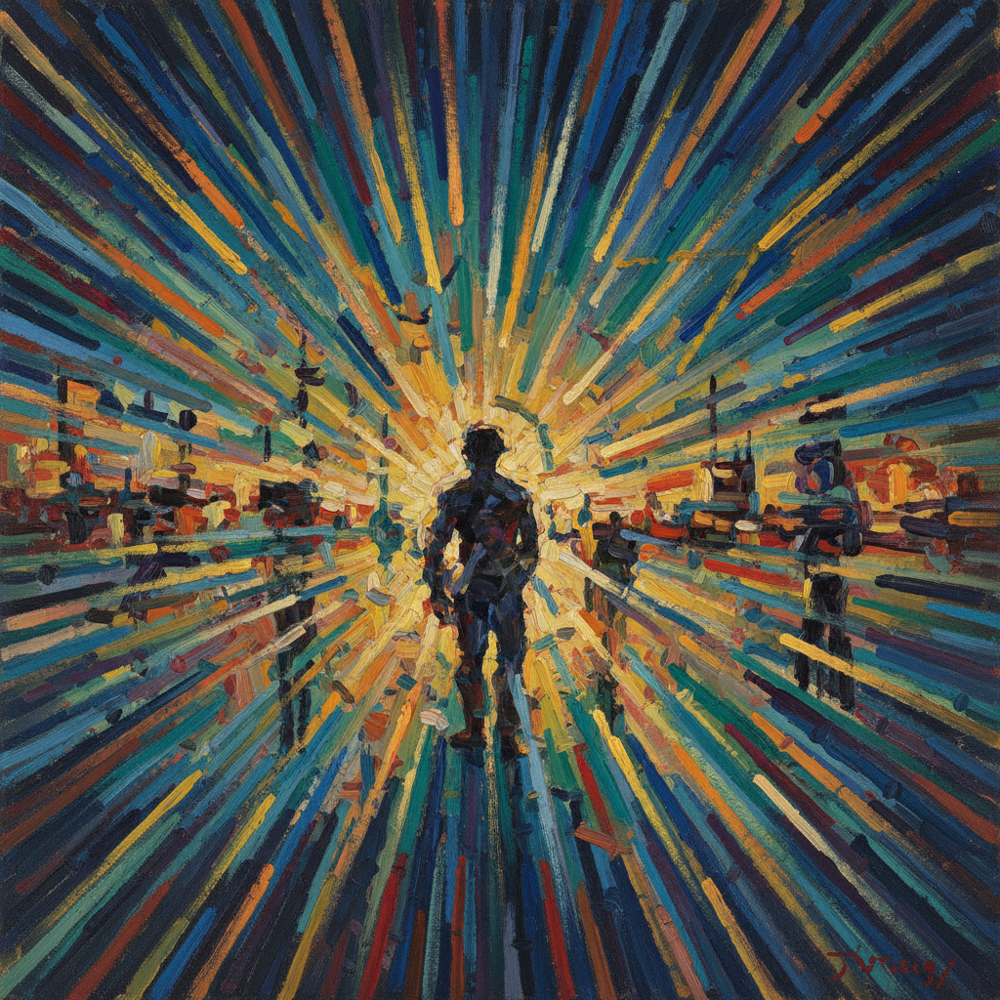

# Rayonism Painting 光线主义绘画

> **时期：** 1911年–1914年  
> **关键词：** 光线交叉、俄罗斯先锋、拉里奥诺夫、抽象光谱、未来主义影响

## 概述

Rayonism（光线主义）是1911年由米哈伊尔·拉里奥诺夫和娜塔莉亚·冈察洛娃在莫斯科创立的绘画运动——他们描绘的不是物体本身，而是物体表面反射的光线在空间中交叉形成的图案。拉里奥诺夫的光线交响、冈察洛娃的动态光谱——光线主义是俄罗斯先锋派走向纯抽象的独特路径，融合了未来主义的速度和印象派的光线。

## 风格特征

- **光线束**：斜向交叉的色彩线条
- **动态感**：速度和能量的视觉化
- **色彩光谱**：棱镜分解的彩虹色
- **半抽象**：物体在光线中溶解
- **锐利笔触**：如光束般的直线条

## 代表人物与作品

- 米哈伊尔·拉里奥诺夫《蓝色光线主义》
- 娜塔莉亚·冈察洛娃 光线风景
- 亚历山大·舍甫琴科 光线实验

## 概念图

