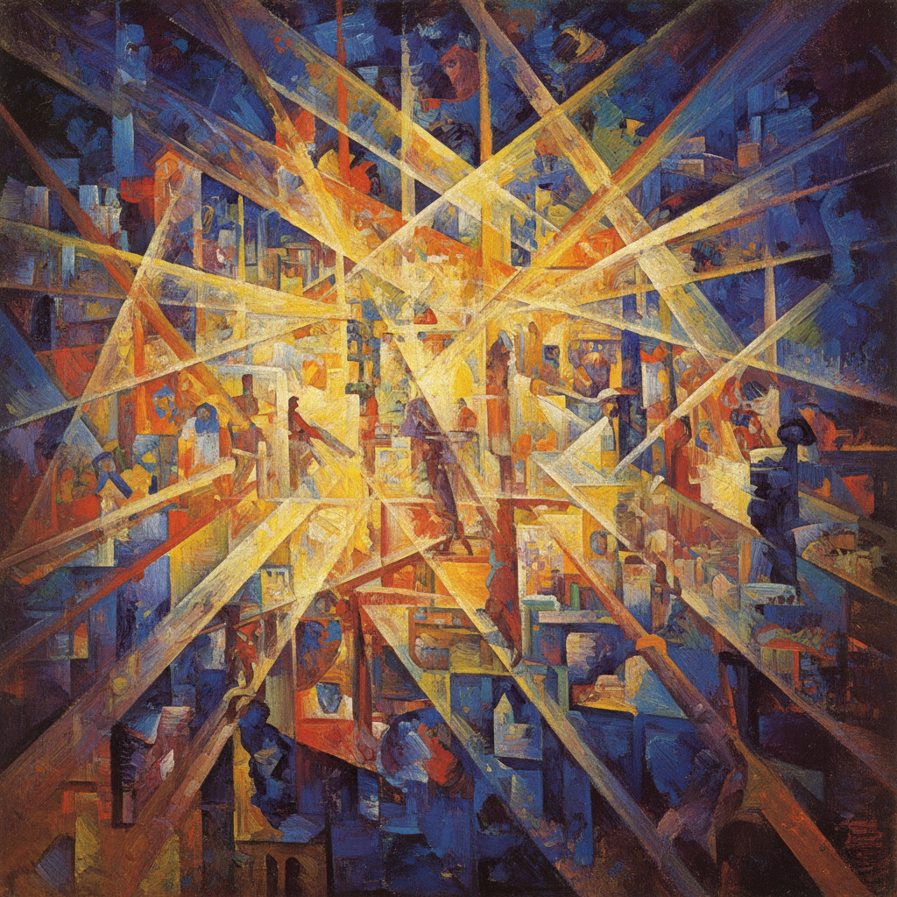

# Rayonism 光线主义

> "We declare: the genius of our days to be: trousers, jackets, shoes, tramways, buses, aeroplanes, railways, magnificent ships." — Rayonist Manifesto

## 概述

光线主义（Rayonism / Лучизм）是1911–1914年间由俄国画家米哈伊尔·拉里奥诺夫（Mikhail Larionov）和娜塔莉亚·冈察洛娃（Natalia Goncharova）创立的抽象艺术运动。它是俄国前卫艺术中最早的纯抽象实验之一，理论基础是：我们看到的不是物体本身，而是物体反射的光线束——画家应该描绘这些交叉的光线，而非物体。

光线主义融合了未来主义的动态、立体主义的碎片化和俄国民间艺术的色彩，创造了一种独特的"光的交响曲"。

## 核心特征

| 特征 | 描述 |
|------|------|
| 光线交叉 | 描绘物体反射的光线束而非物体本身 |
| 对角线动态 | 密集的斜线创造运动感 |
| 色彩光谱 | 光的分解——棱镜般的色彩 |
| 半抽象 | 从具象出发走向纯抽象 |
| 综合性 | 融合未来主义、立体主义、俄国民间艺术 |
| 短暂性 | 运动仅持续约3年 |

## 视觉特征

- **色彩**：明亮的光谱色——黄、橙、蓝、紫的交织
- **线条**：密集的对角线束，如光线穿过棱镜
- **形态**：物体被分解为光线的交叉网络
- **构图**：全面覆盖，无明确焦点
- **动态**：强烈的运动感和能量辐射
- **质感**：平面化，笔触服务于光线方向

## 代表作品

| 作品 | 艺术家 | 年代 | 意义 |
|------|--------|------|------|
| *Glass* | Mikhail Larionov | 1912 | 光线主义的典范 |
| *Rayonist Composition* | Larionov | 1912-13 | 纯抽象光线画 |
| *Cats (Rayonist perception)* | Goncharova | 1913 | 具象与光线的融合 |
| *Blue Rayonism* | Larionov | 1912 | 单色光线实验 |
| *The Forest* | Goncharova | 1913 | 自然的光线分解 |
| *Red Rayonism* | Larionov | 1913 | 红色光谱的爆发 |

## 历史时间线

| 时期 | 事件 |
|------|------|
| 1911 | Larionov开始光线主义实验 |
| 1912 | 首批光线主义作品在"驴尾巴"展览展出 |
| 1913年4月 | "靶子"展览——光线主义正式亮相 |
| 1913年6月 | 光线主义宣言发表 |
| 1914 | Larionov和Goncharova离开俄国前往巴黎 |
| 1914+ | 运动实质终结，两人转向舞台设计 |

## 中国语境

光线主义对中国艺术的直接影响有限，但其"描绘光线而非物体"的理念与中国传统绘画中"气韵生动"的追求有哲学上的共鸣——两者都试图捕捉超越物质表面的能量流动。当代中国抽象艺术家如丁乙的十字线条作品，在视觉上与光线主义的密集线条有形式上的呼应。

## 争议与遗产

- **争议**：被批评为"未来主义和立体主义的简单混合"
- **原创性**：实际上是俄国最早的纯抽象艺术理论之一
- **短命**：创始人离开俄国后运动即终结
- **遗产**：为马列维奇的至上主义和俄国构成主义铺平道路
- **当代回响**：数字光效艺术、LED装置、光纤艺术

## AI生成概念图

## 与其他风格的关系

- **Futurism** → 共享动态和速度的表现，但光线主义更关注光学
- **Cubism** → 立体主义的碎片化是光线主义的出发点
- **Suprematism** → 至上主义继承了光线主义的抽象追求
- **Orphism** → 德劳内的色彩抽象与光线主义平行发展
- **Constructivism** → 俄国构成主义是光线主义的后继
- **Op Art** → 欧普艺术继承了光线主义的光学实验精神

---

*浮光艺志 | Chronicle of Artistry*
