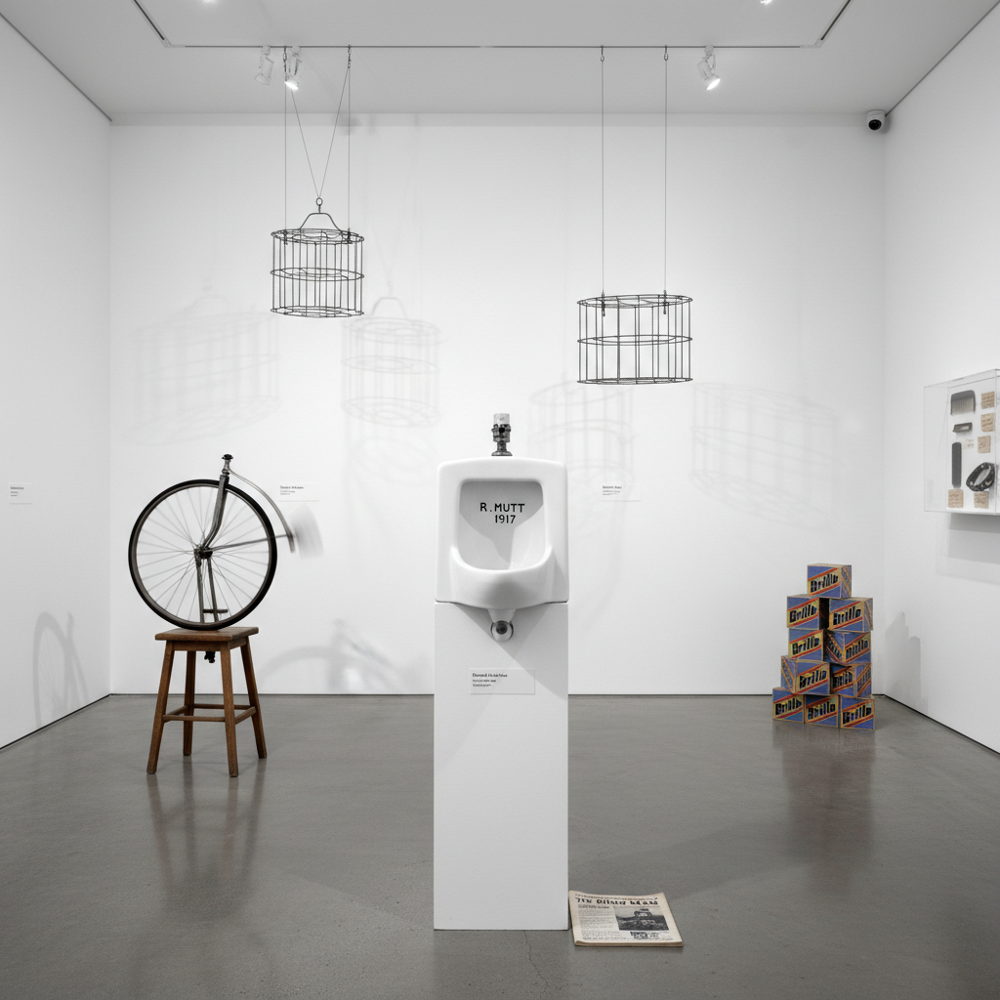

# Ready-Made Art 现成品艺术

> "The readymade is the most radical gesture in modern art — selecting an ordinary manufactured object and declaring it art by the act of choosing alone, no craft required, no transformation needed, only the artist's decision and the gallery's frame to transfigure a urinal into a fountain, a bottle rack into a sculpture, and a snow shovel into a meditation on winter, Marcel Duchamp's quiet revolution that asked not what art looks like but what makes something art." — Unknown

## 概述

现成品艺术（Ready-Made Art）是一种将工业制造的日常物品直接选取并宣布为艺术品的创作方式。现成品不需要艺术家的手工制作或物理改造——艺术家的"选择"行为本身就是创作行为。这一概念由马塞尔·杜尚（Marcel Duchamp）在1913-1917年间系统化提出，彻底改变了"什么是艺术"的定义。

杜尚的现成品实践始于1913年的《自行车轮》（Bicycle Wheel）——将一个自行车前轮倒置安装在一个凳子上。1917年，他以"R. Mutt"的署名将一个工业生产的小便池命名为《泉》（Fountain）提交给独立艺术家协会展览，这成为20世纪最具影响力的艺术事件之一。杜尚区分了"纯粹现成品"（unassisted readymade，未经任何改动的物品）和"辅助现成品"（assisted readymade，经过少量改动的物品）。

## 核心特征

| 特征 | 描述 |
|------|------|
| 选择 | 艺术家的选择即创作 |
| 工业品 | 使用工业制造的物品 |
| 无手工 | 不需要手工制作 |
| 概念 | 概念优先于形式 |
| 质疑 | 质疑艺术的定义 |
| 杜尚 | 杜尚的发明 |

## 视觉特征

- **日常**：日常物品的外观
- **工业**：工业制造的精确
- **未改**：未经改动的状态
- **展示**：展示语境的转换
- **签名**：艺术家的签名或命名
- **悖论**：视觉的平凡与概念的激进

## 代表作品

| 作品 | 艺术家 | 年代 | 意义 |
|------|--------|------|------|
| *Fountain* | Marcel Duchamp | 1917 | 小便池——最著名的现成品 |
| *Bicycle Wheel* | Marcel Duchamp | 1913 | 第一件现成品 |
| *Bottle Rack* | Marcel Duchamp | 1914 | 瓶架——纯粹现成品 |
| *In Advance of the Broken Arm* | Marcel Duchamp | 1915 | 雪铲 |
| *Brillo Boxes* | Andy Warhol | 1964 | 沃霍尔的布里洛盒子 |

## 历史时间线

| 时期 | 事件 |
|------|------|
| 1913 | 杜尚创作《自行车轮》 |
| 1914 | 《瓶架》——第一件纯粹现成品 |
| 1917 | 《泉》的提交与拒绝 |
| 1960年代 | 新达达和波普的继承 |
| 当代 | 现成品概念的全球化影响 |

## 中国语境

现成品艺术在中国当代艺术中有深远影响。中国的"85新潮"运动中，许多艺术家开始使用现成品进行创作。艾未未是中国最著名的现成品艺术实践者之一——他的《透视研究》系列（对着天安门等地标竖中指的照片）、《可口可乐花瓶》（在新石器时代陶罐上印可口可乐标志）等作品都运用了现成品的逻辑。中国当代艺术中的现成品实践往往带有更强的社会批判性和文化反思性——将中国传统文物与当代工业品并置，质疑文化价值的建构。

## AI生成概念图

## 与其他风格的关系

- **Dada** → 达达主义
- **Conceptual Art** → 概念艺术
- **Found Object Art** → 现成物艺术
- **Pop Art** → 波普艺术
- **Neo-Dada** → 新达达
- **Institutional Critique** → 体制批判

---

*浮光艺志 | Chronicle of Artistry*
