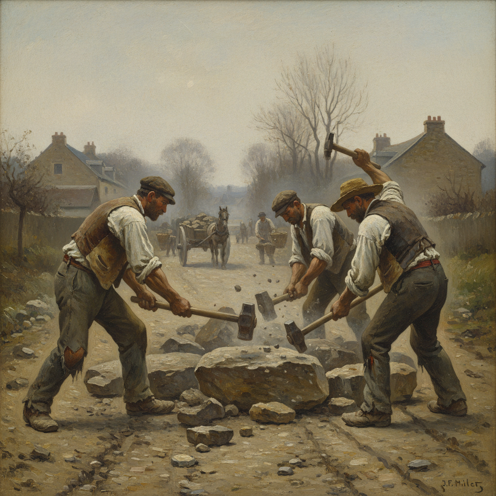

# Realism Painting 现实主义绘画

> **时期：** 1840年代–1880年代  
> **关键词：** 库尔贝、日常真实、反浪漫主义、社会关怀、客观描绘

## 概述

Realism Painting（现实主义绘画）是19世纪中叶由古斯塔夫·库尔贝在法国发起的绘画革命——他宣称"我不会画天使，因为我从未见过天使"。现实主义画家拒绝学院派的神话题材和浪漫主义的情感夸张，转而描绘普通人的日常生活：农民、工人、市民的真实面貌。库尔贝的石匠、米勒的拾穗者——现实主义让"不值得画"的人第一次成为艺术的主角。

## 风格特征

- **日常主题**：普通人的劳动和生活
- **客观描绘**：不美化也不戏剧化
- **反学院**：拒绝历史画的等级制度
- **社会关怀**：关注底层人民的处境
- **朴素技法**：服务于内容而非炫技

## 代表人物与作品

- 古斯塔夫·库尔贝《石匠》《画室》
- 让-弗朗索瓦·米勒《拾穗者》
- 奥诺雷·杜米埃 社会讽刺
- 伊利亚·列宾《伏尔加河上的纤夫》

## 概念图

