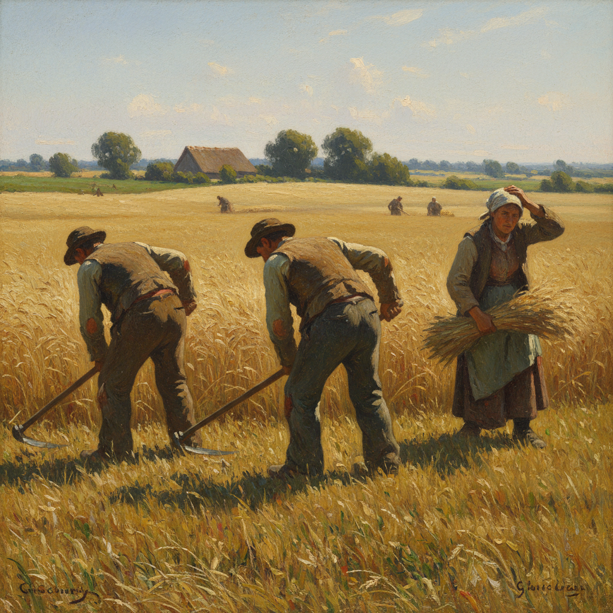

# Realism 现实主义



> **"不美化、不丑化——如实描绘世界的本来面目。"**

## 概述

| 维度 | 描述 |
|------|------|
| 时期 | 1840s–1880s（作为运动）/影响至今 |
| 别名 | Realism, 现实主义, 写实主义 |
| 核心色彩 | 自然色调——土色、灰色、日常光线的真实色彩 |
| 关键元素 | 日常题材、客观描绘、反理想化、社会关注 |
| 代表人物 | Gustave Courbet, Jean-François Millet, Honoré Daumier, Ilya Repin |
| 关联风格 | Naturalism, Social Realism, Impressionism, Photorealism |

---

## 历史脉络

| 年份 | 事件 |
|------|------|
| 1848 | 欧洲革命——现实主义的社会土壤 |
| 1849 | Courbet《奥尔南的葬礼》——现实主义宣言 |
| 1855 | Courbet自办"现实主义展" |
| 1857 | Millet《拾穗者》——农民的尊严 |
| 1860s | 俄国巡回画派——现实主义的东方 |
| 1870s | 现实主义影响印象派 |

### 核心哲学

现实主义的精神是**"艺术应该描绘当下的真实——不是过去的神话"**：
- Courbet："给我看一个天使——我就画一个天使"
- "农民和工人和国王一样值得被画"
- "美不在理想化——在真实本身"
- "艺术家的眼睛应该像照相机——但有良心"
- "现实主义不是没有立场——选择画什么就是立场"

---

## 视觉语法

### 色彩系统

```
主色：
  土褐 (#8B7355) — 大地、劳动
  灰绿 (#6B8E6B) — 田野、自然
  暗红 (#8B4513) — 肉体、温暖
  天空灰 (#778899) — 日常光线

规则：
  - 色彩必须符合自然观察
  - 不人为增强对比
  - 光线来自自然（非戏剧化）
  - 质感真实——皮肤、布料、泥土
  - 不回避"丑"——皱纹、污垢、疲惫
```

### 标志性元素

| 类别 | 元素 |
|------|------|
| 题材 | 农民、工人、日常生活、风景 |
| 技法 | 写实油画、素描、版画 |
| 光线 | 自然光、不戏剧化 |
| 构图 | 日常视角、不英雄化 |
| 态度 | 客观、诚实、社会关注 |

---

## 与其他风格的关系

- **Romanticism** → **Realism**（从理想到现实）
- **Realism** → **Impressionism**（从题材到光线）
- **Realism** → **Naturalism**（更科学的观察）
- **Realism** → **Social Realism**（更强的社会批判）
- **Realism** → **Photorealism**（极致的写实）

---

## 设计应用

| 场景 | 应用方式 |
|------|----------|
| 摄影 | 纪实摄影+街头摄影 |
| 品牌 | 真实感+不修饰+信任 |
| 影视 | 写实风格+自然光+日常叙事 |
| 游戏 | 写实画风+历史题材 |

---

## 相关风格

← [Romanticism 浪漫主义](romanticism.md) | [Impressionism 印象派](impressionism.md) →

↑ [返回千禧怀旧目录](README.md) | [返回总目录](../README.md)
