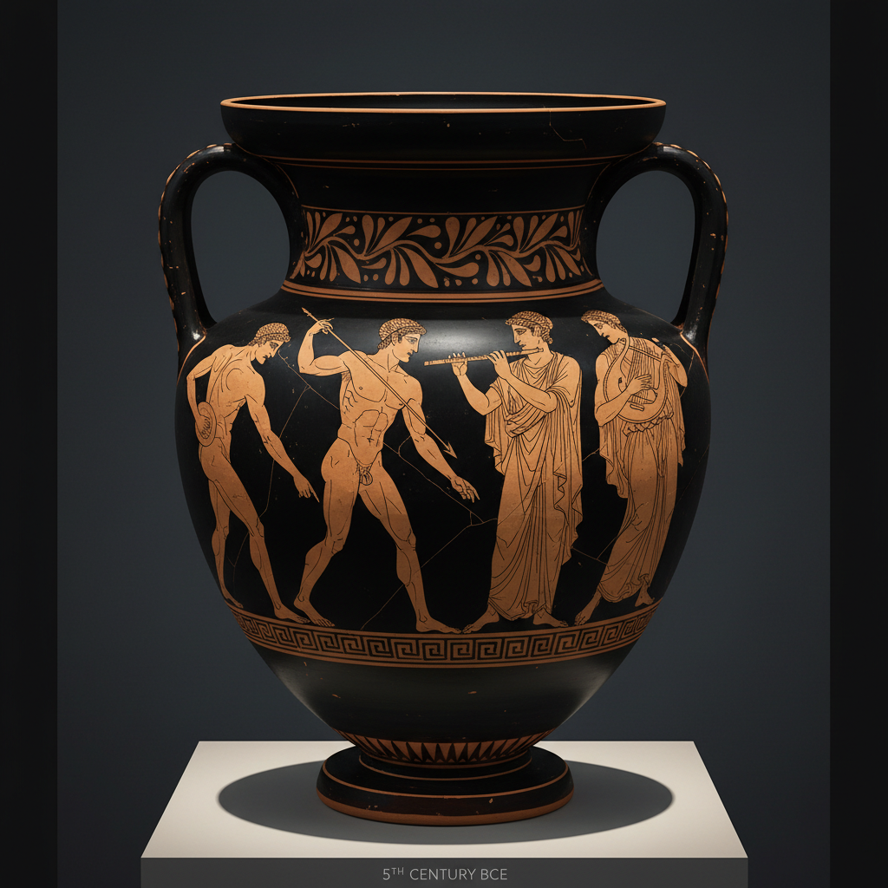

# Red-Figure Art 红绘陶艺术

> "Red-figure freed the painter's hand — where black-figure carved in silence, red-figure drew in light." — Greek vase painting tradition

## 概述

红绘陶艺术（Red-Figure Art）是古希腊（约公元前530-3世纪）发展的一种陶器装饰技术——与黑绘技法相反，红绘技法将背景涂黑，而人物保留红色陶土的本色，细节用黑色线条绘制而非刻划。这一技术革新极大地解放了画师的表现力。

红绘技法约于公元前530年在雅典发明——传统上认为安多基德斯画师（Andokides Painter）是第一位使用红绘技法的画师。红绘技法的革命性在于：画师不再需要用尖锐工具在黑色表面上刻划细节，而是可以用毛笔直接在红色表面上绘画——这使得人物的解剖结构、衣褶、表情等细节的表现变得更加自由和精确。红绘技法迅速取代了黑绘，成为古希腊陶器装饰的主流技术。

红绘陶艺术的核心要素包括：1）反转技法——背景涂黑，人物留红；2）线描细节——用毛笔绘制的精细线条；3）解剖精确——更精确的人体解剖表现；4）透视尝试——早期透视和缩短法的探索；5）情感表达——更丰富的面部表情和姿态；6）雅典起源——从雅典传播到南意大利；7）大师辈出——众多知名画师的个人风格。

## 核心特征

| 特征 | 描述 |
|------|------|
| 反转技法 | 背景涂黑人物留红 |
| 线描细节 | 毛笔绘制精细线条 |
| 解剖精确 | 更精确人体解剖表现 |
| 透视尝试 | 早期透视缩短法探索 |
| 情感表达 | 丰富面部表情姿态 |
| 大师辈出 | 众多知名画师风格 |

## 视觉特征

- **红色人物**：温暖红色陶土的人物形象
- **黑色背景**：深沉的黑色背景
- **精细线条**：毛笔绘制的流畅线条
- **衣褶表现**：精细的衣物褶皱描绘
- **三维感**：通过线条暗示的立体感
- **多视角**：正面、侧面、四分之三视角

## 代表作品

| 作品 | 年代 | 意义 |
|------|------|------|
| *安多基德斯双面瓶* | 前530年 | 最早的红绘 |
| *欧弗洛尼奥斯陶缸* | 前515年 | 先驱大师 |
| *柏林画师作品* | 前490-460年 | 古典风格 |
| *克里奥丰画师作品* | 前440年 | 高度古典 |
| *米迪亚斯画师作品* | 前420年 | 华丽风格 |
| *南意大利红绘* | 前4世纪 | 地区发展 |

## 历史时间线

| 时期 | 事件 |
|------|------|
| 前530年 | 红绘技法在雅典发明 |
| 前530-500年 | 先驱期，与黑绘并存 |
| 前500-450年 | 早期古典，技法成熟 |
| 前450-420年 | 高度古典，巅峰时期 |
| 前420-380年 | 华丽风格 |
| 前4世纪 | 南意大利红绘繁荣 |
| 前3世纪 | 红绘传统终结 |

## 中国语境

红绘陶与中国陶瓷装饰传统的比较揭示了东西方不同的艺术发展路径。希腊红绘追求的是人体解剖的精确性和叙事的戏剧性——这与中国传统陶瓷装饰更注重意境、留白和象征性的美学取向形成鲜明对比。红绘技法从黑绘的"刻"到红绘的"画"的转变——从减法到加法的技术革新——与中国陶瓷从刻花到绘画（如从耀州窑刻花到磁州窑绘画）的发展有着平行的逻辑。红绘陶上众多画师的个人风格和签名传统，反映了古希腊对个体创造力的重视——这在中国陶瓷中直到明清时期才有类似的发展（如景德镇的"官搭民烧"中的个人风格）。

## 概念图

## 与其他风格的关系

- **Black-Figure** → 黑绘陶（前身）
- **White-Ground** → 白底彩绘（同时代变体）
- **Greek Sculpture** → 希腊雕塑（同一文明）
- **South Italian Pottery** → 南意大利陶器
- **Narrative Art** → 叙事艺术
- **Classical Art** → 古典艺术

---

*浮光艺志 | Chronicle of Artistry*
