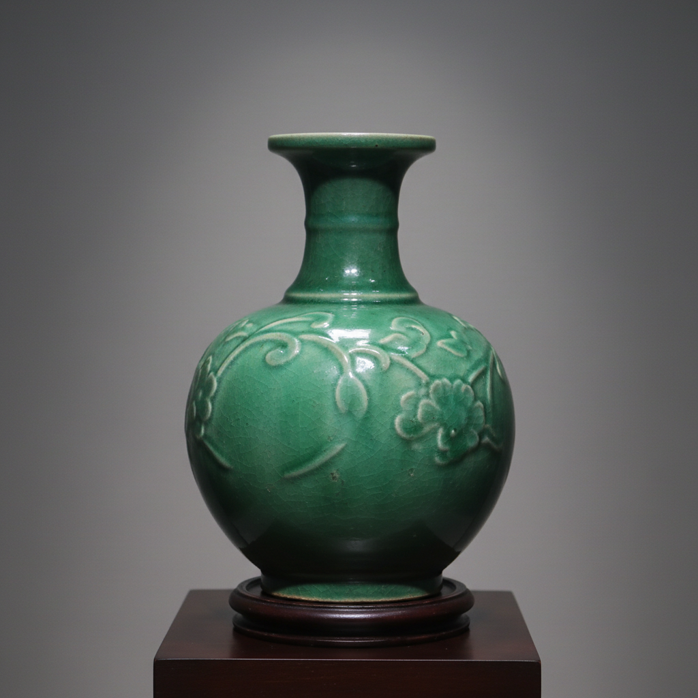

# Reduction Firing Art 还原烧成艺术

> "Reduction firing is ceramics by subtraction — starving the kiln of oxygen so that flames reach hungrily into the clay and glaze themselves to steal what they need, pulling iron from red to green, copper from green to blood red, carbon into the body until white porcelain blushes grey, the kiln atmosphere itself becoming the painter's brush, writing in chemistry what no hand could draw." — Unknown

## 概述

还原烧成艺术（Reduction Firing Art）是一种通过控制窑炉气氛——减少氧气供应——来改变陶瓷坯体和釉料颜色的烧制技法。在还原气氛中，火焰因缺氧而从釉料和坯体中的金属氧化物中"夺取"氧原子，导致金属离子的价态改变，从而产生与氧化烧成完全不同的色彩效果。还原烧成是中国青瓷、铜红釉等经典釉色的核心技术。

还原烧成艺术的核心要素包括：1）缺氧气氛——减少窑内氧气供应；2）金属还原——金属氧化物失去氧原子；3）色彩转变——铁从红变绿，铜从绿变红；4）气氛控制——精确控制还原程度；5）不可预测——还原效果有一定随机性；6）传统技术——数千年的窑火经验；7）化学艺术——以化学反应为创作手段。

## 核心特征

| 特征 | 描述 |
|------|------|
| 缺氧烧制 | 减少窑内氧气供应 |
| 色彩转变 | 金属氧化物颜色改变 |
| 铁还原 | 铁从红/棕变为青/绿 |
| 铜还原 | 铜从绿变为红/紫 |
| 气氛控制 | 精确控制还原程度 |
| 窑变效果 | 不可完全预测的色彩 |

## 视觉特征

- **青绿色调**：铁还原产生的青瓷色
- **铜红色**：铜还原产生的鲜红色
- **灰色坯体**：还原使白色坯体变灰
- **窑变效果**：不均匀还原的色彩变化
- **深沉色调**：比氧化烧成更深沉的色彩
- **金属质感**：还原产生的金属光泽

## 代表作品

| 作品 | 艺术家/文化 | 年代 | 意义 |
|------|-------------|------|------|
| *龙泉青瓷* | 中国龙泉窑 | 宋代 | 铁还原的极致 |
| *钧窑窑变* | 中国钧窑 | 宋代 | 铜还原的经典 |
| *郎窑红* | 中国景德镇 | 清代 | 铜红釉的巅峰 |
| *日本青瓷* | 日本 | 各时期 | 日本还原传统 |
| *当代还原烧* | 各地陶艺家 | 当代 | 还原技术的现代探索 |

## 历史时间线

| 时期 | 事件 |
|------|------|
| 前1000年 | 中国早期还原烧成青瓷 |
| 宋代 | 龙泉、钧窑等还原烧成的巅峰 |
| 明清 | 景德镇铜红釉的发展 |
| 20世纪 | 还原烧成在全球陶艺中的传播 |
| 当代 | 还原烧成的科学化和艺术化 |

## 中国语境

还原烧成是中国陶瓷最核心的技术之一——中国青瓷的千年传统完全建立在铁的还原之上。从越窑到龙泉窑，从汝窑到官窑，中国最伟大的青瓷都是还原烧成的产物。中国的铜红釉——从钧窑的玫瑰紫到景德镇的郎窑红、豇豆红——同样依赖精确的还原气氛。中国古代窑工通过数千年的经验积累，掌握了极其精细的还原控制技术——通过观察火焰颜色、烟气状态来判断窑内气氛。这种"以火为笔"的技术是中国陶瓷对世界的重要贡献。

## AI生成概念图

## 与其他风格的关系

- **Oxidation Firing** → 氧化烧成
- **Celadon** → 青瓷
- **Copper Red Glaze** → 铜红釉
- **Wood Kiln** → 柴窑
- **Kiln Atmosphere** → 窑炉气氛
- **Jun Ware** → 钧窑

---

*浮光艺志 | Chronicle of Artistry*
