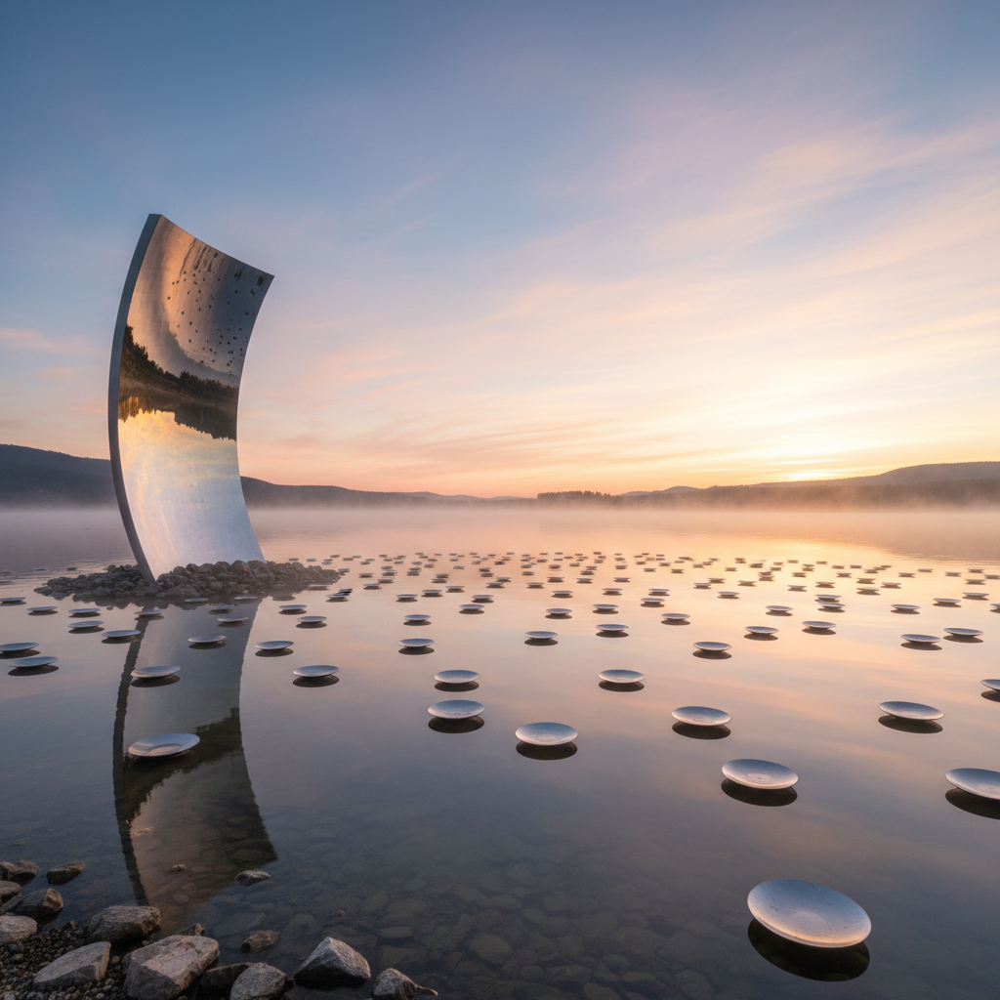

# Reflection Art 反射艺术

> "Reflection art works with the oldest mirror in the world — water — and with every surface that sends light back to the eye. A reflection is not a copy; it is a transformation, a reversal, a doubling that creates a parallel world just beyond the surface. The reflection artist understands that every mirror is a portal, every puddle is a window into an inverted universe, and every polished surface holds within it a ghost image of everything that stands before it." — Unknown

## 概述

反射艺术（Reflection Art）是以光的反射——镜面、水面、金属表面等对光线的反射——为核心创作手段的艺术实践。反射创造了一个镜像世界，一个与现实对称但又不同的平行空间。

反射艺术的实践包括：1）镜面雕塑——使用镜面材料的雕塑，将环境反射为作品的一部分；2）水面反射——利用水面的镜像效果创作；3）万花筒艺术——利用多重反射创造无限图案；4）反射建筑——使用反射材料的建筑，与环境融为一体；5）光学反射——利用棱镜、透镜等光学元素创造反射效果；6）数字镜像——用摄像头和屏幕创造实时镜像互动。

## 核心特征

| 特征 | 描述 |
|------|------|
| 镜像 | 镜像与对称 |
| 环境 | 反射环境 |
| 无限 | 无限反射 |
| 变形 | 曲面变形 |
| 虚实 | 虚实交织 |
| 互动 | 观者成为作品 |

## 视觉特征

- **对称**：镜像的对称性
- **光泽**：高度反光的表面
- **扭曲**：曲面镜的扭曲
- **重复**：多重反射的重复
- **融合**：作品与环境的融合
- **虚幻**：虚实难辨的效果

## 代表作品

| 作品 | 艺术家 | 年代 | 意义 |
|------|--------|------|------|
| *Cloud Gate* | Anish Kapoor | 2006 | 芝加哥"豆子" |
| *Infinity Rooms* | Yayoi Kusama | 1965至今 | 无限镜屋 |
| *Sky Mirror* | Anish Kapoor | 2001 | 天空之镜 |
| *Mirror installations* | Daniel Rozin | 2000年代 | 互动镜面装置 |
| *Water reflections* | Various | 古代至今 | 水面反射艺术 |

## 历史时间线

| 时期 | 事件 |
|------|------|
| 古代 | 水面反射、铜镜 |
| 文艺复兴 | 透视法与镜面研究 |
| 1960年代 | Kusama的无限镜屋 |
| 2000年代 | 大型镜面公共雕塑 |
| 当代 | 数字互动镜面艺术 |

## 中国语境

反射艺术在中国有深厚的文化和哲学基础。中国是最早制造铜镜的文明之一——中国铜镜有四千多年的历史，从商代到清代，铜镜不仅是实用品，更是精美的艺术品，背面的纹饰反映了各时代的审美。中国传统园林中对水面反射的运用——"借景"中的水中倒影——是一种精妙的反射美学。中国传统文化中"镜"有丰富的象征意义——"以铜为镜，可以正衣冠；以古为镜，可以知兴替"。中国当代的一些艺术家在探索反射艺术：将中国传统铜镜的美学与当代镜面雕塑结合、在中国园林的水面上创作反射装置、以及将中国传统的"镜花水月"意境与当代光学艺术对话。

## AI生成概念图

## 与其他风格的关系

- **Light Art** → 光艺术
- **Mirror Art** → 镜面艺术
- **Installation Art** → 装置艺术
- **Op Art** → 光效应艺术
- **Water Art** → 水艺术
- **Public Art** → 公共艺术

---

*浮光艺志 | Chronicle of Artistry*
