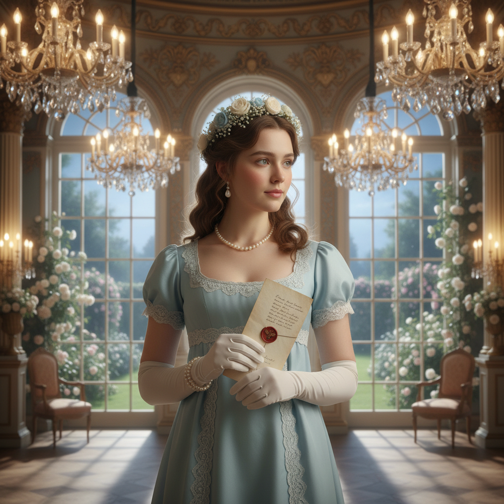

# Regencycore 摄政核



> **"帝政腰线、珍珠手套、舞会请柬——活在简·奥斯汀的小说里。"**

## 概述

| 维度 | 描述 |
|------|------|
| 时期 | 2020–至今 |
| 别名 | Regencycore, Bridgerton Aesthetic, Jane Austen Core |
| 核心色彩 | 淡蓝、淡粉、白色、金色、薰衣草紫 |
| 关键元素 | 帝政腰线连衣裙、珍珠、手套、花冠、舞会 |
| 代表人物 | Netflix《布里奇顿》、简·奥斯汀 |
| 关联风格 | Royalcore, Coquette, Light Academia, Princesscore |

---

## 历史脉络

| 年份 | 事件 |
|------|------|
| 1811–1820 | 英国摄政时期——原始时代 |
| 1813 | 简·奥斯汀《傲慢与偏见》出版 |
| 1995 | BBC《傲慢与偏见》——Colin Firth 版达西 |
| 2020 | Netflix《布里奇顿》首播——Regencycore 爆发 |
| 2022 | 《布里奇顿》第二季——持续流行 |
| 2024 | 第三季——美学持续影响时尚 |

### 核心哲学

Regencycore 的精神是**"优雅是一种态度——在规则中找到自由"**：
- 礼仪 = 美（"每个动作都是舞蹈"）
- 浪漫 = 核心（"一封信可以改变一切"）
- 女性力量 = 在限制中的智慧
- "我想活在一个每天都有舞会的时代"
- 历史 + 幻想 = Regencycore

---

## 视觉语法

### 色彩系统

```
主色：
  淡蓝 (#B0E0E6) — 天空、纯洁
  淡粉 (#FFB6C1) — 浪漫、少女
  白色 (#FFFFFF) — 纯洁、蕾丝
  金色 (#FFD700) — 贵族、装饰
  薰衣草 (#E6E6FA) — 优雅、神秘

辅色：
  深绿 (#006400) — 花园、自然
  酒红 (#722F37) — 成熟、激情
  象牙 (#FFFFF0) — 纸张、丝绸

质感：
  丝绸 — 连衣裙、缎带
  蕾丝 — 手套、边饰
  薄纱 — 覆层、面纱
  珍珠 — 首饰、装饰
  纸张 — 信件、书籍
```

### 标志性元素

| 类别 | 元素 |
|------|------|
| 服装 | 帝政腰线裙、长手套、披肩、燕尾服 |
| 配饰 | 珍珠、扇子、花冠、缎带 |
| 场景 | 舞会、花园、图书馆、马车 |
| 物件 | 手写信、茶具、钢琴、花束 |
| 建筑 | 乡村庄园、柱廊、花园迷宫 |
| 态度 | 优雅、浪漫、礼仪、含蓄 |

---

## 与千禧怀旧的关系

### 《布里奇顿》效应
- Netflix 让摄政时代美学主流化
- 多元化演员 = "这不是历史剧，是幻想"
- 古典音乐翻唱流行歌 = 新旧融合
- "我想要一个摄政时代的婚礼"

### 与 Dark Academia 的对比
- Dark Academia = 学术、严肃、秋冬
- Regencycore = 浪漫、轻盈、春夏
- 两者共享"历史美学"的核心
- 不同的时代、不同的情绪

---

## 中国语境

- 与中国"古风"/"汉服"运动的平行
- 两者都是"穿越回美好时代"的幻想
- 中国观众对《布里奇顿》的接受
- 与中国"宫廷风"的交叉

---

## 设计应用

| 场景 | 应用方式 |
|------|----------|
| 时尚 | 帝政腰线+淡色+珍珠+蕾丝+优雅 |
| 婚礼 | 花园+淡色+珍珠+手写+古典 |
| 空间 | 淡色+花卉+古典家具+自然光 |
| 品牌 | 优雅+浪漫+古典字体+淡色调 |

---

## 相关风格

← [Royalcore 皇室核](royalcore.md) | [Light Academia 浅色学院](light-academia.md) →

↑ [返回千禧怀旧目录](README.md) | [返回总目录](../README.md)
