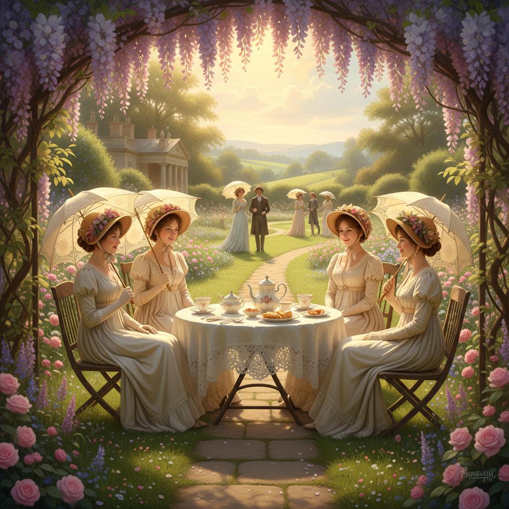

# Regencycore 摄政核




> **"《布里奇顿》让全世界想穿帝政腰线连衣裙去喝下午茶。"**

## 概述

| 维度 | 描述 |
|------|------|
| 时期 | 2020–至今（《布里奇顿》播出后爆发） |
| 别名 | Regencycore, Bridgerton Aesthetic, Empire Waist Revival |
| 核心色彩 | 粉彩蓝、薰衣草、鹅黄、白色、金色 |
| 关键元素 | 帝政腰线裙、珍珠、手套、花冠、丝带 |
| 代表人物 | 《Bridgerton》、Jane Austen 改编电影、《傲慢与偏见》 |
| 关联风格 | Cottagecore, Dark Academia, Coquette Y2K, Royalcore |

---

## 历史脉络

### 2020年12月：《布里奇顿》的引爆

Netflix 剧集《Bridgerton》于 2020 年 12 月 25 日上线，首月即成为 Netflix 历史上观看量最高的剧集之一。它将摄政时代（1811–1820）的视觉美学推入 Z 世代的视野。

**为什么是现在？**
- 疫情期间的逃避主义需求——想逃到一个没有病毒的华丽世界
- 《布里奇顿》的多元化选角让历史剧不再"只属于白人"
- TikTok 的传播力让剧中造型迅速成为穿搭灵感
- 与 Cottagecore 的浪漫主义情绪共振

### 文化基因

| 来源 | 贡献 |
|------|------|
| Jane Austen 改编 | 《傲慢与偏见》(1995/2005) 的乡村庄园美学 |
| 摄政时代时尚 | 帝政腰线、薄纱面料、希腊式垂坠 |
| 英国乡村想象 | 庄园、花园、舞会、下午茶 |
| 浪漫主义文学 | 书信、诗歌、"感性"的崇拜 |
| Cottagecore | 共享田园浪漫主义的情感基底 |

### 2021–至今：持续影响

- #regencycore 在 TikTok 累积数十亿播放
- 帝政腰线连衣裙在快时尚中大量出现
- "Regency era ball" 主题派对在欧美流行
- 与 "dark romance" 小说热潮的交叉

---

## 视觉语法

### 色彩系统

```
主色（《布里奇顿》色板）：
  粉彩蓝 (#B0E0E6) — Bridgerton 家族色
  薰衣草 (#E6E6FA) — 浪漫、优雅
  鹅黄 (#FAFAD2) — 阳光、温暖
  白色 (#FFFFFF) — 薄纱、纯洁
  金色 (#FFD700) — 装饰、首饰

辅色：
  玫瑰粉 (#FF69B4) — 花朵、腮红
  深绿 (#006400) — 花园、常春藤
  象牙 (#FFFFF0) — 手套、信纸

质感：
  薄纱/雪纺 — 轻盈飘逸
  丝绸/缎面 — 光泽优雅
  蕾丝 — 精致装饰
  珍珠 — 温润光泽
  烫金 — 书信、请柬
```

### 标志性元素

| 类别 | 元素 |
|------|------|
| 服装 | 帝政腰线连衣裙、泡泡袖、长手套、披肩 |
| 配饰 | 珍珠项链/耳环、丝带发带、扇子、胸针 |
| 发型 | 摄政时代卷发、花冠、珍珠发饰 |
| 活动 | 舞会、下午茶、花园散步、写信、刺绣 |
| 空间 | 舞厅、花园、图书室、梳妆台 |
| 物品 | 蜡封信、羽毛笔、花束、乐谱 |

---

## 与千禧怀旧的关系

Regencycore 与千禧怀旧的关系是**平行的逃避主义**：
- 千禧怀旧：逃向 2000 年代的数字乐观
- Regencycore：逃向 1810 年代的浪漫幻想
- 共同点：都是对当下的不满，通过美化过去来获得安慰

### 与 2000s 的连接
- 2005年《傲慢与偏见》(Keira Knightley版) 是很多千禧一代的青春记忆
- Jane Austen 改编电影在 2000s 的流行 → 2020s 的 Regencycore 回潮

---

## 中国语境

- "公主风"穿搭中的摄政元素
- 小红书上的"英伦庄园风"
- 与汉服文化的平行：都是对历史服饰的浪漫化复兴
- 下午茶文化在中国的流行
- 《布里奇顿》在中国的传播

---

## 设计应用

| 场景 | 应用方式 |
|------|----------|
| 品牌设计 | 衬线字体+粉彩色+花卉边框+烫金 |
| 包装 | 蜡封+丝带+花卉图案+珍珠色 |
| 空间 | 水晶吊灯+花卉壁纸+丝绒家具 |
| 活动 | 摄政时代主题派对/婚礼/下午茶 |

---

## 延伸阅读

- Aesthetics Wiki: [Regencycore](https://aesthetics.fandom.com/wiki/Regencycore)
- 《Bridgerton》服装设计分析
- 摄政时代时尚史

---

## 相关风格

← [Coquette Y2K 千禧甜心](coquette-y2k.md) | [Cottagecore 田园核](cottagecore.md) →

↑ [返回千禧怀旧目录](README.md) | [返回总目录](../README.md)
