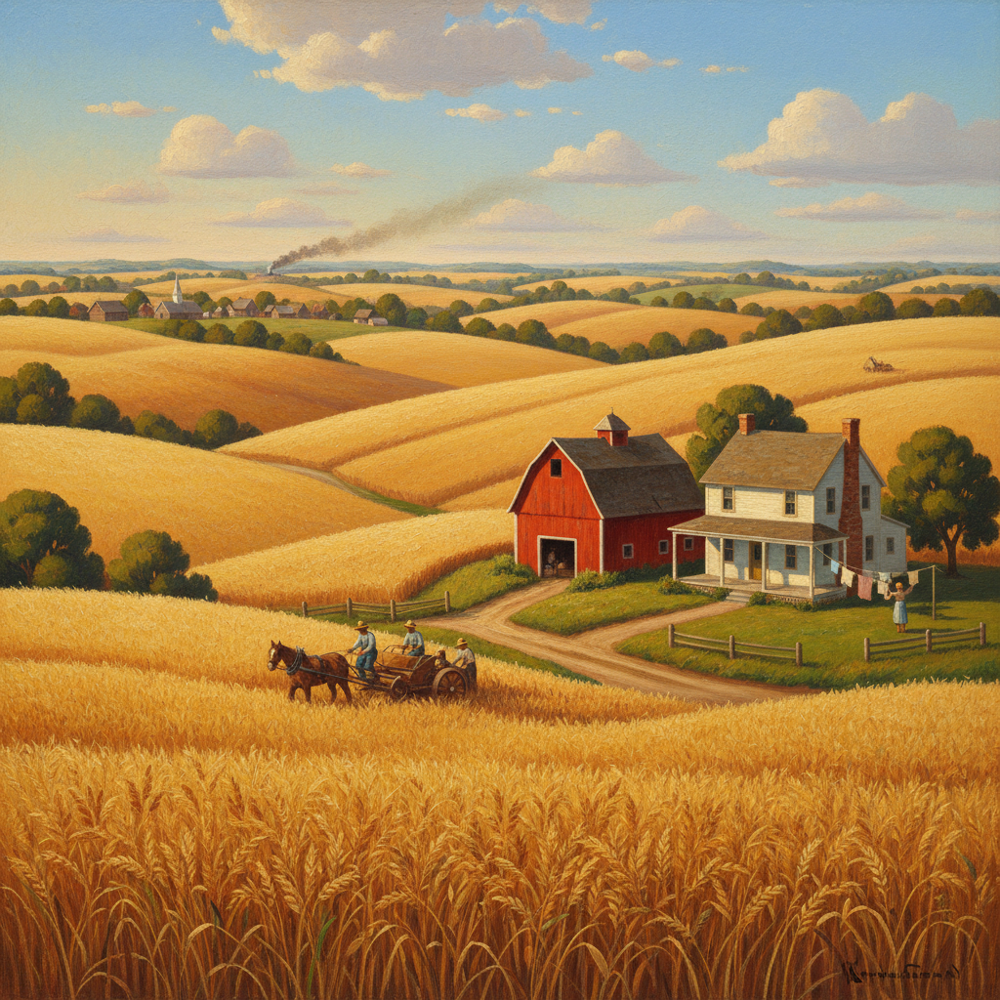

# Regionalism Painting 地方主义绘画

> **时期：** 1930年代  
> **关键词：** 美国中西部、乡村生活、反欧洲现代主义、民族认同、大萧条

## 概述

Regionalism Painting（地方主义绘画）是1930年代美国大萧条时期兴起的绘画运动——画家们拒绝欧洲现代主义的抽象实验，转向描绘美国中西部的乡村生活和价值观。格兰特·伍德的《美国哥特式》、托马斯·哈特·本顿的壁画——他们用清晰可读的写实风格讲述普通美国人的故事，在经济崩溃中寻找国家认同。

## 风格特征

- **清晰写实**：易于理解的叙事性绘画
- **乡村主题**：农场、小镇、劳动场景
- **起伏构图**：中西部丘陵般的韵律感
- **暖色调**：金色麦田和红色谷仓
- **壁画规模**：公共艺术的社会功能

## 代表人物与作品

- 格兰特·伍德《美国哥特式》
- 托马斯·哈特·本顿 美国壁画
- 约翰·斯图尔特·柯里 堪萨斯风暴

## 概念图

