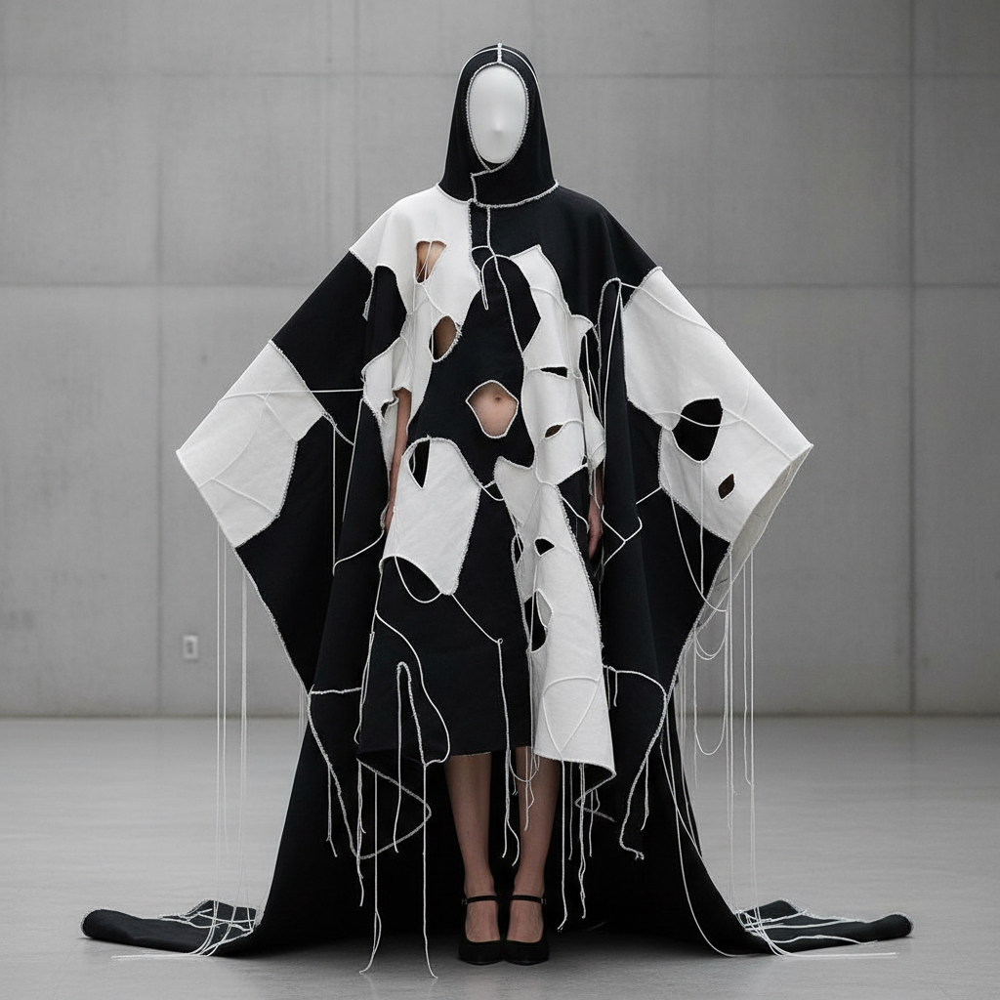

# Rei Kawakubo 川久保玲

> **时期：** 1942–至今  
> **关键词：** Comme des Garçons、解构时装、不对称、反美学

## 概述

Rei Kawakubo 是日本时装设计师，Comme des Garçons创始人。她1981年巴黎首秀以"乞丐风"震惊时尚界——不对称、破洞、黑色、拒绝展示身体曲线——彻底颠覆了西方时尚对美的定义，将时装推向了概念艺术的领域。

## 风格特征

- **反美学**：拒绝传统的美丽和性感标准
- **解构**：衣服被拆解、重组、颠倒
- **黑色**：大量使用黑色，偶尔爆发强烈色彩
- **身体变形**：用填充物改变人体轮廓
- **概念优先**：每季都有明确的概念主题

## 代表作品

- *Body Meets Dress, Dress Meets Body*（1997，"肿块"系列）
- *Broken Bride*（2005）
- *Not Making Clothing*（2014）
- *Comme des Garçons Dover Street Market*

## 概念图

