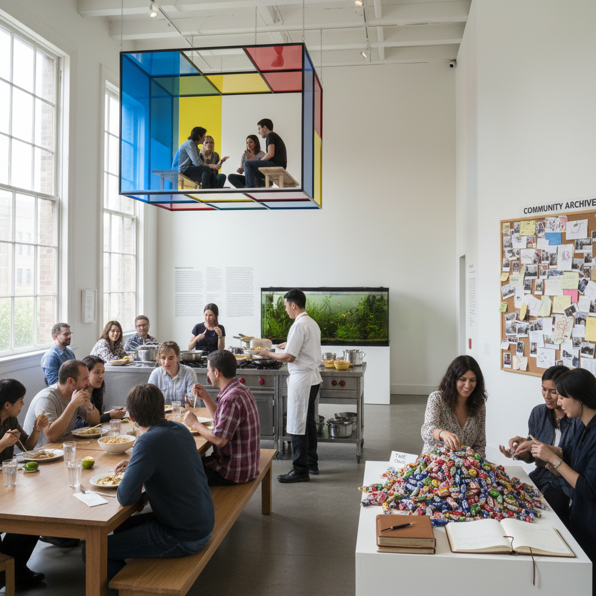

# Relational Aesthetics Art 关系美学

> "Relational aesthetics proposes that art's true medium is not paint or stone but human encounter — the artist creates situations, platforms, and contexts where people come together, share meals, exchange ideas, or simply coexist, the artwork being not the object on the wall but the quality of social interaction it generates, a practice that measures success not in formal beauty but in the richness of human connection it makes possible." — Unknown

## 概述

关系美学（Relational Aesthetics）是法国策展人和批评家尼古拉·布里奥（Nicolas Bourriaud）在1998年同名著作中提出的艺术理论概念，用于描述1990年代一批艺术家的创作实践——他们以人际关系和社会互动作为艺术创作的核心材料和目标。关系美学艺术不生产物品，而是创造"相遇的情境"。

关系美学的代表艺术家包括：里克力·提拉瓦尼亚（Rirkrit Tiravanija，在画廊里做泰国菜给观众吃）、菲利克斯·冈萨雷斯-托雷斯（Felix Gonzalez-Torres，用糖果堆让观众自由取走）、利亚姆·吉利克（Liam Gillick，创造讨论和协作的平台）、皮埃尔·于热（Pierre Huyghe，创造复杂的社会情境和叙事）。关系美学的核心主张是：在一个日益原子化的社会中，艺术的价值在于创造人与人之间真实相遇和交流的可能性。

## 核心特征

| 特征 | 描述 |
|------|------|
| 关系 | 以人际关系为材料 |
| 互动 | 观众的参与和互动 |
| 情境 | 创造相遇的情境 |
| 社会 | 社会性的艺术实践 |
| 过程 | 过程优先于产品 |
| 民主 | 民主和平等的精神 |

## 视觉特征

- **空间**：开放的社交空间
- **食物**：共同进餐的场景
- **对话**：对话和讨论的平台
- **参与**：观众的积极参与
- **临时**：临时性的装置
- **日常**：日常生活的美学化

## 代表作品

| 作品 | 艺术家 | 年代 | 意义 |
|------|--------|------|------|
| *Untitled (Free)* | Rirkrit Tiravanija | 1992 | 在画廊做泰国菜 |
| *Untitled (Portrait of Ross)* | Felix Gonzalez-Torres | 1991 | 糖果堆 |
| *Discussion platforms* | Liam Gillick | 1990年代 | 讨论平台 |
| *No Ghost Just a Shell* | Pierre Huyghe & Philippe Parreno | 1999-2002 | 虚构角色项目 |
| *The Land* | Rirkrit Tiravanija | 1998起 | 泰国的艺术社区 |

## 历史时间线

| 时期 | 事件 |
|------|------|
| 1990年代初 | 关系艺术实践的兴起 |
| 1996 | "Traffic"展览（布里奥策划） |
| 1998 | 布里奥出版《关系美学》 |
| 2000年代 | 关系美学的全球化传播 |
| 当代 | 社会实践艺术的发展 |

## 中国语境

关系美学在中国当代艺术中有独特的回响。中国的一些社会实践艺术家创造了类似关系美学的参与式项目——如欧宁的"碧山计划"（在安徽农村创建艺术社区）、徐坦的"关键词"项目（通过对话探索社会议题）。中国传统文化中的"雅集"传统（文人聚会、品茶、赏画、吟诗）本身就是一种古老的"关系美学"实践。中国当代的社区艺术、乡村建设运动和公共艺术项目中都可以看到关系美学的影响。

## AI生成概念图

## 与其他风格的关系

- **Social Practice** → 社会实践艺术
- **Participatory Art** → 参与式艺术
- **Conceptual Art** → 概念艺术
- **Institutional Critique** → 体制批判
- **Happening** → 偶发艺术
- **Community Art** → 社区艺术

---

*浮光艺志 | Chronicle of Artistry*
