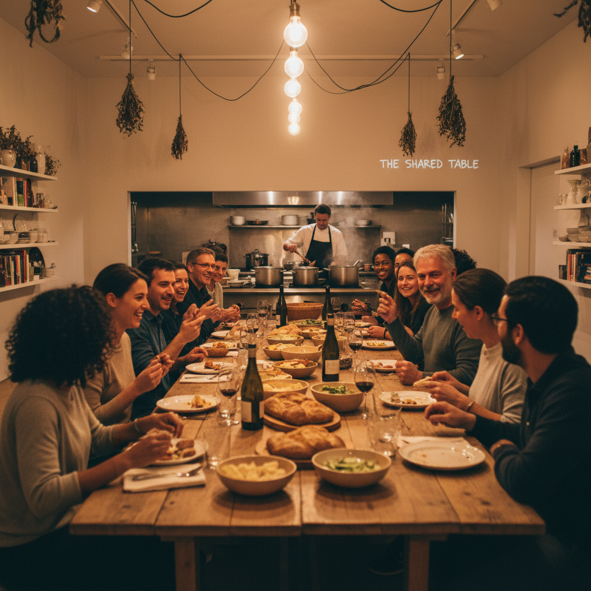

# Relational Aesthetics 关系美学

> "Art is a state of encounter." — Nicolas Bourriaud

## 概述

关系美学（Relational Aesthetics / Esthétique relationnelle）是1990年代由法国策展人和批评家尼古拉·布里奥（Nicolas Bourriaud）提出的艺术理论和实践框架。它主张艺术的核心不是创造物品，而是创造人与人之间的关系和社会交往情境——艺术品是一个"社会间隙"（social interstice），在其中人们可以体验不同于日常资本主义交换逻辑的相处方式。

关系美学标志着当代艺术从"物"到"关系"、从"观看"到"参与"的范式转变。

## 核心特征

| 特征 | 描述 |
|------|------|
| 关系优先 | 人际关系和社会交往是艺术的材料 |
| 参与性 | 观众不是旁观者而是参与者/共同创作者 |
| 情境创造 | 艺术家创造相遇的情境而非物品 |
| 微观乌托邦 | 在艺术空间中实验替代性的社会关系 |
| 日常性 | 烹饪、对话、聚会都可以是艺术 |
| 反商品化 | 体验无法被买卖和收藏 |

## 视觉特征

- **空间**：画廊变成客厅、厨房、游乐场
- **材料**：食物、家具、日常用品、人
- **形式**：聚会、晚餐、工作坊、对话
- **文档**：照片、视频记录参与过程
- **氛围**：温暖的、邀请性的、非正式的
- **边界**：艺术与生活的边界被刻意模糊

## 代表作品

| 作品 | 艺术家 | 年代 | 意义 |
|------|--------|------|------|
| *Untitled (Free)* | Rirkrit Tiravanija | 1992 | 在画廊里煮泰国咖喱请观众吃 |
| *The Land* | Tiravanija & Kamin Lertchaiprasert | 1998+ | 泰国的社区农场/艺术项目 |
| *No Ghost Just a Shell* | Pierre Huyghe & Philippe Parreno | 1999 | 共享虚构角色的协作项目 |
| *Palais de Tokyo* | Various | 2002+ | 关系美学的机构化实践 |
| *The Battle of Orgreave* | Jeremy Deller | 2001 | 社区参与的历史重演 |
| *Theaster Gates projects* | Theaster Gates | 2009+ | 艺术作为社区复兴 |

## 历史时间线

| 时期 | 事件 |
|------|------|
| 1992 | Tiravanija在纽约303 Gallery煮咖喱——关系美学的标志性时刻 |
| 1996 | "Traffic"展览（波尔多）——Bourriaud策划 |
| 1998 | Bourriaud出版《关系美学》（Esthétique relationnelle） |
| 2002 | Palais de Tokyo开馆——关系美学的机构化 |
| 2004 | Claire Bishop发表批评文章"Antagonism and Relational Aesthetics" |
| 2010s | 社会实践艺术（Social Practice）成为主流 |

## 子类型

| 子类型 | 特征 |
|--------|------|
| 烹饪/聚会 | Tiravanija——食物作为社交媒介 |
| 社区项目 | Gates、Bruguera——艺术作为社区建设 |
| 对话艺术 | Kester——对话和协商作为艺术形式 |
| 参与式剧场 | Deller——社区参与的事件 |
| 礼物经济 | 免费赠予作为对商品逻辑的抵抗 |

## 中国语境

关系美学在中国当代艺术中有独特的回响。中国传统文化中的"人情"、"关系"本身就是一种社会艺术。当代实践中，徐震的"没顶公司"模糊了艺术与商业的边界；社区艺术项目如"碧山计划"（欧宁）试图用艺术重建乡村社区关系。但在中国语境下，"关系"一词本身就带有权力网络的含义，使关系美学的"微观乌托邦"理想面临更复杂的现实。

## 争议与遗产

- **Bishop批评**：Claire Bishop指出关系美学回避了对抗和冲突，创造的是"舒适的共识"
- **精英主义**：画廊里的免费晚餐真的能改变社会关系吗？
- **文档化悖论**：体验性作品最终还是变成了照片和文字
- **遗产**：为社会实践艺术、社区艺术、参与式设计奠定理论基础
- **当代回响**：共享经济、社区营造、参与式城市规划

## AI生成概念图

## 与其他风格的关系

- **Fluxus** → 激浪派的事件性和日常性是关系美学的先驱
- **Situationism** → 情境主义的"构建情境"理念直接影响关系美学
- **Performance Art** → 行为艺术的现场性和参与性
- **Conceptual Art** → 概念艺术的去物质化为关系美学铺路
- **Social Practice** → 社会实践艺术是关系美学的延伸和深化
- **Community Art** → 社区艺术共享参与和赋权的理念

---

*浮光艺志 | Chronicle of Artistry*
