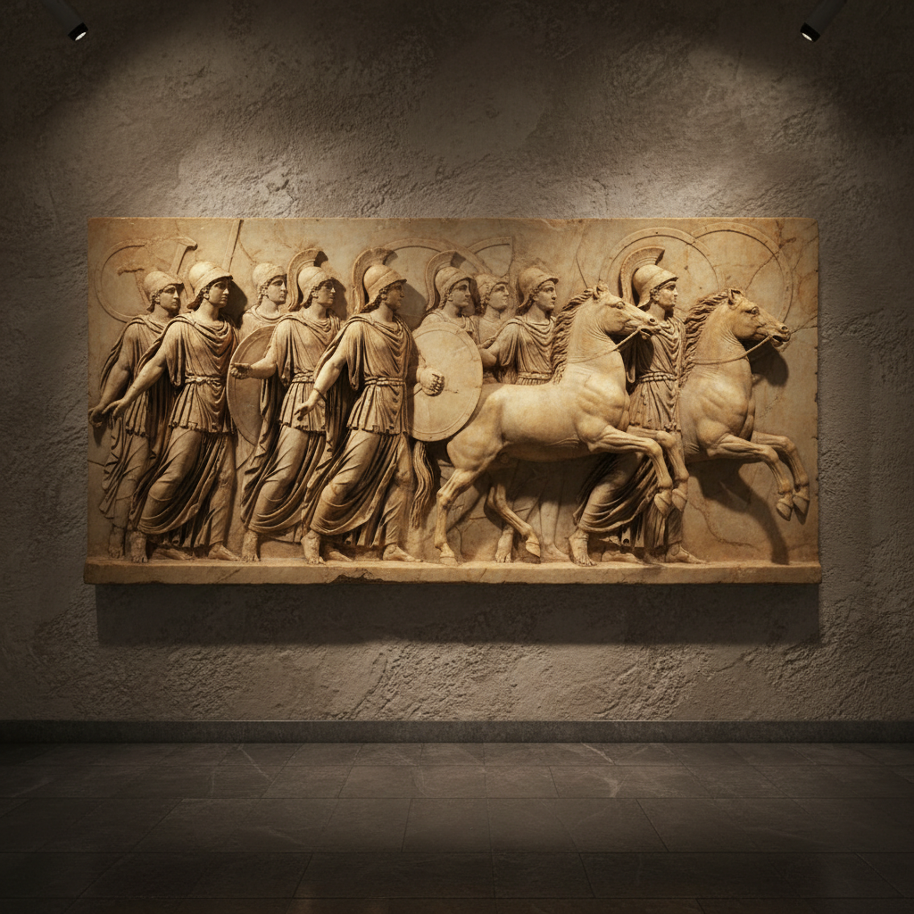

# Relief Art 浮雕艺术

> "Relief is the meeting point of painting and sculpture." — Lorenzo Ghiberti

## 概述

浮雕艺术（Relief Art）是介于绘画和圆雕之间的艺术形式——图像从平面背景上凸起，但不完全脱离背景。从古埃及神庙的壁面浮雕到文艺复兴的青铜门板，从古希腊帕特农神庙的饰带到当代的浮雕装置，浮雕是人类最持久的纪念性艺术形式之一。

浮雕的魅力在于它同时拥有绘画的叙事性和雕塑的物质性——光影在凸起的表面上游走，赋予平面以生命。

## 核心特征

| 特征 | 描述 |
|------|------|
| 半立体 | 介于平面和圆雕之间 |
| 背景依附 | 图像不完全脱离背景 |
| 光影性 | 依赖光影产生立体效果 |
| 叙事性 | 适合连续叙事——如饰带 |
| 建筑性 | 常与建筑结合 |
| 层次性 | 高浮雕、低浮雕、凹浮雕 |

## 视觉特征

- **深度**：从几毫米到几十厘米的凸起
- **光影**：侧光下的丰富明暗变化
- **叙事**：连续的场景叙事
- **材质**：石头、金属、木头、陶瓷
- **构图**：在有限深度中创造空间感
- **细节**：精细的表面雕刻

## 代表作品

| 作品 | 地点/艺术家 | 年代 | 意义 |
|------|-------------|------|------|
| *帕特农神庙饰带* | 雅典 | 公元前5世纪 | 古希腊浮雕的巅峰 |
| *图拉真柱* | 罗马 | 113年 | 连续叙事浮雕的极致 |
| *天堂之门* | Ghiberti | 1452 | 文艺复兴青铜浮雕 |
| *吴哥窟浮雕* | 柬埔寨 | 12世纪 | 东南亚浮雕的巅峰 |
| *人民英雄纪念碑浮雕* | 中国 | 1958 | 现代纪念性浮雕 |
| *Richard Serra reliefs* | Richard Serra | 2000s | 当代抽象浮雕 |

## 历史时间线

| 时期 | 事件 |
|------|------|
| 远古 | 岩画——最早的浮雕形式 |
| 古埃及 | 神庙壁面的叙事浮雕 |
| 古希腊 | 帕特农神庙——古典浮雕的巅峰 |
| 古罗马 | 凯旋门和纪念柱的浮雕 |
| 中世纪 | 教堂门楣和柱头浮雕 |
| 文艺复兴 | Ghiberti、Donatello——浮雕的革新 |
| 19-20世纪 | 纪念碑浮雕 |
| 当代 | 浮雕作为当代艺术形式 |

## 中国语境

中国有悠久的浮雕传统——从商周青铜器上的饕餮纹到汉代画像石，从唐代石窟造像到明清建筑装饰，浮雕贯穿了中国艺术史。人民英雄纪念碑的八块浮雕是现代中国纪念性浮雕的代表。当代中国的城市雕塑中浮雕仍然是重要形式。

## AI生成概念图

## 与其他风格的关系

- **Sculpture** → 浮雕是雕塑的重要分支
- **Mural Art** → 浮雕壁画是壁画的立体形式
- **Architecture** → 浮雕与建筑装饰紧密结合
- **Coin Art** → 硬币是微型浮雕
- **Printmaking** → 版画的凸版原理与浮雕相关
- **Ceramic Art** → 陶瓷浮雕是重要的装饰形式

---

*浮光艺志 | Chronicle of Artistry*
