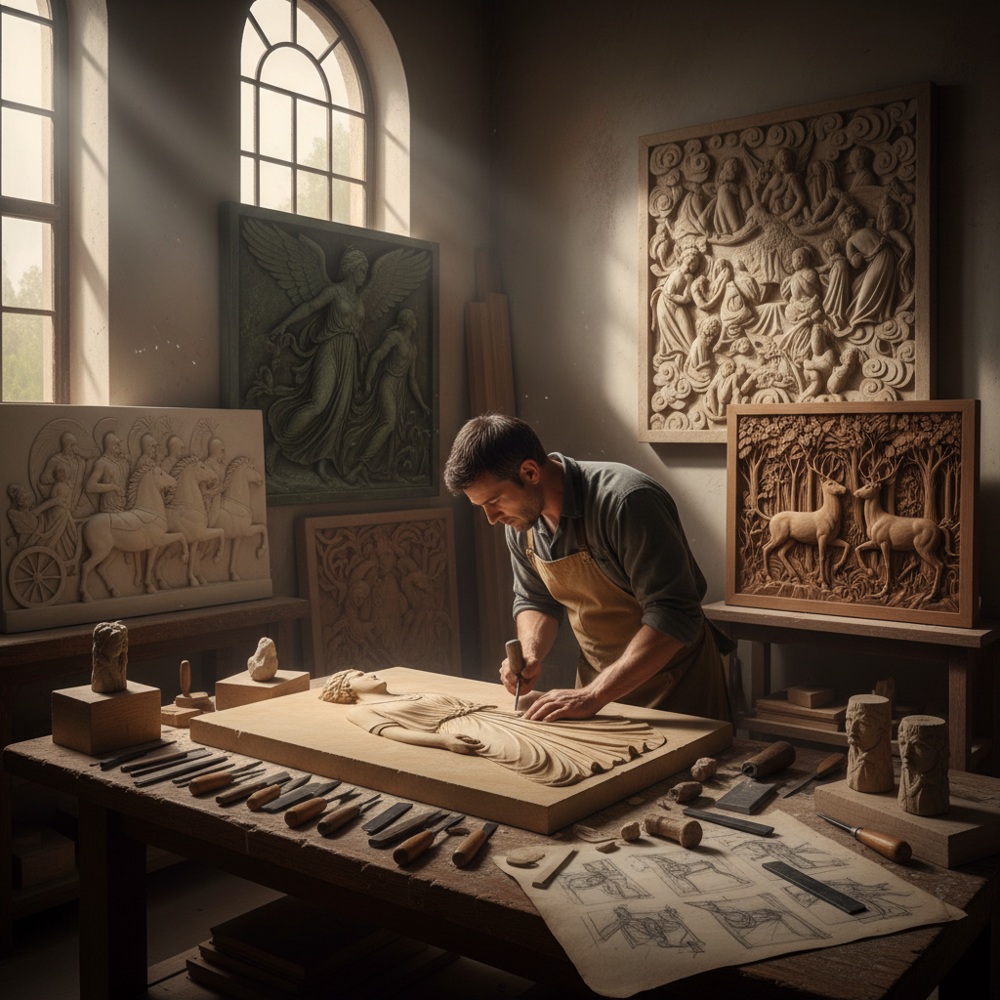

# Relief Carving Art 浮雕艺术

> "Relief carving exists in the space between drawing and sculpture — figures emerge from a flat background as if pushing through from another world, caught forever in the act of becoming three-dimensional. The relief carver must think in compressed depth, creating the illusion of full roundness within inches of actual projection, using the angle of light as an ally to suggest volumes that are not truly there." — Unknown

## 概述

浮雕艺术（Relief Carving Art）是在平面材料（木材、石材、金属等）表面雕刻出凸起图案的造型艺术——图案从背景中凸出但不完全脱离背景平面，通过不同的凸起高度创造出从浅浮雕到高浮雕的各种效果。浮雕是建筑装饰和器物装饰中最常见的雕刻形式。

浮雕艺术的实践包括：1）浅浮雕——凸起很低的精细浮雕；2）高浮雕——凸起较高接近圆雕的浮雕；3）凹浮雕——向内凹陷的浮雕（如古埃及）；4）建筑浮雕——建筑外墙和内部的浮雕装饰；5）木浮雕——木材上的浮雕雕刻；6）石浮雕——石材上的浮雕雕刻；7）当代浮雕——将传统技法与现代艺术结合的创作。

## 核心特征

| 特征 | 描述 |
|------|------|
| 半立体 | 介于平面和立体之间 |
| 光影 | 依赖光影表现深度 |
| 叙事 | 强大的叙事能力 |
| 装饰 | 优秀的装饰效果 |
| 建筑 | 与建筑紧密结合 |
| 多材 | 适用于多种材料 |

## 视觉特征

- **层次**：前后层次的空间感
- **光影**：凸起表面的光影变化
- **深度**：压缩的深度表现
- **背景**：平整的背景衬托
- **轮廓**：清晰的轮廓线条
- **叙事**：连续的叙事场景

## 代表作品

| 作品 | 艺术家/文化 | 年代 | 意义 |
|------|-------------|------|------|
| *Parthenon frieze* | 古希腊 | 公元前5世纪 | 古希腊浮雕巅峰 |
| *Trajan's Column* | 古罗马 | 113年 | 罗马叙事浮雕 |
| *Angkor Wat reliefs* | 高棉 | 12世纪 | 东南亚浮雕 |
| *Ghiberti's Gates of Paradise* | Ghiberti | 1452 | 文艺复兴浮雕 |
| *大足石刻* | 中国宋代 | 9-13世纪 | 中国石刻浮雕 |

## 历史时间线

| 时期 | 事件 |
|------|------|
| 史前 | 最早的岩壁浮雕 |
| 古代 | 埃及、希腊、罗马浮雕 |
| 中世纪 | 教堂和寺庙浮雕 |
| 文艺复兴 | 浮雕艺术的高峰 |
| 当代 | 浮雕的多元发展 |

## 中国语境

浮雕艺术在中国有极其丰富的传统——从建筑装饰到器物装饰，浮雕无处不在。中国的石窟艺术中有大量精美的浮雕——如大足石刻的佛教浮雕被列入世界文化遗产。中国传统建筑中的砖雕、石雕和木雕大多采用浮雕形式——从门楼到照壁，从梁枋到窗棂。中国的玉雕中，"薄意"是一种极其精细的浅浮雕技法——在寿山石和玉石上雕刻出如同绘画般的浅浮雕。中国的青铜器上的纹饰也是浮雕的一种形式——饕餮纹、龙纹等都是浮雕表现。中国当代的一些雕塑家将传统浮雕技法与现代艺术理念相结合——创造具有当代感的浮雕作品。中国的城市公共艺术中，浮雕墙是常见的形式——用于表现历史故事和文化主题。

## AI生成概念图

## 与其他风格的关系

- **Sculpture** → 雕塑
- **Stone Carving** → 石雕
- **Wood Carving** → 木雕
- **Architecture** → 建筑艺术
- **Chip Carving** → 剔花雕刻
- **Coin Art** → 钱币艺术

---

*浮光艺志 | Chronicle of Artistry*
