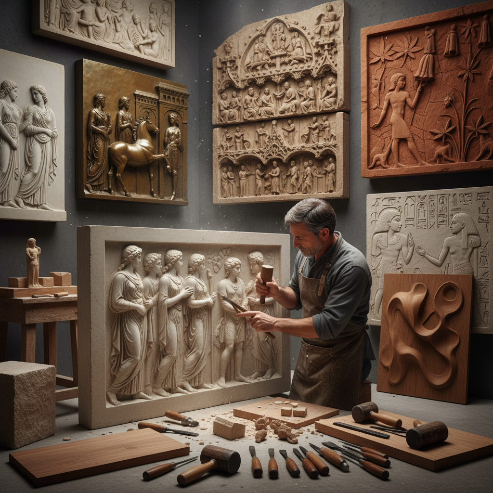

# Relief Carving 浮雕

> "Relief carving is sculpture that refuses to leave the wall — figures emerging from flat backgrounds as if pushing through from another dimension, catching light and casting shadow to create the illusion of depth while remaining anchored to their ground, a conversation between two and three dimensions that has decorated temples, cathedrals, and palaces since the dawn of civilization." — Unknown

## 概述

浮雕（Relief Carving）是一种在平面材料（木材、石材、象牙、金属等）表面雕刻出凸起图案的雕塑技法。浮雕的图案从背景中凸出，但仍然附着在背景平面上——介于完全平面的绘画和完全立体的圆雕之间。根据凸起的程度，浮雕分为：高浮雕（high relief/alto-rilievo，凸起超过一半厚度）、低浮雕（low relief/bas-relief，凸起较浅）和凹浮雕（sunken relief/intaglio，图案凹入表面）。

浮雕是人类最古老的艺术形式之一——从旧石器时代的洞穴浮雕到古埃及神庙的墙面浮雕，从古希腊帕特农神庙的饰带到文艺复兴时期吉贝尔蒂的"天堂之门"。浮雕在建筑装饰、纪念碑、钱币、奖章和家具装饰中有广泛应用。

## 核心特征

| 特征 | 描述 |
|------|------|
| 凸起 | 图案从平面凸起 |
| 附着 | 附着在背景上 |
| 光影 | 利用光影效果 |
| 层次 | 多层次的深度 |
| 建筑 | 常用于建筑装饰 |
| 叙事 | 叙事性的场景 |

## 视觉特征

- **立体**：从平面凸起的立体感
- **光影**：光影创造的深度
- **层次**：前景中景背景的层次
- **纹理**：雕刻的表面纹理
- **叙事**：连续叙事的场景
- **装饰**：建筑装饰的功能

## 代表作品

| 作品 | 艺术家 | 年代 | 意义 |
|------|--------|------|------|
| *Parthenon Frieze* | Phidias | 公元前5世纪 | 帕特农神庙饰带 |
| *Gates of Paradise* | Lorenzo Ghiberti | 1425-1452 | 天堂之门 |
| *Trajan's Column* | 罗马工匠 | 113 AD | 图拉真柱 |
| *Angkor Wat reliefs* | 高棉工匠 | 12世纪 | 吴哥窟浮雕 |
| *Grinling Gibbons carvings* | Grinling Gibbons | 17世纪 | 吉本斯木浮雕 |

## 历史时间线

| 时期 | 事件 |
|------|------|
| 旧石器时代 | 洞穴浮雕的起源 |
| 古埃及 | 神庙墙面浮雕 |
| 古希腊罗马 | 建筑浮雕的鼎盛 |
| 文艺复兴 | 浮雕的艺术化发展 |
| 当代 | 浮雕在当代艺术中的应用 |

## 中国语境

浮雕在中国有极其悠久和丰富的传统。中国的石窟艺术（如龙门石窟、云冈石窟）包含大量精美的浮雕。中国传统建筑中的砖雕、石雕、木雕都大量使用浮雕技法。中国的玉雕传统中也有精美的浮雕作品。当代中国的城市雕塑和纪念碑中广泛使用浮雕。中国的浮雕传统在题材上以佛教故事、历史人物、花鸟山水为主。中国的砖雕（如徽州砖雕）是国家级非物质文化遗产。

## AI生成概念图

## 与其他风格的关系

- **Sculpture** → 雕塑
- **Wood Carving** → 木雕
- **Stone Carving** → 石雕
- **Architectural Decoration** → 建筑装饰
- **Coin Design** → 钱币设计
- **Intarsia** → 木镶嵌

---

*浮光艺志 | Chronicle of Artistry*
