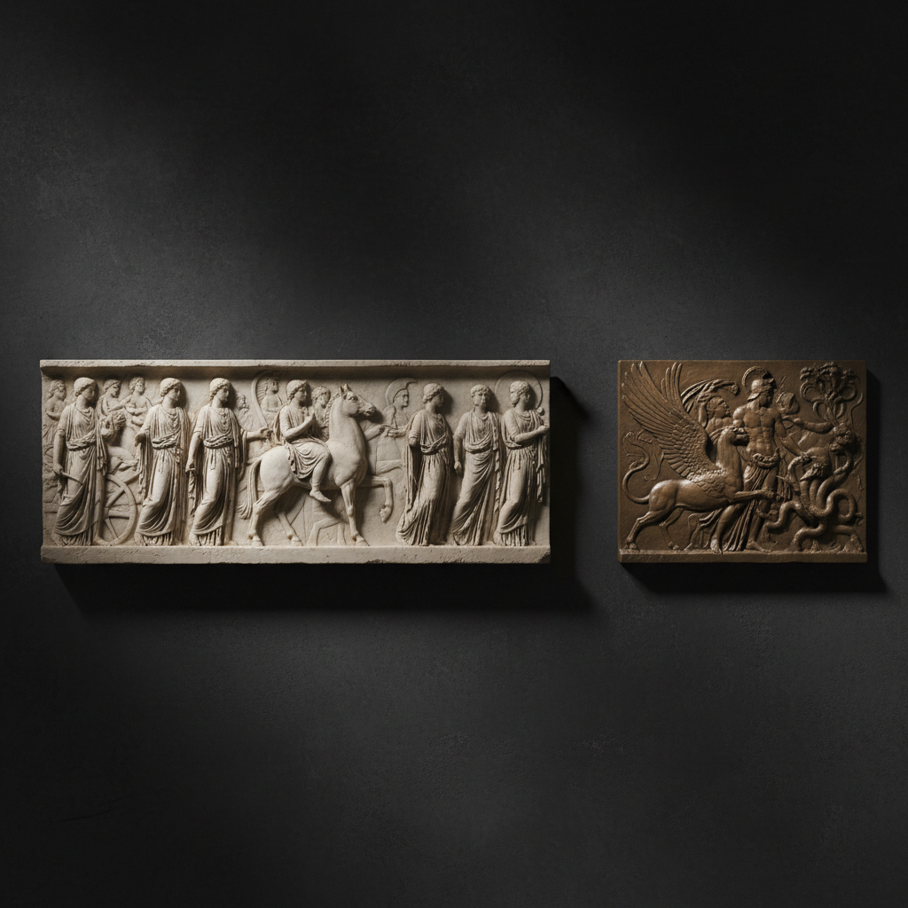

# Relief Sculpture 浮雕

> "Relief is the art of emergence — figures rising from stone as if waking from a dream." — Unknown

## 概述

浮雕（Relief Sculpture）是介于平面绘画和圆雕之间的雕塑形式——图像从平面背景中凸起，但不完全脱离背景。根据凸起程度分为浅浮雕（bas-relief）、中浮雕（mezzo-relief）和高浮雕（high relief）。从古埃及神庙的墙面到帕特农神庙的饰带，从中国的画像石到罗丹的《地狱之门》，浮雕是人类最古老、最普遍的雕塑形式——它将三维的世界压缩在二维的平面上，创造出独特的空间幻觉。

浮雕的哲学在于：从平面中诞生立体——它是雕塑与绘画的交汇点，是空间压缩的艺术。

## 核心特征

| 特征 | 描述 |
|------|------|
| 凸起 | 图像从背景凸起 |
| 背景 | 保留平面背景 |
| 层次 | 前后层次的空间感 |
| 光影 | 依赖光影表现立体 |
| 叙事 | 适合连续叙事 |
| 建筑 | 常与建筑结合 |

## 视觉特征

- **凸起**：从平面中凸起的形象
- **光影**：侧光下的戏剧性光影
- **层次**：前景中景背景的层次
- **连续**：适合长卷式连续叙事
- **建筑**：与建筑表面的结合
- **材质**：石材、金属、木材等

## 代表作品

| 作品 | 艺术家 | 年代 | 意义 |
|------|--------|------|------|
| *Parthenon frieze* | Phidias | 公元前5世纪 | 古希腊浮雕巅峰 |
| *Trajan's Column* | 匿名 | 113 AD | 罗马叙事浮雕 |
| *Angkor Wat reliefs* | 匿名 | 12世纪 | 吴哥窟浮雕 |
| *Gates of Paradise* | Ghiberti | 1425-52 | 文艺复兴浮雕 |
| *Gates of Hell* | Auguste Rodin | 1880-1917 | 现代浮雕杰作 |

## 历史时间线

| 时期 | 事件 |
|------|------|
| 史前 | 洞穴中的早期浮雕 |
| 古埃及 | 神庙墙面浮雕 |
| 古希腊 | 帕特农神庙饰带 |
| 古罗马 | 凯旋门和纪念柱 |
| 中世纪 | 教堂门楣浮雕 |
| 文艺复兴 | Ghiberti的天堂之门 |
| 当代 | 浮雕在当代艺术中 |

## 中国语境

中国的浮雕传统极其丰富——从汉代画像石、画像砖到唐代昭陵六骏，从宋代石窟造像到明清建筑装饰。中国浮雕的独特之处在于将绘画的构图法则（散点透视）融入雕塑，创造出独特的叙事空间。龙门石窟、云冈石窟中的浮雕是中国古代浮雕的巅峰。当代中国的城市雕塑中浮雕仍然是重要形式。

## AI生成概念图

## 与其他风格的关系

- **Sculpture** → 雕塑的平面形式
- **Repoussé** → 金属浮雕技法
- **Architecture** → 建筑装饰浮雕
- **Coin Design** → 硬币上的浮雕
- **Cameo** → 宝石浮雕
- **Woodcarving** → 木雕浮雕

---

*浮光艺志 | Chronicle of Artistry*
