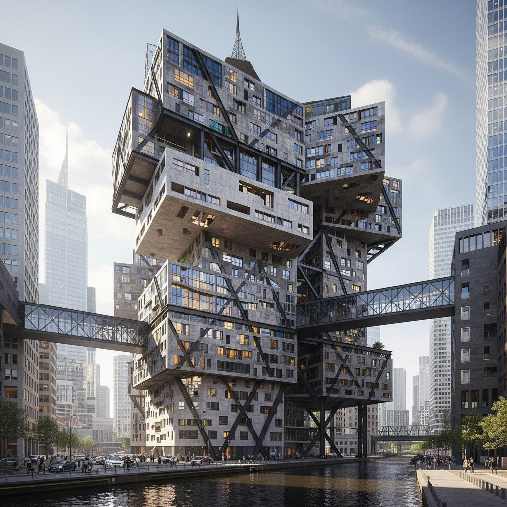

# Rem Koolhaas 雷姆·库哈斯

> **时期：** 1944–至今  
> **关键词：** 大都会主义、OMA、反乌托邦现实主义、理论建筑

## 概述

Rem Koolhaas 是荷兰建筑师和理论家，普利兹克奖得主。他既是建筑师也是城市研究者——用写作和建筑同时工作，将购物中心、机场、摩天楼等"垃圾空间"视为当代城市的真实面貌，拒绝乌托邦幻想，拥抱混乱和矛盾。

## 风格特征

- **大尺度**：偏好巨型建筑和城市尺度的思考
- **材料混搭**：混凝土、钢、玻璃、彩色塑料等材料自由组合
- **剖面设计**：从剖面而非平面出发设计空间
- **理论驱动**：每个项目都有理论框架和叙事
- **反形式主义**：拒绝统一的风格标签

## 代表作品

- *西雅图中央图书馆*（2004）
- *CCTV总部大楼*（2012）
- *波尔图音乐厅*（2005）
- *深圳证券交易所*（2013）

## 概念图

