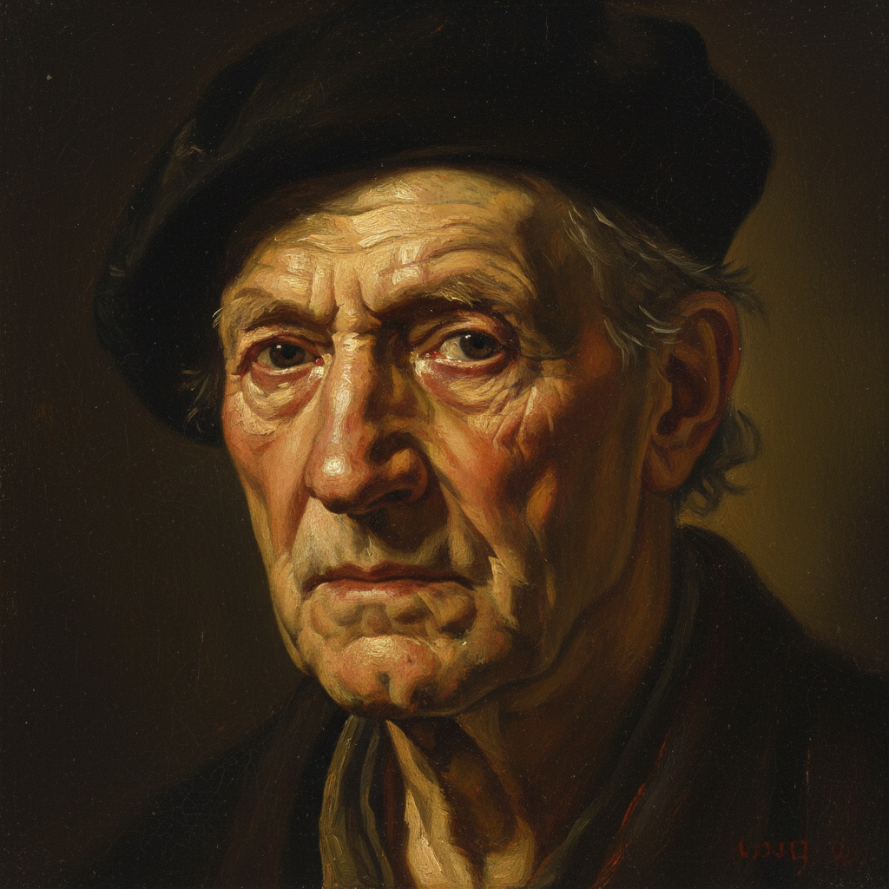

# Rembrandt van Rijn 伦勃朗

> "Choose only one master — Nature." — Rembrandt van Rijn

## 概述

伦勃朗·哈尔曼松·凡·莱因（Rembrandt Harmenszoon van Rijn，1606–1669）是荷兰黄金时代最伟大的画家，也是西方艺术史上最深刻的人性观察者之一。他以无与伦比的明暗法（chiaroscuro）、对人物心理的深刻洞察和晚期越来越自由的笔触著称。

伦勃朗一生创作了约300幅油画、300幅蚀刻版画和2000幅素描，其中近100幅自画像记录了他从意气风发到晚年落魄的完整人生。

## 核心特征

| 特征 | 描述 |
|------|------|
| 伦勃朗光线 | 标志性的三角形面部光影——一侧照亮，另一侧阴影中有三角形光斑 |
| 心理深度 | 人物内心世界的深刻揭示 |
| 厚涂高光 | 珠宝、金属等高光处的厚重颜料 |
| 透明暗部 | 阴影区域的透明罩染，深邃而非死黑 |
| 晚期自由 | 晚年笔触越来越粗犷自由 |
| 自画像 | 近100幅自画像——艺术史上最诚实的自我审视 |

## 视觉特征

- **光线**：温暖的金色光芒从黑暗中浮现
- **色调**：深褐、金色、暗红为主
- **笔触**：早期精细，晚期粗犷有力
- **暗部**：透明的、有深度的阴影
- **高光**：厚涂的白色和金色
- **人物**：真实的、不理想化的面容

## 代表作品

| 作品 | 年代 | 意义 |
|------|------|------|
| *The Night Watch* | 1642 | 群像画的革命——打破静态排列 |
| *The Anatomy Lesson of Dr. Nicolaes Tulp* | 1632 | 早期成名作 |
| *Self-Portrait with Two Circles* | c.1665 | 晚期自画像巅峰 |
| *The Return of the Prodigal Son* | c.1668 | 最后的杰作——宽恕与慈悲 |
| *The Jewish Bride* | c.1667 | 梵高称之为"世界上最亲密的画" |
| *Bathsheba at Her Bath* | 1654 | 人体画的心理深度 |

## 真实作品（公共领域）

伦勃朗的作品已进入公共领域：

| 作品 | 来源 |
|------|------|
| *The Night Watch* | [Rijksmuseum](https://www.rijksmuseum.nl/en/stories/operation-night-watch) |
| *Self-Portrait (1659)* | [National Gallery of Art](https://www.nga.gov/collection/art-object-page.79.html) |
| *The Return of the Prodigal Son* | [Hermitage Museum](https://www.hermitagemuseum.org/) |

> ⚠️ 本条目优先使用真实作品。如需本地图片，请从上述来源手动下载后放入 `assets/artworks/rembrandt/` 并压缩。

## AI生成概念图（备用）

## 历史背景

1. **1606年**：出生于莱顿
2. **1631年**：移居阿姆斯特丹，迅速成名
3. **1642年**：创作《夜巡》；妻子萨斯基亚去世
4. **1650年代**：经济困难，风格转向更深沉内省
5. **1656年**：宣告破产
6. **1660年代**：晚期杰作——最自由、最深刻的作品
7. **1669年**：在贫困中去世

## 与其他风格的关系

- **Chiaroscuro** → 发展出独特的"伦勃朗光线"
- **Dutch Golden Age** → 荷兰黄金时代的最高代表
- **Baroque** → 巴洛克戏剧性的北方诠释
- **Impasto** → 厚涂技法的早期大师
- **Glazing** → 透明暗部的罩染大师
- **Expressionism** → 晚期自由笔触预示了表现主义

---

*浮光艺志 | Chronicle of Artistry*
