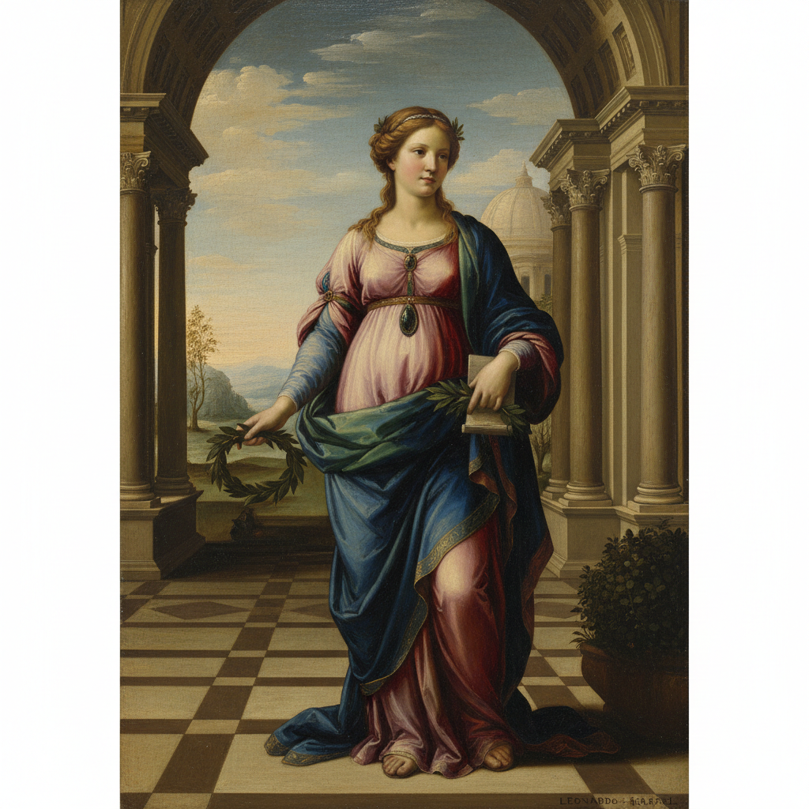

# Renaissance 文艺复兴



> **"人是万物的尺度——透视法、解剖学、明暗法——用科学的精确画出神圣的美。"**

## 概述

| 维度 | 描述 |
|------|------|
| 时期 | 1400–1600/影响至今 |
| 别名 | Renaissance, Italian Renaissance, High Renaissance, 文艺复兴 |
| 核心色彩 | 深沉宝石色、金色、肉色、天空蓝、大地色 |
| 关键元素 | 透视法、解剖学、明暗法(chiaroscuro)、古典构图、人文主义 |
| 代表人物 | Leonardo da Vinci, Michelangelo, Raphael, Botticelli, Titian |
| 关联风格 | Baroque, Neoclassicism, Academic Art, Pre-Raphaelite |

---

## 历史脉络

| 年份 | 事件 |
|------|------|
| 1401 | 佛罗伦萨洗礼堂大门竞赛——文艺复兴开始 |
| 1435 | Alberti《论绘画》——透视法理论化 |
| 1482 | Botticelli《春》——古典神话复兴 |
| 1503 | Leonardo《蒙娜丽莎》——肖像画革命 |
| 1508 | Michelangelo 西斯廷天顶画——人体的极致 |
| 1511 | Raphael《雅典学院》——完美构图 |
| 2020s | 文艺复兴美学在AI生图中持续流行 |

### 核心哲学

文艺复兴的精神是**"人可以理解世界——并用艺术证明这种理解"**：
- 人文主义 = 核心（"人不再只是上帝的仆人——人本身就值得被画"）
- 科学 = 工具（"透视法、解剖学——用科学让艺术更真实"）
- 古典 = 理想（"希腊罗马的美 = 永恒的标准"）
- 完美 = 追求（"每一幅画都追求完美的构图、完美的比例"）
- Leonardo: "绘画是一门科学"

---

## 视觉语法

### 色彩系统

```
主色：
  深蓝 (#00008B) — 圣母、天空（群青颜料极贵）
  金色 (#DAA520) — 神圣、光环、装饰
  肉色 (#FFDAB9) — 人体、温暖
  深红 (#8B0000) — 权力、基督

辅色：
  大地色 (#8B4513) — 背景、建筑
  翡翠绿 (#50C878) — 自然、希望
  黑色 (#000000) — 阴影、深度

规则：
  - 明暗法(chiaroscuro)
  - 色彩服务于体积感
  - 深色背景+亮色人物
  - 颜料的珍贵决定用色

质感：
  油画 — 多层罩染
  光滑 — 看不见笔触
  肌肤 — sfumato(烟雾法)
  织物 — 丝绸、天鹅绒
```

### 标志性元素

| 类别 | 元素 |
|------|------|
| 技法 | 透视法、明暗法、sfumato、解剖学 |
| 构图 | 金字塔构图、对称、古典比例 |
| 题材 | 宗教、神话、肖像、历史 |
| 人体 | 理想化比例、肌肉解剖、优雅姿态 |
| 建筑 | 古典柱式、拱门、透视空间 |
| 态度 | 完美、理性、人文、科学、古典 |

---

## 与千禧怀旧的关系

### "永恒的美"
- 《蒙娜丽莎》= 全球最著名的画
- 文艺复兴 = "美"的标准定义
- "每次有人说'像油画一样美'——他们说的就是文艺复兴"
- AI生图中"Renaissance style"是经典风格标签

### 对一切视觉文化的基础影响
- 透视法 → 摄影 → 电影 → 游戏 → VR
- 人体比例 → 时尚 → 角色设计
- 构图法则 → 平面设计 → UI设计
- "文艺复兴不是一种风格——是所有西方视觉的基础语法"

---

## 中国语境

- 文艺复兴对中国近代美术教育的影响
- 中国美术学院的西方古典训练
- 中国当代艺术对文艺复兴的引用和解构
- 文艺复兴展览在中国的热度

---

## 设计应用

| 场景 | 应用方式 |
|------|----------|
| 品牌 | 高端+经典+永恒+艺术+奢华 |
| 游戏 | 世界观+角色+建筑+氛围 |
| 时尚 | 古典印花+艺术联名+面料 |
| 空间 | 酒店+博物馆+奢侈品店+壁画 |

---

## 相关风格

← [Gothic Art 哥特艺术](gothic-art.md) | [Baroque 巴洛克](baroque.md) →

↑ [返回千禧怀旧目录](README.md) | [返回总目录](../README.md)
