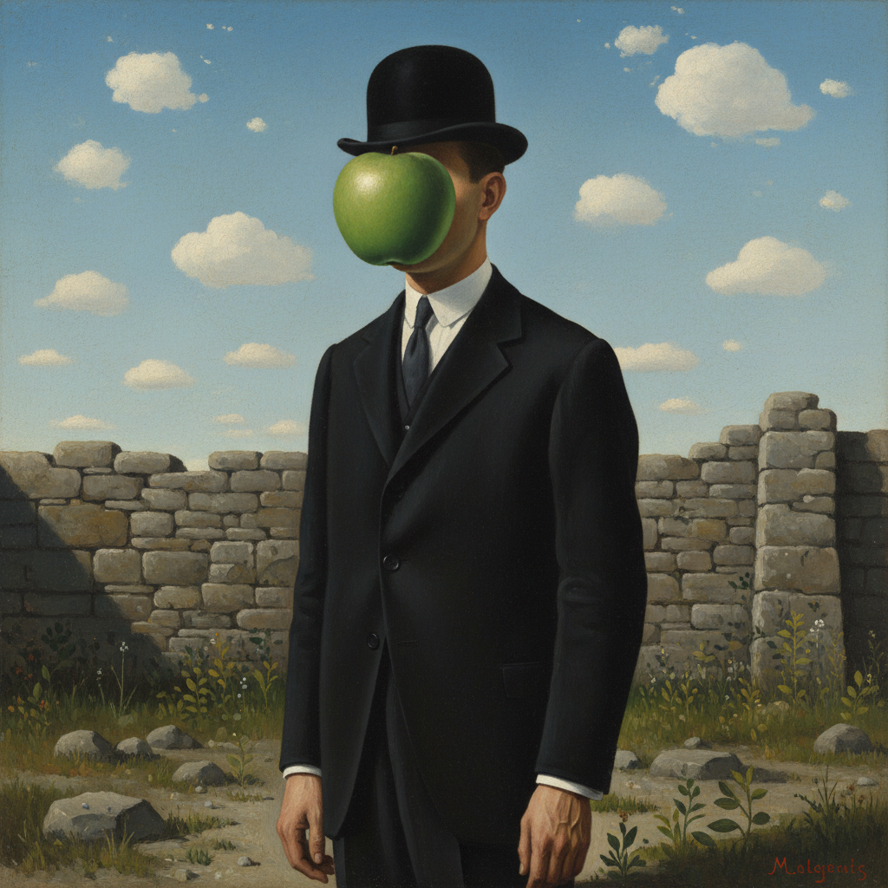

# René Magritte 马格利特

> "Everything we see hides another thing, we always want to see what is hidden by what we see." — René Magritte

## 概述

勒内·马格利特（René Magritte，1898–1967）是比利时超现实主义画家，以精确写实的风格描绘不可能的场景闻名。他的画面——戴圆顶帽的男人、漂浮的岩石、画中画——用日常物品的异常组合挑战观者对现实的认知，将哲学问题转化为视觉谜题。

## 核心特征

| 特征 | 描述 |
|------|------|
| 视觉悖论 | 不可能场景的精确描绘 |
| 日常异化 | 普通物品的超现实组合 |
| 精确写实 | 商业插画般的清晰风格 |
| 文字与图像 | "这不是一只烟斗" |
| 圆顶帽男人 | 标志性的匿名人物 |
| 哲学提问 | 关于表象与现实的思考 |

## 代表作品

| 作品 | 年代 | 意义 |
|------|------|------|
| *The Treachery of Images* | 1929 | "这不是一只烟斗" |
| *The Son of Man* | 1964 | 苹果遮面的圆顶帽男人 |
| *Golconda* | 1953 | 下雨的男人们 |
| *The Empire of Light* | 1953–54 | 白天与黑夜的同时 |

## AI生成概念图

## 与其他风格的关系

- **Surrealism** → 超现实主义的哲学分支
- **de Chirico** → 受形而上绘画启发
- **Conceptual Art** → 预示了观念艺术
- **Pop Art** → 影响了波普的图像策略
