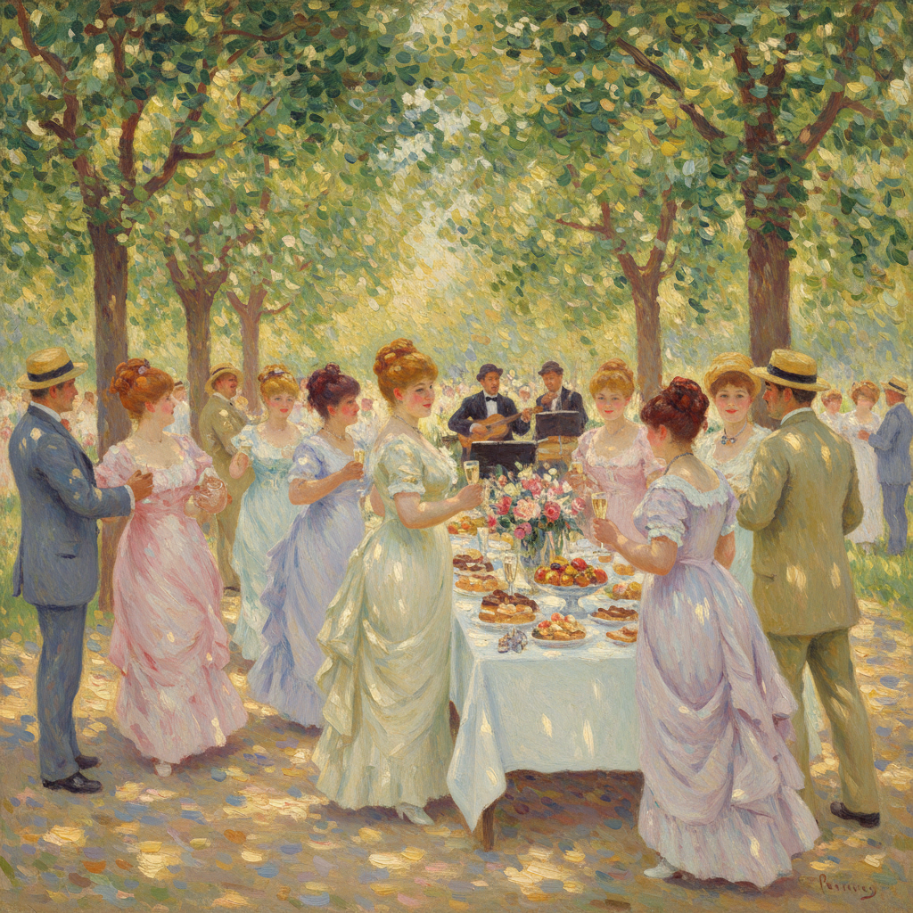

# Pierre-Auguste Renoir 雷诺阿

> "Why shouldn't art be pretty? There are enough unpleasant things in the world." — Pierre-Auguste Renoir

## 概述

皮埃尔-奥古斯特·雷诺阿（Pierre-Auguste Renoir，1841–1919）是法国印象派核心画家，以描绘欢乐的巴黎生活、丰满的女性人体和斑驳的阳光闻名。他是印象派中最"快乐"的画家——他的画面永远充满温暖、愉悦和对生活之美的赞颂。

雷诺阿晚年虽然双手因关节炎而变形，仍将画笔绑在手上继续创作，证明了对美的追求可以超越肉体的痛苦。

## 核心特征

| 特征 | 描述 |
|------|------|
| 欢乐主题 | 舞会、野餐、沐浴——生活的愉悦 |
| 丰满人体 | 温暖的、珍珠般光泽的女性肌肤 |
| 斑驳光影 | 树叶间漏下的阳光斑点 |
| 柔和轮廓 | 形体边缘融入背景——无硬线条 |
| 温暖色调 | 粉红、金色、珊瑚色的温暖调性 |
| 笔触融合 | 羽毛般轻柔的笔触互相融合 |

## 视觉特征

- **色彩**：温暖的粉红、金色、珊瑚和蓝色
- **笔触**：轻柔的、羽毛般的短笔触
- **光线**：斑驳的自然光——树影下的光斑
- **人物**：丰满的、红润的、快乐的面庞
- **肌肤**：珍珠般的光泽——温暖的肉色
- **氛围**：欢乐的、温暖的、亲密的

## 代表作品

| 作品 | 年代 | 意义 |
|------|------|------|
| *Bal du moulin de la Galette* | 1876 | 印象派的巅峰——巴黎的欢乐 |
| *Luncheon of the Boating Party* | 1881 | 社交生活的完美捕捉 |
| *Dance at Le Moulin de la Galette* | 1876 | 光影与运动的交响 |
| *The Large Bathers* | 1887 | 古典回归——雷诺阿的转折 |
| *Girls at the Piano* | 1892 | 亲密的家庭场景 |

## 真实作品（公共领域）

| 作品 | 来源 |
|------|------|
| *Bal du moulin de la Galette* | [Musée d'Orsay](https://www.musee-orsay.fr/en/artworks/bal-du-moulin-de-la-galette-702) |
| *Luncheon of the Boating Party* | [Phillips Collection](https://www.phillipscollection.org/collection/luncheon-boating-party) |
| *Girls at the Piano* | [Musée d'Orsay](https://www.musee-orsay.fr/en/artworks/jeunes-filles-au-piano-1192) |

> ⚠️ 本条目优先使用真实作品。

## AI生成概念图

## 与其他风格的关系

- **Impressionism** → 印象派的核心成员
- **Rococo** → 继承了洛可可的欢乐和感官性
- **Titian** → 晚期回归提香的丰满人体传统
- **Matisse** → 马蒂斯继承了雷诺阿的色彩愉悦
