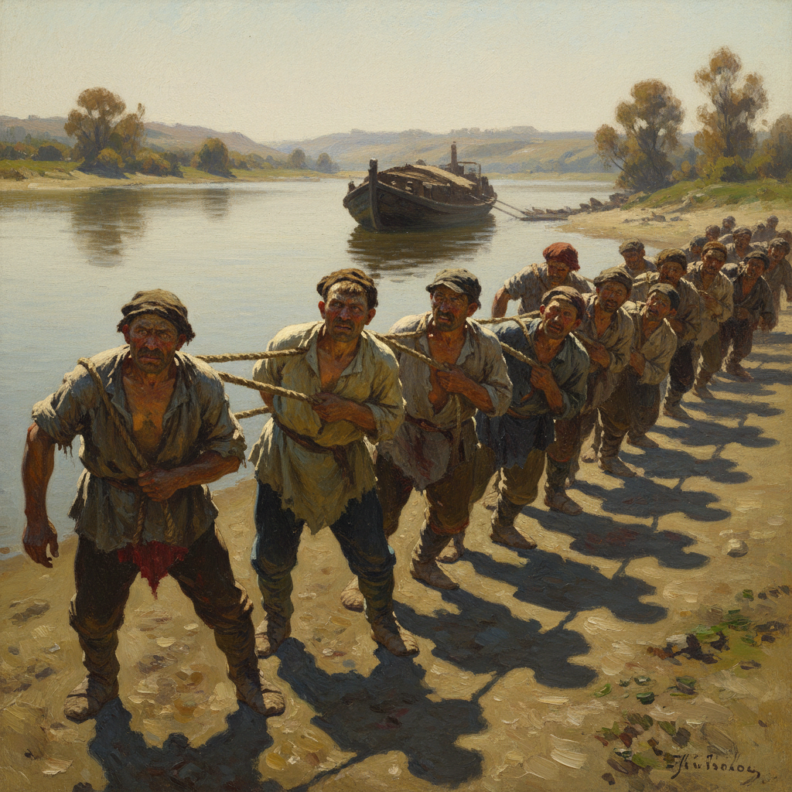

# Repin Art 列宾艺术

> "I do not understand the separation of form from content. I cannot imagine form without content." — Ilya Repin

## 概述

列宾艺术（Repin Art）是19世纪俄罗斯现实主义绑画大师伊利亚·叶菲莫维奇·列宾（Ilya Yefimovich Repin, 1844-1930）创立的批判现实主义绑画风格。列宾被誉为俄罗斯最伟大的画家——他以深刻的社会洞察力、精湛的技法和强烈的人文关怀，创作了一系列反映俄罗斯社会现实的不朽杰作。他是巡回展览画派最杰出的代表——将绘画提升为社会批判和人性探索的工具。

列宾最著名的作品《伏尔加河上的纤夫》（1873）描绘了一群在烈日下拖拽驳船的纤夫——他们疲惫而坚韧的形象成为俄罗斯底层人民苦难与力量的象征。他的另一杰作《意外归来》（1884-1888）以戏剧性的构图捕捉了一个政治流放者突然回家的瞬间——每个人物的表情都传达着复杂的情感。列宾还是杰出的肖像画家，为托尔斯泰、穆索尔斯基等文化巨人留下了传世肖像。

列宾艺术的核心要素包括：1）社会批判——对社会不公的深刻揭示；2）人物刻画——极其生动的人物心理描写；3）叙事性——戏剧性的叙事构图；4）技法精湛——素描和色彩的高超技巧；5）人文关怀——对底层人民的深切同情；6）历史题材——重大历史事件的再现；7）肖像艺术——深入灵魂的肖像画。

## 核心特征

| 特征 | 描述 |
|------|------|
| 社会批判 | 对社会不公深刻揭示 |
| 人物刻画 | 极其生动心理描写 |
| 叙事性 | 戏剧性叙事构图 |
| 技法精湛 | 素描色彩高超技巧 |
| 人文关怀 | 对底层人民深切同情 |
| 肖像艺术 | 深入灵魂的肖像画 |

## 视觉特征

- **群像构图**：多人物的戏剧性场景
- **表情刻画**：每个人物独特的心理状态
- **光影对比**：强烈的明暗对比
- **动态姿态**：充满张力的人物姿态
- **环境叙事**：环境服务于叙事
- **色彩厚重**：厚实有力的色彩

## 代表作品

| 作品 | 年代 | 意义 |
|------|------|------|
| *伏尔加河上的纤夫* (Barge Haulers on the Volga) | 1873 | 社会批判的里程碑 |
| *意外归来* (Unexpected Visitors) | 1884-1888 | 叙事画的巅峰 |
| *伊凡雷帝杀子* (Ivan the Terrible and His Son) | 1885 | 历史悲剧 |
| *查波罗什人写信给土耳其苏丹* (Reply of the Zaporozhian Cossacks) | 1891 | 民族精神 |
| *穆索尔斯基肖像* (Portrait of Mussorgsky) | 1881 | 肖像画杰作 |
| *库尔斯克省的宗教行列* (Religious Procession in Kursk) | 1883 | 社会全景 |

## 历史时间线

| 时期 | 事件 |
|------|------|
| 1844年 | 出生于乌克兰丘古耶夫 |
| 1863-1871年 | 就读圣彼得堡美术学院 |
| 1873年 | 完成《伏尔加河上的纤夫》 |
| 1878年 | 加入巡回展览画派 |
| 1894年 | 成为美术学院教授 |
| 1930年 | 在芬兰库奥卡拉去世 |

## 中国语境

列宾在中国的影响极为深远——可以说是对中国美术影响最大的外国画家之一。20世纪50年代，中国派遣大批美术留学生赴苏联学习，列宾美术学院（原圣彼得堡美术学院）成为中国油画家的圣地。列宾的现实主义创作方法——深入生活、关注社会、塑造典型人物——成为中国美术教育的核心理念。《伏尔加河上的纤夫》在中国几乎家喻户晓——它被视为"艺术为人民服务"的典范。中国几代油画家如靳尚谊、全山石、詹建俊等都深受列宾传统的影响。列宾证明了绘画可以成为社会良知的表达——这一理念深刻塑造了中国当代现实主义美术的面貌。

## 概念图

## 与其他风格的关系

- **Peredvizhniki** → 巡回展览画派
- **Shishkin** → 希施金（风景画同道）
- **Kramskoi** → 克拉姆斯柯依（导师）
- **Surikov** → 苏里科夫（历史画同道）
- **Critical Realism** → 批判现实主义
- **Social Realism** → 社会现实主义

---

*浮光艺志 | Chronicle of Artistry*
