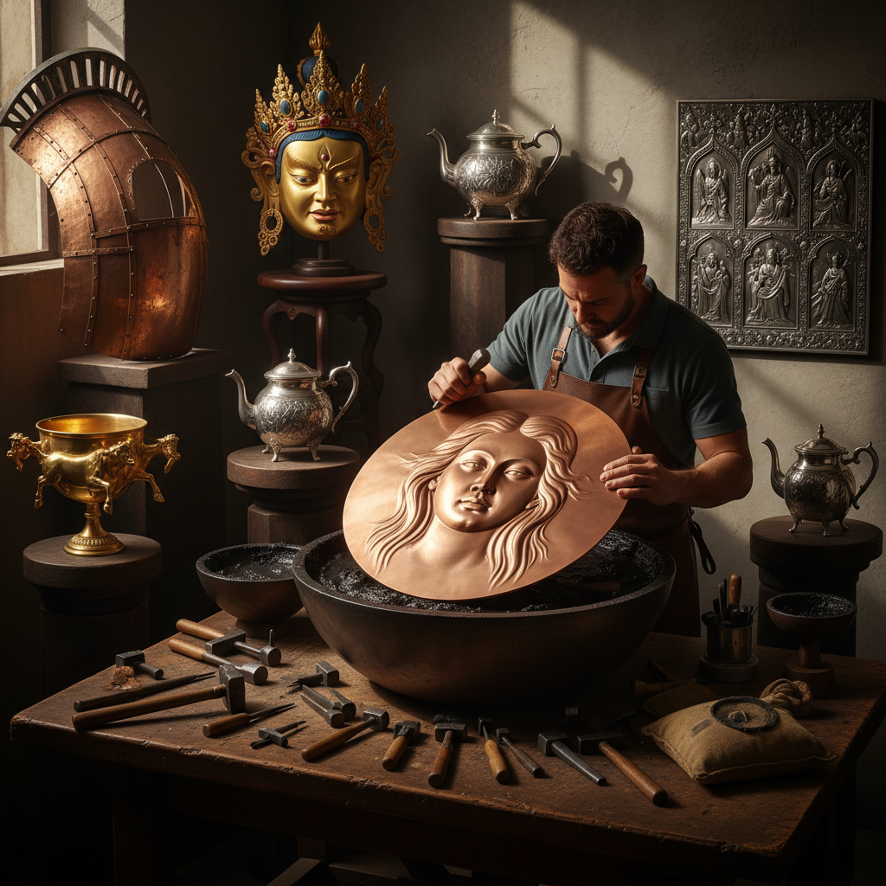

# Repoussé Art 锤揲艺术

> "Repoussé is sculpture from the inside out — the metalworker pushes from behind, raising forms that emerge on the front like memories surfacing from the deep. The hammer never touches the visible face; instead, it works blind, guided only by touch and experience, coaxing the metal into hills and valleys that catch light like landscape. Every great repoussé piece is a conversation between force and restraint, between the hammer's power and the metal's willingness to yield." — Unknown

## 概述

锤揲艺术（Repoussé Art）是一种从金属板背面用锤子和各种工具将图案凸起到正面的金属成型技法——通过反复从正反两面交替锤打（repoussé从背面推出，chasing从正面精修），在金属板上创造出精美的浮雕效果。这是人类最古老的金属装饰技法之一。

锤揲艺术的实践包括：1）浮雕锤揲——在金属板上锤出高浮雕图案；2）器物成型——用锤揲技法制作器物；3）建筑装饰——建筑上的金属浮雕装饰；4）雕塑制作——大型金属雕塑的锤揲成型；5）首饰制作——锤揲技法的首饰应用；6）盔甲装饰——历史上盔甲的锤揲装饰；7）当代锤揲——将传统技法与现代艺术结合的创作。

## 核心特征

| 特征 | 描述 |
|------|------|
| 立体 | 从平面创造立体 |
| 反向 | 从背面工作的独特方式 |
| 流动 | 金属的流动感 |
| 光影 | 丰富的光影效果 |
| 古老 | 极其古老的技法 |
| 手感 | 完全依赖手感 |

## 视觉特征

- **浮雕**：从平面凸起的立体效果
- **流线**：金属流动的曲线
- **光影**：凸起表面的光影变化
- **锤纹**：精修后的细腻表面
- **层次**：高低不同的浮雕层次
- **金属**：金属材质的光泽

## 代表作品

| 作品 | 艺术家/文化 | 年代 | 意义 |
|------|-------------|------|------|
| *Statue of Liberty* | Bartholdi | 1886 | 锤揲铜雕塑 |
| *Vaphio cups* | 迈锡尼文明 | 公元前1500年 | 古代金杯 |
| *Gundestrup cauldron* | 凯尔特 | 公元前1世纪 | 凯尔特银锅 |
| *Benin bronzes* | 贝宁王国 | 16-17世纪 | 非洲金属艺术 |
| *Tibetan repoussé* | 西藏传统 | 古代至今 | 藏传佛教金属艺术 |

## 历史时间线

| 时期 | 事件 |
|------|------|
| 公元前3000年 | 最早的锤揲金属制品 |
| 古代 | 各文明的锤揲传统 |
| 中世纪 | 宗教金属器物的锤揲 |
| 文艺复兴 | 锤揲技法的精细化 |
| 当代 | 锤揲的当代艺术应用 |

## 中国语境

锤揲艺术在中国有悠久的传统——中国古代称之为"锤鍱"或"锤揲"。中国的金银器制作中大量使用锤揲技法——唐代的金银器是中国锤揲工艺的巅峰，如何家村窖藏出土的鎏金银器。西藏的金属佛像制作中，锤揲是最重要的技法之一——用铜板锤揲出佛像的各个部分再焊接组合。中国的铜锣制作也是锤揲工艺的典型应用——从一块铜板锤打成型。中国当代的一些金属艺术家重新发掘锤揲技法——将其作为当代雕塑和装置艺术的创作手段。中国的非物质文化遗产中，多项金属工艺都涉及锤揲技法——如苗族银饰制作、藏族金属器物制作等。

## AI生成概念图

## 与其他风格的关系

- **Chasing** → 錾刻艺术
- **Metal Sculpture** → 金属雕塑
- **Silversmithing** → 银器艺术
- **Coppersmithing** → 铜器艺术
- **Relief Art** → 浮雕艺术
- **Armor Art** → 盔甲装饰

---

*浮光艺志 | Chronicle of Artistry*
