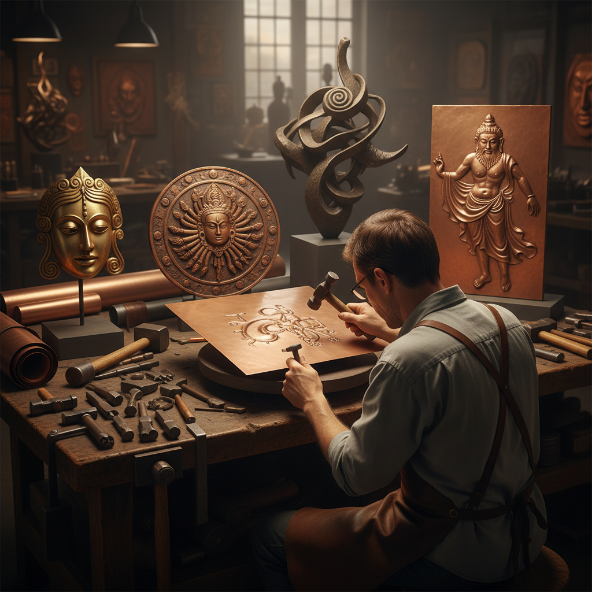

# Repoussé 锤揲工艺

> "Repoussé is sculpture from the inside out — the metalsmith pushes form from behind, raising mountains and valleys in a thin sheet of metal with nothing but hammer and will." — Unknown

## 概述

锤揲工艺（Repoussé）是从金属板的背面用锤子和各种形状的冲头（punches）将金属向外推出，形成浮雕图案的金属成形技法。"Repoussé"源自法语"repousser"（推回）。与之配合的是"chasing"（正面追纹）——从金属板的正面用工具精修细节和轮廓。Repoussé和chasing通常结合使用：先从背面推出大的形体，再从正面追纹细节。这种技法可以在薄金属板上创造出极其精细的三维浮雕效果——从古代的黄金面具到自由女神像的铜皮，都是锤揲工艺的杰作。

锤揲工艺的哲学在于：从内向外——不是从外部雕刻去除材料，而是从内部推出形体，让金属在锤击中获得生命。

## 核心特征

| 特征 | 描述 |
|------|------|
| 背面 | 从背面推出形体 |
| 锤击 | 锤子和冲头成形 |
| 浮雕 | 创造浮雕效果 |
| 薄板 | 在薄金属板上操作 |
| 追纹 | 正面追纹精修 |
| 立体 | 三维的立体效果 |

## 视觉特征

- **浮雕**：精美的浮雕效果
- **立体**：三维的形体感
- **金属**：金属的光泽和质感
- **流动**：流动的形态
- **细节**：精细的表面细节
- **力量**：锤击的力量感

## 代表作品

| 作品 | 艺术家 | 年代 | 意义 |
|------|--------|------|------|
| *Mask of Agamemnon* | 匿名 | 公元前1550年 | 迈锡尼金面具 |
| *Statue of Liberty skin* | Frédéric Bartholdi | 1886 | 自由女神像铜皮 |
| *Benvenuto Cellini works* | Cellini | 16世纪 | 文艺复兴金属艺术 |
| *Tibetan repoussé* | 匿名 | 传统 | 藏传佛教金属艺术 |
| *Contemporary repoussé* | Various | 当代 | 当代锤揲艺术 |

## 历史时间线

| 时期 | 事件 |
|------|------|
| 公元前3000年 | 美索不达米亚的早期锤揲 |
| 古希腊 | 希腊金属浮雕 |
| 古罗马 | 罗马银器锤揲 |
| 中世纪 | 教堂金属装饰 |
| 文艺复兴 | Cellini的金属艺术 |
| 当代 | 当代锤揲工艺的复兴 |

## 中国语境

锤揲工艺在中国有悠久的传统——中国古代的金银器制作大量使用锤揲技法。唐代的金银器（如何家村窖藏出土的金银器）展现了极高的锤揲工艺水平。藏传佛教的金属佛像和法器也广泛使用锤揲技法——西藏和尼泊尔的金属工匠用锤揲创造精美的佛像浮雕。中国的铜器制作传统中，"打铜"（锤击铜板成形）是重要的技法。当代中国的金属工艺家继续传承锤揲技法，将其应用于当代艺术创作和高端定制。

## AI生成概念图

## 与其他风格的关系

- **Chasing** → 追纹（配合技法）
- **Metalwork** → 金属工艺
- **Sculpture** → 雕塑
- **Embossing** → 压花
- **Silversmithing** → 银器制作
- **Relief** → 浮雕

---

*浮光艺志 | Chronicle of Artistry*
