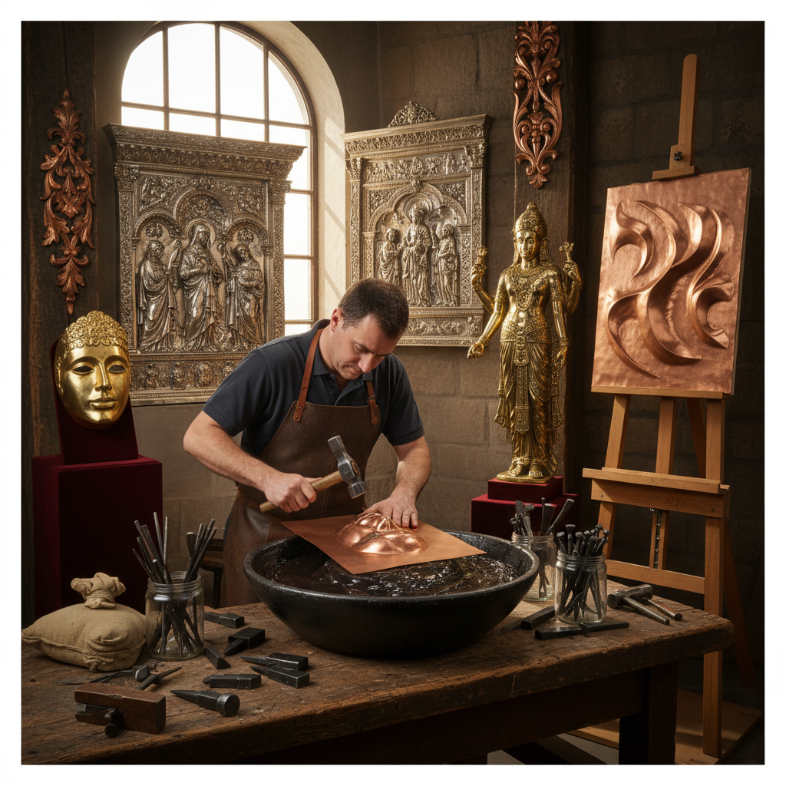

# Repoussé Metalwork 锤揲金属工艺

> "Repoussé is drawing with a hammer — the metalworker pushing sheet metal from behind with punches and chasing tools, coaxing flat copper or silver into three-dimensional forms without removing any material, each blow a conversation between tool and metal that gradually raises figures from the surface like spirits emerging from a mirror." — Unknown

## 概述

锤揲（Repoussé）是一种通过从金属板的背面用锤子和冲头敲击，使金属向正面凸起形成立体图案的金属成形技法。"Repoussé"来自法语"repousser"（推回）。与之配合的技法是"Chasing"（正面追纹）——从金属板的正面用工具精细地修整和添加细节。Repoussé和Chasing通常结合使用，反复从正反两面交替工作。

Repoussé是人类最古老的金属成形技法之一——不需要熔铸，不需要去除材料，只需要锤子、冲头和一块金属板。从古代美索不达米亚的金面具到自由女神像的铜皮外壳，Repoussé在人类文明史上有着广泛的应用。这种技法可以用于铜、银、金、锡、铝等各种延展性好的金属。

## 核心特征

| 特征 | 描述 |
|------|------|
| 背面敲击 | 从背面锤击成形 |
| 凸起 | 金属向正面凸起 |
| 不去材 | 不去除任何材料 |
| 薄板 | 使用金属薄板 |
| 立体 | 创造立体效果 |
| 古老 | 极其古老的技法 |

## 视觉特征

- **立体**：从平面凸起的立体形态
- **流畅**：流畅的曲面
- **金属光泽**：金属的自然光泽
- **细节**：精细的表面细节
- **大型**：可制作大型作品
- **有机**：有机的形态感

## 代表作品

| 作品 | 艺术家 | 年代 | 意义 |
|------|--------|------|------|
| *Mask of Agamemnon* | 迈锡尼工匠 | 公元前16世纪 | 阿伽门农金面具 |
| *Statue of Liberty skin* | Frédéric Bartholdi | 1886 | 自由女神像铜皮 |
| *Benvenuto Cellini works* | Benvenuto Cellini | 16世纪 | 切利尼金属作品 |
| *Indian repoussé deities* | 印度工匠 | 传统 | 印度锤揲神像 |
| *Contemporary repoussé sculpture* | Various | 当代 | 当代锤揲雕塑 |

## 历史时间线

| 时期 | 事件 |
|------|------|
| 公元前3000年 | 美索不达米亚锤揲的起源 |
| 古希腊 | 希腊锤揲金属工艺 |
| 文艺复兴 | 锤揲在艺术中的应用 |
| 19世纪 | 自由女神像等大型应用 |
| 当代 | 锤揲的艺术化复兴 |

## 中国语境

锤揲在中国有悠久的传统——中国的金银器制作中大量使用锤揲技法。中国唐代的金银器（如何家村窖藏出土的金银器）展示了极高的锤揲工艺水平。中国的铜器制作传统中也有锤揲技法的应用。中国西藏的铜佛像制作传统使用锤揲技法。当代中国的一些金属工艺师在传承和发展锤揲技法。中国的传统锡器、银器制作中的"打制"工艺就是锤揲的中国表达。

## AI生成概念图

## 与其他风格的关系

- **Chasing** → 追纹
- **Metalwork** → 金属工艺
- **Sculpture** → 雕塑
- **Silversmithing** → 银器工艺
- **Embossing** → 压花
- **Relief** → 浮雕

---

*浮光艺志 | Chronicle of Artistry*
