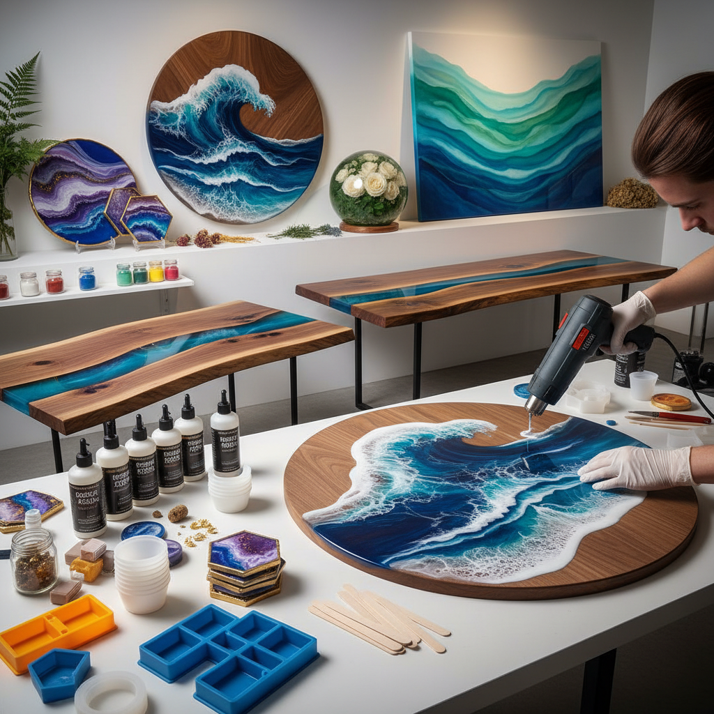

# Resin Art 树脂艺术

> "Resin art captures light itself — liquid epoxy poured in layers, each one a transparent stratum that holds pigment, objects, and depth in suspended animation, curing into a glass-like surface that transforms ordinary materials into jewel-like permanence." — Unknown

## 概述

树脂艺术（Resin Art）是使用环氧树脂（epoxy resin）或聚酯树脂（polyester resin）作为主要媒介的艺术创作形式。液态树脂与固化剂混合后，在一定时间内保持液态（工作时间），然后逐渐固化为透明、坚硬、光滑的固体。艺术家在树脂液态时加入颜料、金属粉、酒精墨水等着色剂，或嵌入花朵、照片、木材等物体，创造出具有深度和光泽的作品。

树脂艺术的应用范围极广：从抽象绘画（树脂画）到功能性物品（树脂桌面、砧板、首饰）、从保存标本（树脂封存花朵、昆虫）到建筑装饰（树脂地面、墙面）。树脂的透明性和自流平特性使其能够创造出独特的深度感和玻璃般的光泽。树脂艺术在2010年代后期获得了全球性的流行。

## 核心特征

| 特征 | 描述 |
|------|------|
| 树脂 | 环氧树脂媒介 |
| 透明 | 透明的深度感 |
| 光泽 | 玻璃般的光泽 |
| 固化 | 液态到固态的转变 |
| 封存 | 可封存物体 |
| 多用 | 应用范围极广 |

## 视觉特征

- **光泽**：玻璃般的光泽表面
- **深度**：透明层的深度感
- **色彩**：丰富的色彩效果
- **流动**：流动的图案
- **封存**：封存物体的效果
- **质感**：光滑坚硬的质感

## 代表作品

| 作品 | 艺术家 | 年代 | 意义 |
|------|--------|------|------|
| *Resin ocean art* | Various | 当代 | 树脂海洋画 |
| *River tables* | Various | 当代 | 树脂河流桌 |
| *Resin geode art* | Various | 当代 | 树脂晶洞艺术 |
| *Preserved flower resin* | Various | 当代 | 树脂封存花朵 |
| *Resin jewelry* | Various | 当代 | 树脂首饰 |

## 历史时间线

| 时期 | 事件 |
|------|------|
| 1930年代 | 环氧树脂的发明 |
| 1960年代 | 树脂在艺术中的早期应用 |
| 1990年代 | 树脂家具和设计的发展 |
| 2015年后 | 树脂艺术的全球爆发 |
| 当代 | 树脂艺术的持续创新 |

## 中国语境

树脂艺术在中国有极其快速的发展——2018年前后通过社交媒体传入中国后迅速走红。中国的电商平台（淘宝、拼多多）上有丰富的树脂艺术材料。中国的手工体验工作室开设树脂艺术课程。中国的家具设计师创作树脂河流桌等功能性艺术品。中国的花艺师使用树脂封存鲜花创作永生花饰品。中国的一些当代艺术家将树脂与中国传统材料（漆、玉、木）结合，探索新的表达可能。

## AI生成概念图

## 与其他风格的关系

- **Fluid Art** → 流体艺术
- **Pour Painting** → 倾倒绘画
- **Alcohol Ink Art** → 酒精墨水艺术
- **Furniture Design** → 家具设计
- **Jewelry Making** → 首饰制作
- **Lacquer Art** → 漆艺

---

*浮光艺志 | Chronicle of Artistry*
