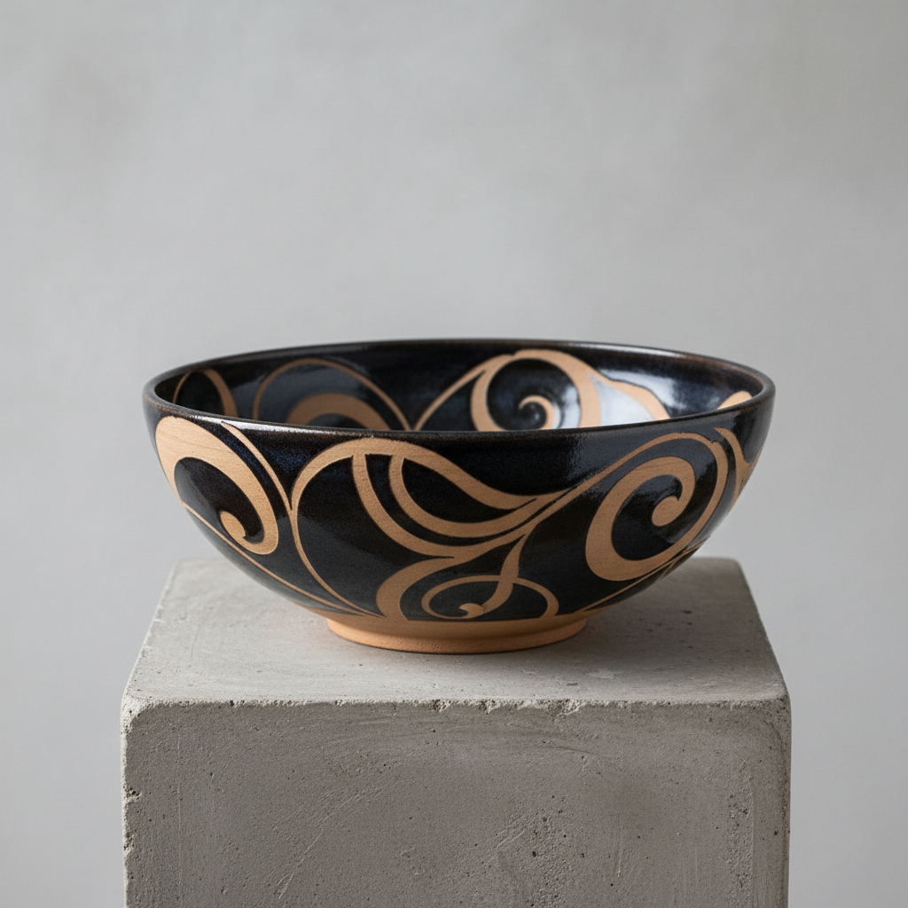

# Resist Decoration Art 防染装饰艺术

> "Resist decoration is ceramics by negation — wax brushed where color should not go, paper cut and pressed where glaze should not land, latex painted in patterns that peel away to reveal the bare clay beneath, each technique a conversation between presence and absence, the decorated surface defined not by what was added but by what was prevented, negative space made visible through the chemistry of repulsion." — Unknown

## 概述

防染装饰艺术（Resist Decoration Art）是一种通过在陶瓷表面施加防护材料（蜡、纸、乳胶等）来阻止釉料或颜料附着，从而创造图案的装饰技法总称。防染技法的核心原理是"以防代画"——不是直接绑制图案，而是通过阻挡来显现图案。这一原理与纺织品中的蜡染、扎染异曲同工，是人类最古老的图案创造方式之一。

防染装饰艺术的核心要素包括：1）防护材料——蜡、纸、乳胶、胶带等；2）阻挡原理——阻止釉料或颜料附着；3）负空间——通过"不做"来创造图案；4）层次感——多次防染创造层次；5）边缘效果——防染边界的独特效果；6）揭示过程——去除防护后图案显现；7）多种变体——蜡防、纸防、乳胶防等。

## 核心特征

| 特征 | 描述 |
|------|------|
| 阻挡原理 | 通过阻挡创造图案 |
| 负空间 | 以"不做"定义图案 |
| 多种材料 | 蜡、纸、乳胶等防护材料 |
| 层次丰富 | 多次防染创造层次 |
| 边缘独特 | 防染边界的特殊效果 |
| 揭示惊喜 | 去除防护后的惊喜效果 |

## 视觉特征

- **清晰边界**：防染区域的清晰边缘
- **正负对比**：有釉与无釉的对比
- **层次叠加**：多层防染的层次效果
- **有机边缘**：蜡防的自然流动边缘
- **几何图案**：纸防的精确几何图案
- **质感对比**：光滑釉面与粗糙坯体的对比

## 代表作品

| 作品 | 艺术家/文化 | 年代 | 意义 |
|------|-------------|------|------|
| *蜡防青花* | 中国景德镇 | 明清 | 蜡防在青花中的应用 |
| *日本蜡防陶瓷* | 日本 | 各时期 | 日本蜡防传统 |
| *当代乳胶防染* | 各地陶艺家 | 当代 | 乳胶防染的现代应用 |
| *多层防染作品* | 当代陶艺家 | 当代 | 复杂的多层防染 |
| *纸防装饰* | 各地陶艺家 | 当代 | 纸防的精确图案 |

## 历史时间线

| 时期 | 事件 |
|------|------|
| 古代 | 最早的蜡防陶瓷装饰 |
| 明清 | 中国蜡防青花的发展 |
| 20世纪 | 乳胶防染技术的出现 |
| 当代 | 防染技法的多元化发展 |
| 当代 | 数字切割纸防的应用 |

## 中国语境

防染装饰在中国陶瓷中有悠久的传统——景德镇的蜡防青花是最著名的应用之一。中国的蜡染纺织传统（特别是贵州苗族蜡染）与陶瓷防染装饰有相同的原理基础。中国当代陶艺家广泛使用各种防染技法——从传统的蜡防到现代的乳胶防染和胶带防染。中国的防染装饰传统体现了东方美学中"留白"的哲学——通过"不做"来创造意义，通过空白来定义图案。这与中国水墨画中的留白、中国园林中的借景有异曲同工之妙。

## AI生成概念图

## 与其他风格的关系

- **Wax Resist** → 蜡防
- **Paper Resist** → 纸防
- **Batik** → 蜡染
- **Sgraffito** → 刮花
- **Negative Space** → 负空间
- **Stencil** → 模版

---

*浮光艺志 | Chronicle of Artistry*
