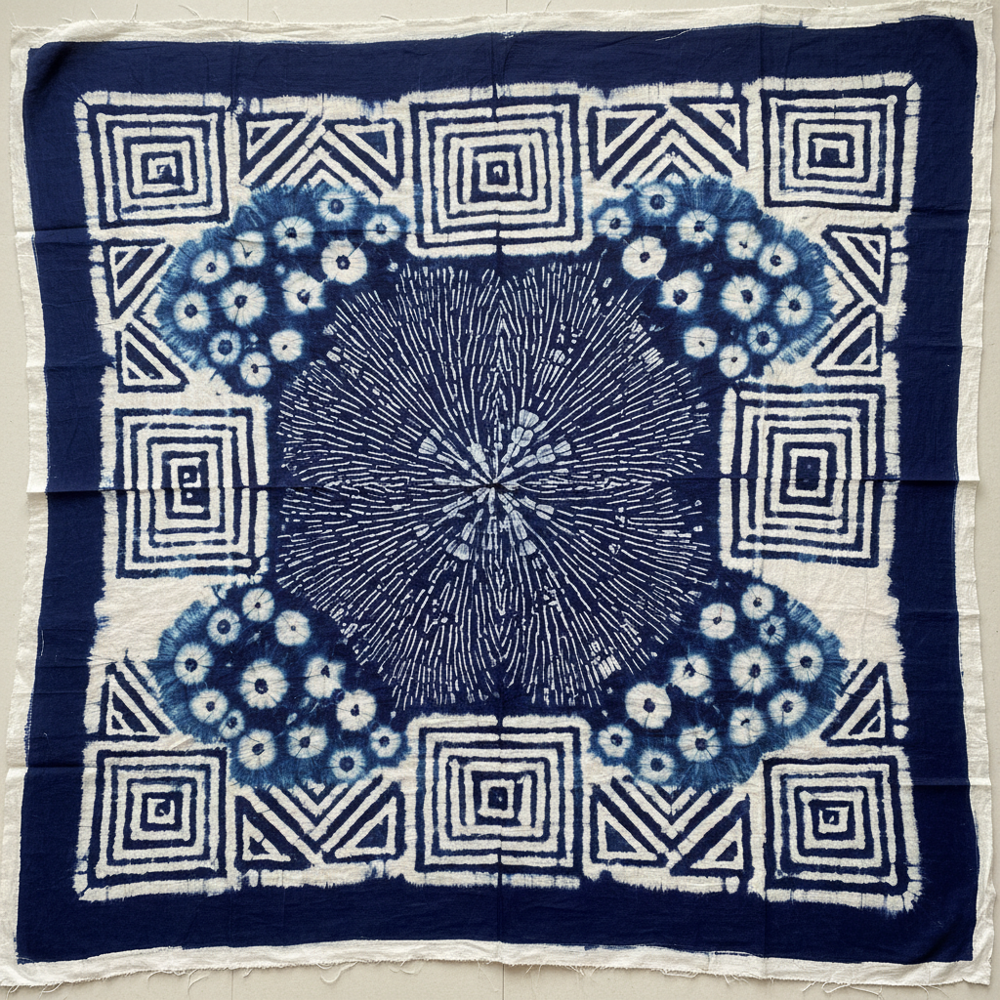

# Resist Dyeing Art 防染艺术

> "Resist dyeing is the art of saying no to color — wax, paste, stitching, or physical barriers are applied to fabric before it enters the dye bath, creating patterns by preventing the dye from reaching certain areas. It is design through negation, where the image emerges not from what is added but from what is withheld. Every resist technique is a conversation between the maker's intention and the dye's desire to penetrate everywhere." — Unknown

## 概述

防染艺术（Resist Dyeing Art）是一种通过在织物上施加各种阻隔物（蜡、浆糊、绑扎、缝合等）来阻止染料渗透，从而在染色后形成图案的纺织装饰技法总称。防染是人类最古老和最普遍的纺织装饰方法之一——在世界各地的文化中都有独立发展，包括蜡染、扎染、型染、糊防染等多种具体技法。

防染艺术的实践包括：1）蜡防染（Batik）——用蜡作为防染剂；2）糊防染——用淀粉糊或泥浆作为防染剂；3）扎防染（Tie-dye/Shibori）——用绑扎物理阻隔；4）缝防染——用缝合线阻隔；5）夹防染——用板夹阻隔；6）型版防染——用模板涂覆防染剂；7）当代防染——将传统技法与现代设计结合的创作。

## 核心特征

| 特征 | 描述 |
|------|------|
| 阻隔 | 阻止染料渗透 |
| 负形 | 通过负形创造图案 |
| 多样 | 多种防染方法 |
| 全球 | 全球性的传统 |
| 古老 | 数千年的历史 |
| 偶然 | 防染边缘的偶然性 |

## 视觉特征

- **边缘**：防染边缘的特有效果
- **对比**：染色与未染色的对比
- **层次**：多次染色的层次
- **有机**：有机自然的图案
- **民族**：浓郁的民族风格
- **独特**：每件作品的独特性

## 代表作品

| 作品 | 艺术家/文化 | 年代 | 意义 |
|------|-------------|------|------|
| *Javanese batik* | 印尼 | 传统 | 爪哇蜡染 |
| *Japanese katazome* | 日本 | 传统 | 日本型染 |
| *African adire* | 尼日利亚 | 传统 | 非洲防染布 |
| *Indian bandhani* | 印度 | 传统 | 印度扎染 |
| *Contemporary resist dyeing* | 国际 | 当代 | 当代防染艺术 |

## 历史时间线

| 时期 | 事件 |
|------|------|
| 古代 | 各文明独立发展防染技法 |
| 中世纪 | 丝绸之路传播防染技法 |
| 17-19世纪 | 各地防染传统的成熟 |
| 20世纪 | 工业化对传统的冲击 |
| 当代 | 防染艺术的全球复兴 |

## 中国语境

防染艺术在中国有极其悠久和丰富的传统。中国是世界上最早使用防染技法的文明之一——中国传统的三大印染技法（蜡染、扎染、夹缬）都属于防染范畴。中国贵州苗族的蜡染是国家级非物质文化遗产——以其精美的几何图案和蓝白色调著称。中国云南白族的扎染同样是国家级非遗——以蝴蝶泉和花卉图案闻名。中国的蓝印花布（型版防染）是江南地区的传统工艺——南通蓝印花布是重要的文化遗产。中国当代的纺织设计师将传统防染技法与现代时装结合——在国际舞台上展示中国纺织文化。中国的美术院校中，防染作为纤维艺术的核心课程——培养学生对传统染色工艺的理解和创新。

## AI生成概念图

## 与其他风格的关系

- **Batik** → 蜡染
- **Shibori** → 绞缬染色
- **Tie-dye** → 扎染
- **Katazome** → 型染
- **Textile Art** → 纺织艺术
- **Indigo Dyeing** → 靛蓝染色

---

*浮光艺志 | Chronicle of Artistry*
