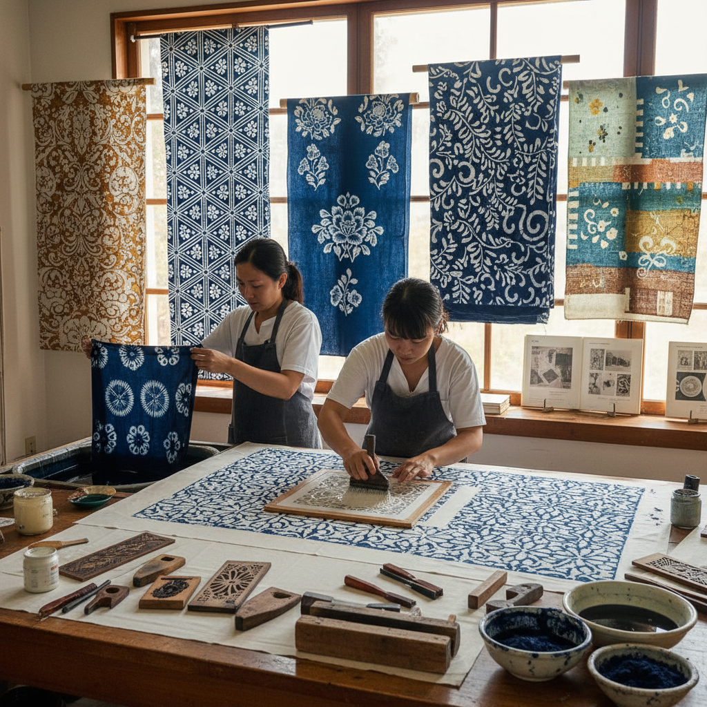

# Resist Dyeing 防染技法

> "Resist dyeing is the art of protection — shielding fabric from color with wax, paste, thread, or pressure, so that when the dye recedes, patterns emerge like secrets revealed, white spaces speaking as loudly as the colored ground." — Unknown

## 概述

防染技法（Resist Dyeing）是一类通过在织物上施加各种"抗染剂"来阻止染料渗透特定区域，从而形成图案的染色方法的总称。防染技法是人类最古老的纺织装饰方法之一——其核心原理是"保护"：在染色前用某种物质或方法保护织物的特定区域不被染色，染色后去除保护物，露出未染色的图案。

防染技法包括多种具体方法：蜡防染（batik，用蜡覆盖）、糊防染（paste resist，用淀粉糊或泥浆覆盖）、绞缬防染（tie-dye/shibori，用线绑扎或折叠）、夹缬防染（clamp resist，用板夹压）、型染防染（stencil resist，用模板覆盖）等。不同文化发展出了各自独特的防染传统——日本的友禅染、中国的蓝印花布、印尼的蜡染、非洲的adire等。

## 核心特征

| 特征 | 描述 |
|------|------|
| 保护 | 保护特定区域 |
| 多样 | 多种防染方法 |
| 古老 | 极其古老的技法 |
| 全球 | 全球性的传统 |
| 对比 | 染色与留白的对比 |
| 手工 | 手工操作为主 |

## 视觉特征

- **对比**：染色与未染色的对比
- **图案**：清晰的图案边界
- **白色**：留白的图案
- **渗透**：边缘的渗透效果
- **传统**：传统的图案风格
- **手工**：手工的不规则美

## 代表作品

| 作品 | 艺术家 | 年代 | 意义 |
|------|--------|------|------|
| *Japanese yuzen* | 日本工匠 | 传统 | 日本友禅染 |
| *Chinese blue calico* | 中国工匠 | 传统 | 中国蓝印花布 |
| *Indonesian batik* | 印尼工匠 | 传统 | 印尼蜡染 |
| *African adire* | 非洲工匠 | 传统 | 非洲防染布 |
| *Indian bandhani* | 印度工匠 | 传统 | 印度扎染 |

## 历史时间线

| 时期 | 事件 |
|------|------|
| 古代 | 防染技法的起源 |
| 古代-中世纪 | 全球各文化的防染传统发展 |
| 唐代 | 中国夹缬、蜡缬、绞缬的鼎盛 |
| 江户时代 | 日本友禅染的发展 |
| 殖民时期 | 防染纺织品的全球贸易 |
| 当代 | 防染技法在当代艺术中的应用 |

## 中国语境

防染技法在中国有极其悠久和丰富的历史——中国古代的"三缬"（蜡缬、绞缬、夹缬）是防染技法的经典代表。中国的蓝印花布使用淀粉糊防染，是最具代表性的中国防染传统之一。中国的贵州蜡染、云南扎染都是防染技法的杰出代表。中国的唐代丝绸中有精美的夹缬作品。中国的当代纺织艺术家在创作中融合多种防染技法。中国的非物质文化遗产中有多项防染技法被列入保护名录。

## AI生成概念图

## 与其他风格的关系

- **Batik** → 蜡染
- **Shibori** → 绞缬染色
- **Indigo Dyeing** → 靛蓝染色
- **Stencil Dyeing** → 型染
- **Textile Art** → 纺织艺术
- **Folk Art** → 民间艺术

---

*浮光艺志 | Chronicle of Artistry*
