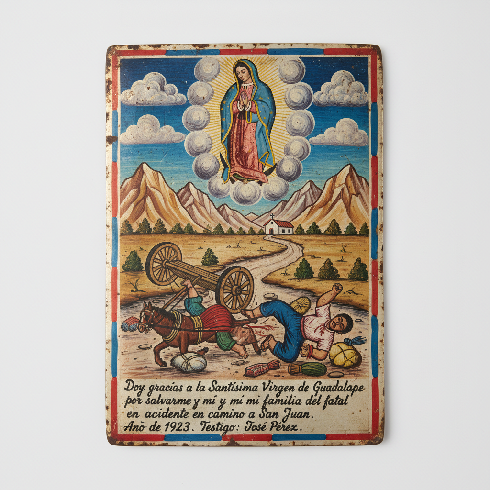

# Retablo 墨西哥祭坛画 | Retablo / Ex-voto

> **"铁皮上的奇迹——墨西哥人在小铁片上画下圣母显灵救命的瞬间。"**

## 概述

Retablo（祭坛画 / Ex-voto还愿画）是墨西哥民间宗教绘画传统，在小块铁皮（lamina）上绘制圣母或圣人显灵拯救信徒的场景，作为还愿感恩的供品悬挂在教堂中。这种传统源自殖民时期的西班牙天主教，但在墨西哥发展出独特的民间风格——朴素的绘画技法、鲜艳的色彩、戏剧性的叙事场景，以及底部的手写感恩文字。Retablo记录了从车祸获救、疾病痊愈到越境成功等各种"奇迹"，是墨西哥民间信仰最生动的视觉档案。

## 核心特征

- **铁皮载体**：在小块铁皮上绘制
- **还愿功能**：感谢圣母/圣人的庇佑
- **叙事场景**：描绘危难和获救的瞬间
- **手写文字**：底部的感恩叙述
- **朴素画风**：非专业画家的民间风格
- **教堂悬挂**：作为供品挂在教堂墙上

## 常见题材

| 题材 | 特征 |
|------|------|
| 疾病痊愈 | 病床场景 |
| 车祸获救 | 翻车/撞车 |
| 越境成功 | 穿越沙漠/河流 |
| 监狱释放 | 牢房场景 |
| 自然灾害 | 地震/洪水 |
| 日常危难 | 各种意外 |

## 视觉特征

- 小块铁皮的金属质感
- 朴素天真的绘画风格
- 鲜艳的民间色彩
- 圣母/圣人的云端形象
- 戏剧性的叙事构图
- 底部的手写文字

## 与其他风格的关系

| 风格 | 关系 |
|------|------|
| 民间艺术 Folk Art | 墨西哥民间绘画传统 |
| Frida Kahlo | 深受Retablo影响 |
| 当代叙事艺术 | Retablo的叙事性 |
| 宗教图像 | 天主教视觉传统 |
| Lotería | 共享墨西哥民间视觉 |

## 概念图

---

*浮光艺志 | Chronicle of Artistry*
