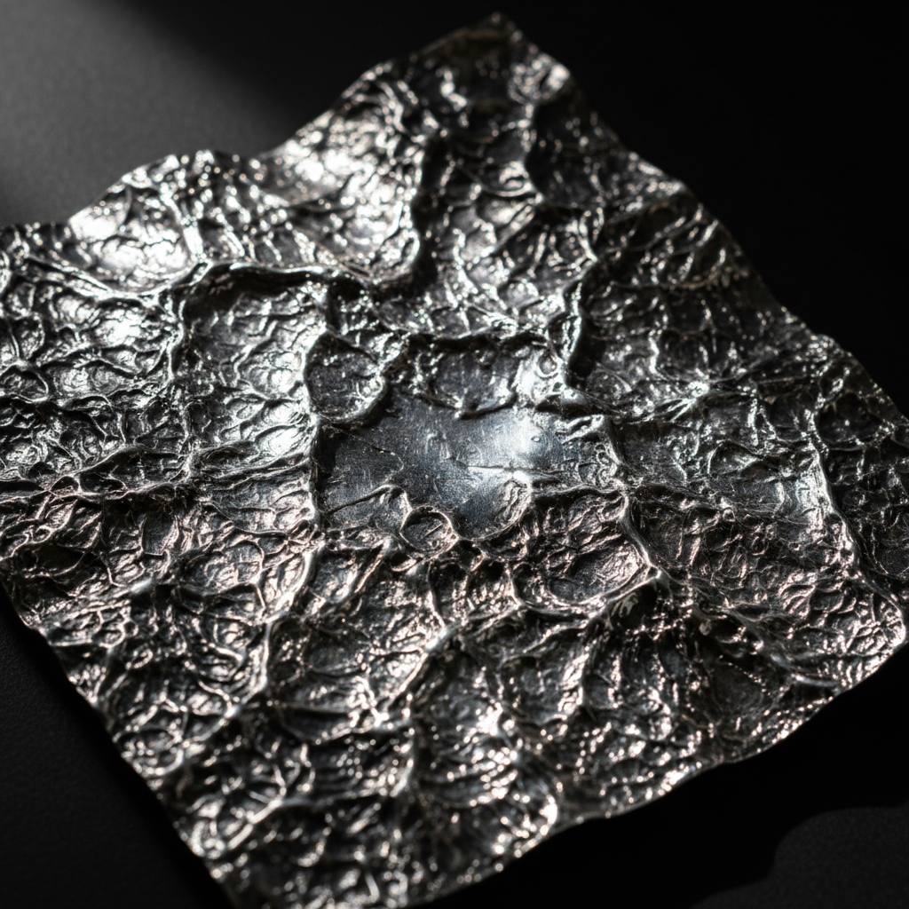

# Reticulation Art 网纹金属艺术

> "Reticulation is controlled chaos in metal — the surface of sterling silver or gold is heated until the inner core melts while the outer skin remains solid, causing the surface to wrinkle, buckle, and ripple into organic textures that resemble tree bark, cracked earth, or lunar landscapes. The metalsmith must balance on the knife-edge between melting and collapse, coaxing texture from the metal's own thermal stress." — Unknown

## 概述

网纹金属艺术（Reticulation Art）是一种通过加热金属使其表面产生褶皱和纹理的金属表面处理技法——利用金属合金中不同成分熔点的差异，使表面层在内部开始熔化时产生收缩和褶皱。Reticulation（拉丁语"网状"）创造出独特的有机纹理，类似树皮、龟裂或月球表面，每次加热的结果都不可完全预测。

网纹金属艺术的实践包括：1）合金选择——选择适合网纹处理的合金（如925银）；2）反复退火氧化——多次加热和酸洗使表面形成纯银层；3）加热网纹——快速加热使内部熔化表面褶皱；4）局部网纹——只在特定区域进行网纹处理；5）组合技法——与其他金属技法结合；6）珠宝应用——在首饰中应用网纹效果；7）当代网纹——将传统技法与现代设计结合的创作。

## 核心特征

| 特征 | 描述 |
|------|------|
| 热处理 | 通过加热产生纹理 |
| 褶皱 | 表面的褶皱效果 |
| 不可控 | 部分不可预测 |
| 有机 | 有机自然的纹理 |
| 独特 | 每次结果都独特 |
| 银合金 | 常用于银合金 |

## 视觉特征

- **褶皱**：金属表面的褶皱纹理
- **有机**：有机自然的图案
- **质感**：丰富的表面质感
- **对比**：光滑与褶皱的对比
- **深度**：纹理的深度变化
- **独特**：不可重复的效果

## 代表作品

| 作品 | 艺术家/文化 | 年代 | 意义 |
|------|-------------|------|------|
| *Studio jewelry reticulation* | 国际 | 20世纪起 | 工作室珠宝网纹 |
| *Reticulated silver vessels* | 当代 | 当代 | 网纹银器 |
| *Mixed metal reticulation* | 当代 | 当代 | 混合金属网纹 |
| *Architectural reticulation* | 当代 | 当代 | 建筑装饰网纹 |
| *Contemporary reticulation* | 国际 | 当代 | 当代网纹艺术 |

## 历史时间线

| 时期 | 事件 |
|------|------|
| 古代 | 金属加热纹理的偶然发现 |
| 20世纪初 | 网纹技法的系统化研究 |
| 1960年代 | 工作室珠宝运动中的应用 |
| 1980年代 | 网纹技法的普及 |
| 当代 | 网纹的多元化发展 |

## 中国语境

网纹金属技法在中国的认知正在增长。中国当代的珠宝设计师开始学习和应用网纹技法——将其视为一种创造独特金属质感的方法。中国的金属工艺教育中，网纹作为一种表面处理技法——在一些专业课程中有所教授。中国的一些珠宝工作室将网纹与中国传统金属工艺结合——创造出具有东方美学的网纹珠宝。中国的银器制作传统中有类似的热处理纹理——虽然不完全等同于西方的网纹技法。中国的当代金属艺术家探索网纹在雕塑和装置中的应用——利用其独特的有机质感。中国的珠宝市场中，具有独特纹理的手工珠宝正在获得关注——网纹作为一种不可复制的装饰效果受到欢迎。

## AI生成概念图

## 与其他风格的关系

- **Metalwork** → 金属工艺
- **Jewelry Design** → 珠宝设计
- **Texture Art** → 质感艺术
- **Forging** → 锻造工艺
- **Patination** → 着色工艺
- **Organic Design** → 有机设计

---

*浮光艺志 | Chronicle of Artistry*
