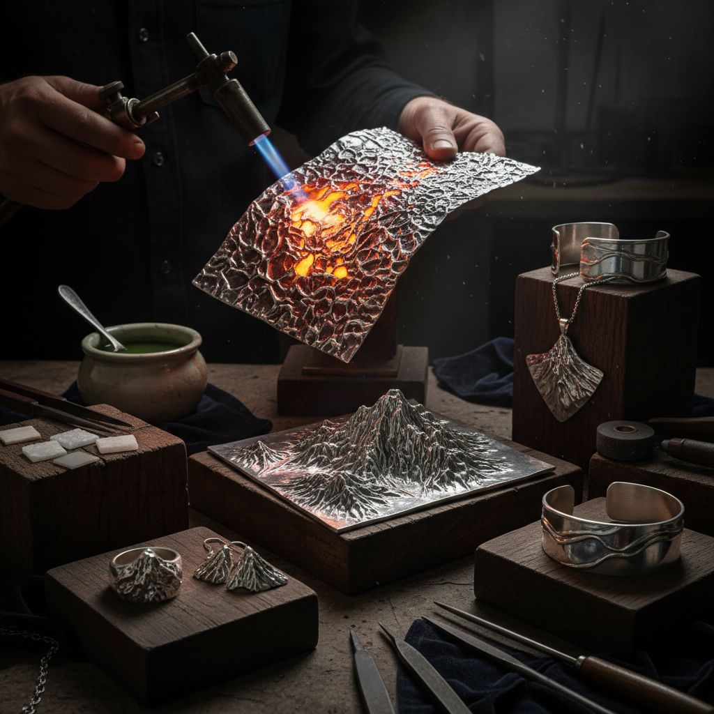

# Reticulation 网纹效果

> "Reticulation is controlled chaos — the silversmith heats sterling until its surface wrinkles and buckles like sun-baked earth, creating a texture of ridges and valleys that no tool could carve with such organic randomness." — Unknown

## 概述

网纹效果（Reticulation）是一种金属表面处理技法——通过反复加热和酸洗银合金（通常是925银/sterling silver），使表面形成一层纯银薄膜，然后用高温火焰快速加热。由于纯银表面层和内部合金的熔点不同，内部合金先熔化流动，而表面的纯银薄膜保持固态——这种差异导致表面产生褶皱、起伏和网状纹理。

网纹效果的魅力在于其不可预测性——每次加热产生的纹理都不同，形成独特的有机质感。这种纹理类似于干裂的泥土、树皮或月球表面——具有强烈的自然感和原始感。网纹效果在当代首饰制作中被广泛使用——它能为银饰增添独特的质感和视觉趣味。

## 核心特征

| 特征 | 描述 |
|------|------|
| 热处理 | 高温加热产生 |
| 褶皱 | 表面褶皱纹理 |
| 银合金 | 主要用于银合金 |
| 不可预测 | 结果不可完全预测 |
| 有机 | 有机的自然质感 |
| 独特 | 每件都独一无二 |

## 视觉特征

- **褶皱**：表面的褶皱起伏
- **网状**：网状的纹理
- **有机**：有机的自然感
- **粗犷**：粗犷的质感
- **对比**：光滑与粗糙的对比
- **原始**：原始的美感

## 代表作品

| 作品 | 艺术家 | 年代 | 意义 |
|------|--------|------|------|
| *Reticulated silver jewelry* | Various | 当代 | 网纹银饰 |
| *Reticulated rings* | Various | 当代 | 网纹戒指 |
| *Reticulated pendants* | Various | 当代 | 网纹吊坠 |
| *Mixed texture jewelry* | Various | 当代 | 混合质感首饰 |
| *Reticulated art objects* | Various | 当代 | 网纹艺术品 |

## 历史时间线

| 时期 | 事件 |
|------|------|
| 传统 | 金属加热中偶然发现的效果 |
| 20世纪初 | 网纹效果的有意识应用 |
| 1960s | 工作室首饰运动中的采用 |
| 1980s | 技法的系统化教学 |
| 当代 | 网纹效果在当代首饰中的流行 |
| 当代 | 与其他技法的结合创新 |

## 中国语境

网纹效果在中国的当代首饰设计领域有一定的应用。中国的一些珠宝设计学校和金属工艺课程教授网纹效果技法。中国的独立首饰设计师使用网纹效果为银饰增添独特的质感——这种"不完美"的美学符合当代设计对自然感和手工感的追求。中国的金属工艺社区中有关于网纹效果的讨论和实践。网纹效果的"每件独一无二"特点在中国的定制首饰市场中有吸引力。

## AI生成概念图

## 与其他风格的关系

- **Silversmithing** → 银器制作
- **Texturing** → 金属质感处理
- **Patination** → 铜绿/做旧
- **Fold Forming** → 折叠成型
- **Jewelry Making** → 首饰制作
- **Wabi-sabi** → 侘寂

---

*浮光艺志 | Chronicle of Artistry*
