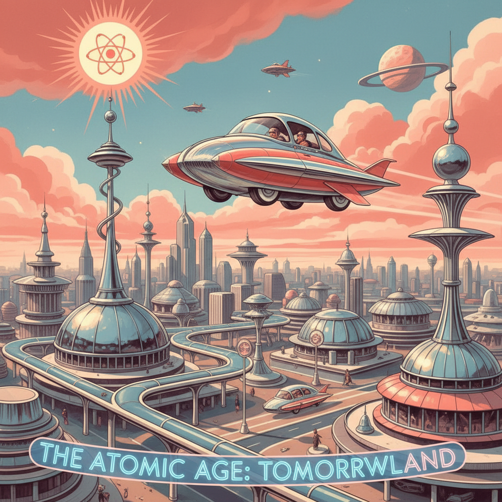

# Retro Futurism 复古未来主义



> **"飞行汽车、圆形太空站、银色连体衣——过去想象的未来比现在更有趣。"**

## 概述

| 维度 | 描述 |
|------|------|
| 时期 | 1920s–1960s 原版 / 2010s–至今 复兴 |
| 别名 | Retro Futurism, Raygun Gothic, Atompunk, Googie |
| 核心色彩 | 银色、天蓝、珊瑚红、金色、白色 |
| 关键元素 | 飞行汽车、圆形建筑、原子符号、太空头盔 |
| 代表人物 | 《杰森一家》、Syd Mead、Eero Saarinen |
| 关联风格 | Synthwave, Dieselpunk, Frutiger Aero, Space Age |

---

## 历史脉络

### "未来"的历史

| 年份 | 事件 |
|------|------|
| 1920s–30s | Art Deco 的未来想象 |
| 1939 | 纽约世博会 "World of Tomorrow" |
| 1950s | 原子时代——一切都是"原子形" |
| 1957 | Sputnik 发射——太空时代开始 |
| 1962 | 《杰森一家》动画——定义视觉原型 |
| 1969 | 登月——现实追上了想象 |
| 2010s | Retro Futurism 作为怀旧美学复兴 |

### 它代表什么？

| 元素 | 含义 |
|------|------|
| 飞行汽车 | "未来会更好"的乐观 |
| 圆形建筑 | 流线型 = 进步 |
| 银色连体衣 | 统一、效率、"未来人" |
| 原子符号 | 科学 = 救世主 |
| 太空站 | 人类的无限可能 |

### 核心哲学

Retro Futurism 的精神是**"过去对未来的想象比现实的未来更美好"**：
- 那时候人们相信"明天会更好"
- 科技 = 解放，不是监控
- 未来 = 干净、有序、快乐
- "我们被承诺了飞行汽车——却得到了Twitter"
- 怀念的不是过去——是过去的乐观

---

## 视觉语法

### 色彩系统

```
主色：
  银色 (#C0C0C0) — 金属、未来
  天蓝 (#87CEEB) — 天空、乐观
  珊瑚红 (#FF6F61) — 活力、温暖
  金色 (#FFD700) — 太阳、繁荣
  白色 (#FFFFFF) — 干净、纯粹

辅色：
  薄荷绿 (#98FF98) — 清新
  粉色 (#FFB6C1) — 乐观
  深蓝 (#000080) — 太空

规则：
  - 明亮、乐观
  - 高饱和度
  - 金属质感
  - 流线型
  - "干净的未来"

质感：
  铬合金 — 光滑、反射
  塑料 — 光泽、彩色
  玻璃 — 透明、未来
  白色涂料 — 干净
```

### 标志性元素

| 类别 | 元素 |
|------|------|
| 交通 | 飞行汽车、单轨列车、火箭 |
| 建筑 | 圆形、流线型、玻璃穹顶 |
| 服装 | 银色连体衣、太空头盔、护目镜 |
| 家具 | 蛋形椅、郁金香桌、球形灯 |
| 符号 | 原子、星星、行星环 |
| 字体 | 未来感无衬线、斜体、圆体 |

---

## 与千禧怀旧的关系

### "从未到来的未来"
- 千禧一代成长于"未来已来"的叙事
- 但现实的未来 = 气候危机 + 社交媒体焦虑
- Retro Futurism = "我想要那个更好的未来"
- 与 Nostalgiacore/Hauntology 共享"失落的未来"主题

### 与 Frutiger Aero 的关系
- Frutiger Aero (2004–2013) = Retro Futurism 的数字版
- 两者都相信"科技让生活更美好"
- 两者都用明亮色彩表达乐观
- Frutiger Aero 是 Retro Futurism 在数字时代的回响

---

## 中国语境

- "复古未来"在B站/小红书的讨论
- 中国50–60年代的"未来想象"海报
- 与"太空核"/"科幻"的交叉
- 中国航天成就激发的新一轮太空美学

---

## 设计应用

| 场景 | 应用方式 |
|------|----------|
| 品牌 | 银色+流线型+未来字体+乐观 |
| 空间 | 圆形家具+金属+玻璃+明亮色彩 |
| 产品 | 流线型+铬合金+复古未来造型 |
| 活动 | 太空主题+50s配色+原子符号 |

---

## 相关风格

← [Synthwave 合成波](synthwave.md) | [Frutiger Aero](frutiger-aero.md) →

↑ [返回千禧怀旧目录](README.md) | [返回总目录](../README.md)
