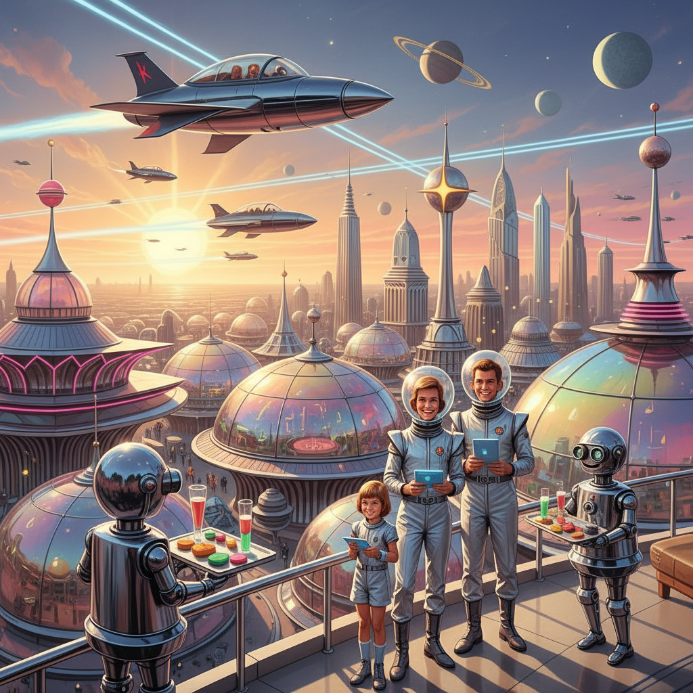

# Retrofuturism 复古未来主义



> **"1960年代想象的2000年——飞行汽车、银色连体衣和住在月球上的家庭。"**

## 概述

| 维度 | 描述 |
|------|------|
| 时期 | 1950s–1970s 原始期 / 2010s 怀旧复兴 |
| 别名 | Retrofuturism, Atompunk, Space Age, Googie |
| 核心色彩 | 银色、橙色、天蓝、白色、原子绿 |
| 关键元素 | 飞行汽车、圆形建筑、机器人管家、太空家庭 |
| 代表人物 | The Jetsons、Syd Mead、Eero Saarinen |
| 关联风格 | Spacecore, Vintage Americana, Dieselpunk, Cassette Futurism |

---

## 历史脉络

### 1950s–1970s：未来的黄金想象

冷战时期的太空竞赛催生了一种极度乐观的未来想象：

| 预言 | 现实 |
|------|------|
| 2000年人人有飞行汽车 | 我们有了 Uber |
| 月球殖民地 | 我们有了 ISS |
| 机器人管家 | 我们有了 Roomba |
| 食物药丸 | 我们有了外卖 |
| 银色连体衣 | 我们穿运动裤 |

### 视觉来源

| 来源 | 贡献 |
|------|------|
| The Jetsons (1962) | 太空家庭生活的视觉原型 |
| Googie 建筑 | 原子时代的商业建筑风格 |
| World's Fair (1964) | 企业对未来的展示 |
| Syd Mead | 工业设计师的未来城市 |
| NASA 概念图 | 太空殖民的官方想象 |
| 科幻杂志封面 | 大众对未来的视觉教育 |

### 核心吸引力

Retrofuturism 的怀旧感来自于**一个从未到来的未来**：
- 那个时代真诚地相信技术会解决一切
- 未来是光明的、干净的、有趣的
- 每个人都会过得更好
- 这种乐观主义本身就令人怀念

---

## 视觉语法

### 色彩系统

```
主色：
  银色 (#C0C0C0) — 金属、飞船
  橙色 (#FF8C00) — 原子时代的活力色
  天蓝 (#87CEEB) — 未来的天空
  白色 (#FFFFFF) — 清洁、纯净
  原子绿 (#7FFF00) — 辐射、能量

辅色：
  红色 (#FF0000) — 火箭、按钮
  金色 (#FFD700) — 装饰
  黑色 (#000000) — 太空背景

质感：
  光滑金属 — 飞船、建筑
  塑料 — 家具、器具
  玻璃 — 穹顶、面罩
  霓虹 — 招牌、仪表盘
  流线型 — 一切都是流线型的
```

### 标志性元素

| 类别 | 元素 |
|------|------|
| 交通 | 飞行汽车、单轨列车、火箭、飞碟 |
| 建筑 | Googie 风格、穹顶城市、悬浮建筑 |
| 家居 | 圆形家具、管道式厨房、机器人管家 |
| 服装 | 银色连体衣、泡泡头盔、靴子 |
| 科技 | 巨型计算机、射线枪、传送门 |
| 生活 | 食物药丸、视频电话、自动人行道 |

---

## 与千禧怀旧的关系

### Y2K 的复古未来元素
- Y2K 美学中的银色、太空感直接来自 Retrofuturism
- 2000年 = "未来终于到了"的兴奋
- 千禧一代在这种"未来已来"的氛围中长大

### 对"失落未来"的怀念
- 我们没有得到飞行汽车，得到了社交媒体焦虑
- Retrofuturism 怀念的是一种"相信未来会更好"的心态
- 在气候危机和政治极化的时代，这种乐观主义格外珍贵

---

## 中国语境

- "原子时代"/"太空时代"的设计复兴
- 中国航天文化中的复古未来元素
- 50–60年代中国宣传画中的未来想象
- 与"赛博朋克"的对比（乐观 vs 悲观的未来）

---

## 设计应用

| 场景 | 应用方式 |
|------|----------|
| 品牌 | 银色+橙色+流线型字体+原子图案 |
| 空间 | 圆形家具+金属+霓虹+Googie 元素 |
| 产品 | 流线型造型+铬合金+复古仪表盘 |
| 数字 | 复古未来UI+圆角+渐变+动态仪表 |

---

## 相关风格

← [Vintage Americana 复古美国风](vintage-americana.md) | [Cassette Futurism 磁带未来主义](cassette-futurism.md) →

↑ [返回千禧怀旧目录](README.md) | [返回总目录](../README.md)
