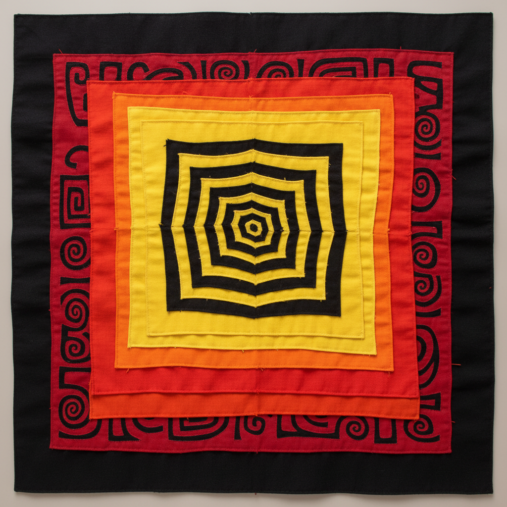

# Reverse Appliqué Art 反贴布艺术

> "Reverse appliqué is excavation in fabric — instead of adding layers on top, the artist cuts through upper layers to reveal colors beneath, turning the cloth into a geological cross-section of stacked hues. Each cut edge is turned under and stitched with invisible precision, creating designs that appear to emerge from within the fabric rather than being placed upon it." — Unknown

## 概述

反贴布艺术（Reverse Appliqué Art）是一种通过在多层叠放的织物上层剪切开口，露出下层不同颜色的织物，然后将切口边缘折入缝合的纺织装饰技法。与传统贴布（在底布上缝贴图案）相反，反贴布是从上层"挖掘"出图案——创造出图案从织物内部浮现的效果。

反贴布艺术的实践包括：1）多层叠放——将不同颜色的布料叠放；2）图案剪切——在上层剪出图案形状；3）边缘折入——将切口边缘折入缝合；4）多层露出——通过不同深度的剪切露出不同层；5）Mola——巴拿马库纳族的反贴布传统；6）Hmong反贴布——苗族的反贴布传统；7）当代反贴布——将传统技法与现代设计结合的创作。

## 核心特征

| 特征 | 描述 |
|------|------|
| 剪切 | 从上层剪切露出下层 |
| 多层 | 多层不同颜色的布 |
| 反向 | 与贴布相反的方向 |
| 色彩 | 层次丰富的色彩 |
| 精确 | 精确的剪切和缝合 |
| 民族 | 多个民族的传统 |

## 视觉特征

- **层次**：多层色彩的层次感
- **轮廓**：清晰的图案轮廓
- **色彩**：鲜艳对比的色彩
- **几何**：几何化的图案设计
- **精确**：精确的边缘处理
- **深度**：视觉上的深度感

## 代表作品

| 作品 | 艺术家/文化 | 年代 | 意义 |
|------|-------------|------|------|
| *Kuna Mola* | 巴拿马库纳族 | 传统 | 库纳族莫拉 |
| *Hmong Pa Ndau* | 苗族 | 传统 | 苗族花布 |
| *San Blas Islands textiles* | 巴拿马 | 传统 | 圣布拉斯群岛纺织品 |
| *Hawaiian quilts* | 夏威夷 | 19世纪起 | 夏威夷绗缝 |
| *Contemporary reverse appliqué* | 国际 | 当代 | 当代反贴布 |

## 历史时间线

| 时期 | 事件 |
|------|------|
| 古代 | 反贴布技法的早期使用 |
| 传统 | 库纳族和苗族的反贴布传统 |
| 19世纪 | 夏威夷绗缝中的反贴布 |
| 20世纪 | 反贴布的国际认知 |
| 当代 | 反贴布的艺术化发展 |

## 中国语境

反贴布在中国有深厚的民族传统。中国苗族的花布（Pa Ndau）是世界上最精美的反贴布传统之一——苗族妇女将多层布料叠放后剪切缝合创造精美图案。中国西南少数民族（苗族、侗族、布依族等）的反贴布——是中国非物质文化遗产的重要组成部分。中国的贵州、云南和湖南等地——是反贴布传统的主要分布区域。中国当代的时装设计师将少数民族的反贴布技法——应用于现代服装和配饰设计。中国的纤维艺术教育中，反贴布作为重要的传统技法——在相关课程中深入教授。中国的文创产业中，反贴布元素——被应用于各种现代产品设计。

## AI生成概念图

## 与其他风格的关系

- **Mola** → 莫拉艺术
- **Appliqué** → 贴布艺术
- **Hmong Textile** → 苗族纺织
- **Folk Art** → 民间艺术
- **Textile Art** → 纺织艺术
- **Quilting** → 绗缝

---

*浮光艺志 | Chronicle of Artistry*
