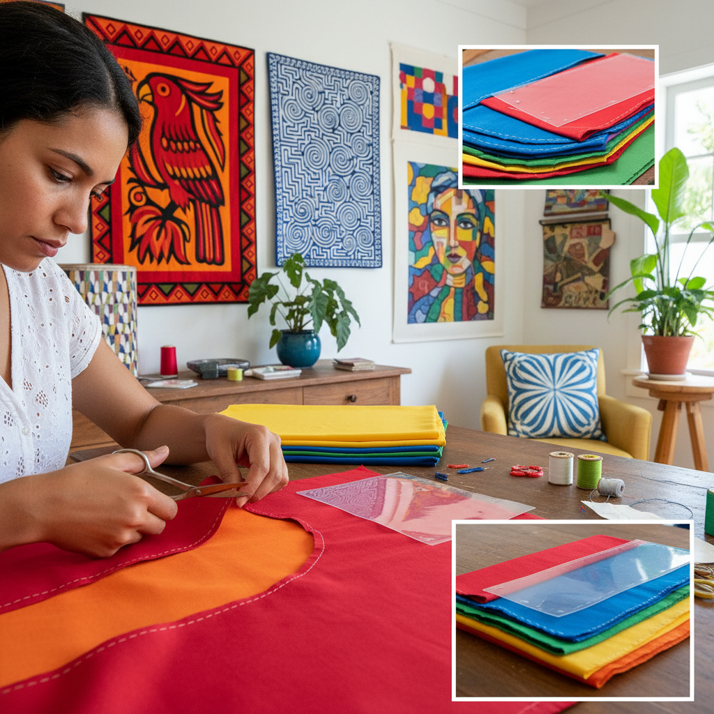

# Reverse Applique 反面贴布

> "Reverse appliqué is revelation through subtraction — layers of colored fabric stacked and stitched, then the top layers carefully cut away to reveal the colors beneath, each incision a window into hidden depths, creating designs not by adding but by uncovering what was always there, waiting to be seen." — Unknown

## 概述

反面贴布（Reverse Appliqué）是一种与传统贴布（appliqué）相反的技法——不是将形状贴在底布上，而是将多层织物叠在一起，然后从上层剪出形状，露出下层的颜色。通过在不同层次剪切，可以在一件作品中展现多种颜色。反面贴布的边缘通常用细密的针脚（如卷边针/whip stitch或毯边针/blanket stitch）固定。

反面贴布最著名的传统是巴拿马库纳族（Kuna/Guna）的莫拉（Mola）——库纳族妇女将多层（通常4-7层）不同颜色的棉布叠在一起，从各层剪出图案，创造出色彩鲜艳、图案复杂的纺织品。莫拉是库纳族女性服装（blouse panel）的重要组成部分。其他反面贴布传统包括：印度的Ralli quilts、泰国苗族的反面贴布、夏威夷被的某些技法等。

## 核心特征

| 特征 | 描述 |
|------|------|
| 多层 | 多层织物叠加 |
| 剪切 | 从上层剪出图案 |
| 露出 | 露出下层颜色 |
| 减法 | 减法的创作方式 |
| 色彩 | 多层色彩的展现 |
| 边缘 | 精细的边缘处理 |

## 视觉特征

- **层次**：多层色彩的层次感
- **鲜艳**：鲜艳的色彩对比
- **图案**：复杂的图案设计
- **轮廓**：清晰的剪切轮廓
- **深度**：层层深入的深度感
- **民族**：强烈的民族风格

## 代表作品

| 作品 | 艺术家 | 年代 | 意义 |
|------|--------|------|------|
| *Kuna Mola* | 库纳族妇女 | 传统 | 巴拿马莫拉 |
| *Hmong reverse appliqué* | 苗族妇女 | 传统 | 苗族反面贴布 |
| *Indian Ralli quilts* | 印度工匠 | 传统 | 印度拉利被 |
| *Contemporary reverse appliqué* | Various | 当代 | 当代反面贴布 |
| *Art quilts with reverse appliqué* | Various | 当代 | 艺术绗缝 |

## 历史时间线

| 时期 | 事件 |
|------|------|
| 古代 | 反面贴布在多个文化中的实践 |
| 传统 | 库纳族莫拉的发展 |
| 19-20世纪 | 莫拉的商业化 |
| 20世纪后期 | 反面贴布在艺术绗缝中的应用 |
| 当代 | 反面贴布的全球传播 |

## 中国语境

反面贴布在中国有相关的传统——中国苗族的服饰中有反面贴布技法。贵州、云南等地的苗族妇女使用多层织物的剪切和翻折技法创造装饰图案。中国的拼布（patchwork）社区中，反面贴布是常用的技法之一。当代中国的纤维艺术家在创作中使用反面贴布。中国的手工教育中开始引入莫拉等反面贴布传统的教学。

## AI生成概念图

## 与其他风格的关系

- **Applique Art** → 贴布绣
- **Patchwork** → 拼布
- **Quilting** → 绗缝
- **Cutwork** → 雕绣
- **Folk Art** → 民间艺术
- **Textile Art** → 纺织艺术

---

*浮光艺志 | Chronicle of Artistry*
