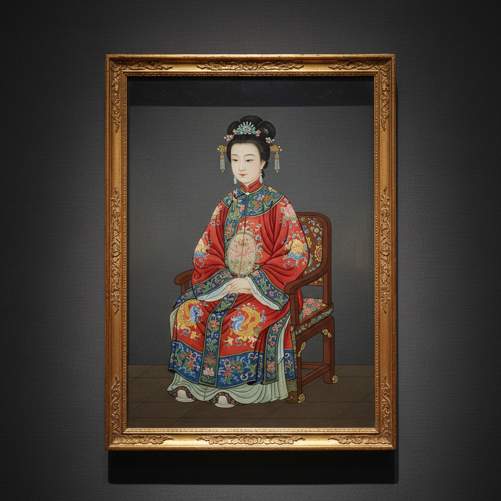

# Reverse Glass Painting Art 玻璃背画艺术

> "Reverse glass painting is painting backwards — the artist works on the back of a sheet of glass, applying details first and background last, building the image in reverse order so that when viewed from the front through the glass, the painting appears complete and luminous. The glass surface gives the colors an extraordinary depth and brilliance, as if the image were sealed beneath a layer of crystal. It demands absolute planning: there is no going back, no painting over mistakes." — Unknown

## 概述

玻璃背画艺术（Reverse Glass Painting Art）是在玻璃板的背面进行绘画，从正面透过玻璃观看的传统绘画技法——艺术家必须以相反的顺序工作（先画细节，后画背景），因为最先画的部分在正面观看时位于最前面。玻璃背画以其独特的光泽、鲜艳的色彩和玻璃表面的保护效果著称，在欧洲、中国和东南亚都有悠久的传统。

玻璃背画艺术的实践包括：1）传统玻璃背画——在玻璃背面用油画或水粉颜料绘画；2）金箔玻璃背画——结合金箔和绘画的技法；3）镜面背画——在镜子背面绘画；4）宗教图像——圣像和宗教场景的玻璃背画；5）民间玻璃背画——民间故事和装饰图案；6）中国玻璃背画——中国传统的玻璃背画；7）当代玻璃背画——将传统技法与现代设计结合的创作。

## 核心特征

| 特征 | 描述 |
|------|------|
| 反向 | 反向顺序的绘画 |
| 光泽 | 玻璃表面的光泽 |
| 鲜艳 | 色彩格外鲜艳 |
| 保护 | 玻璃保护画面 |
| 计划 | 需要精确的计划 |
| 不可逆 | 不可修改的特性 |

## 视觉特征

- **光泽**：玻璃表面的光滑光泽
- **鲜艳**：格外鲜艳的色彩
- **深度**：玻璃层创造的深度感
- **清晰**：极其清晰的线条
- **平滑**：完美平滑的表面
- **明亮**：明亮通透的整体感

## 代表作品

| 作品 | 艺术家/文化 | 年代 | 意义 |
|------|-------------|------|------|
| *Romanian icons on glass* | 罗马尼亚 | 18世纪至今 | 罗马尼亚玻璃圣像 |
| *Bavarian glass paintings* | 德国 | 18-19世纪 | 巴伐利亚玻璃背画 |
| *Chinese export glass paintings* | 中国 | 18-19世纪 | 中国外销玻璃背画 |
| *Indonesian glass paintings* | 印尼 | 传统 | 印尼玻璃背画 |
| *Contemporary reverse glass* | 当代 | 当代 | 当代玻璃背画 |

## 历史时间线

| 时期 | 事件 |
|------|------|
| 古罗马 | 玻璃背画的早期形式 |
| 14世纪 | 欧洲宗教玻璃背画的发展 |
| 18世纪 | 中国外销玻璃背画的兴起 |
| 18-19世纪 | 欧洲民间玻璃背画的流行 |
| 当代 | 玻璃背画的艺术化复兴 |

## 中国语境

玻璃背画艺术在中国有极其重要的历史地位。中国的玻璃背画（又称"玻璃画"或"镜画"）在18-19世纪达到巅峰——主要作为外销艺术品出口欧洲。中国广州是玻璃背画的主要产地——广州十三行的画师为欧洲市场创作了大量精美的玻璃背画。中国的玻璃背画题材包括肖像、风景、花鸟和历史故事——以精细的工笔画风格著称。中国的玻璃背画技法融合了中国传统绘画和西方透视法——创造出独特的中西合璧风格。中国当代的一些艺术家重新探索玻璃背画——将这一几乎失传的技法与当代艺术表达结合。中国的博物馆中收藏有大量清代玻璃背画——作为中外文化交流的重要见证。中国的非物质文化遗产保护中，一些地方的玻璃背画技法正在被重新发掘和传承。

## AI生成概念图

## 与其他风格的关系

- **Glass Painting** → 玻璃绘画
- **Icon Painting** → 圣像画
- **Chinese Export Art** → 中国外销艺术
- **Folk Art** → 民间艺术
- **Miniature Painting** → 细密画
- **Decorative Art** → 装饰艺术

---

*浮光艺志 | Chronicle of Artistry*
