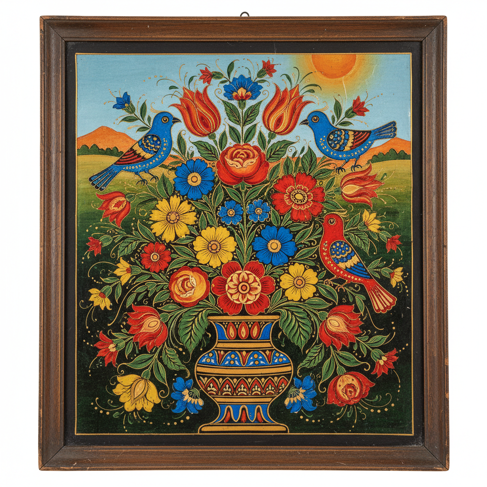

# Reverse Glass Painting 玻璃反画 | Hinterglasmalerei / 玻璃画

> **"镜子背后的世界——画家在玻璃背面倒序作画，前面看到的是完美的正像。"**

## 概述

玻璃反画（Reverse Glass Painting / Hinterglasmalerei / Peinture sous verre）是在玻璃板背面作画，从正面透过玻璃观看的装饰绘画技法。画家必须倒序作画——先画最前面的细节（如眼睛、嘴唇），最后画背景，这与正常绘画顺序完全相反。这种技法起源于古罗马，在中世纪欧洲（特别是巴伐利亚和波西米亚）发展为民间艺术，同时在中国（清代广州外销画）、印尼（Wayang玻璃画）、塞内加尔（Souwer）和罗马尼亚（Icoane pe sticlă）都有独立传统。

## 主要传统

| 地区 | 名称 | 特征 |
|------|------|------|
| 巴伐利亚/奥地利 | Hinterglasmalerei | 宗教圣像 |
| 中国广州 | 玻璃画 | 外销画，肖像 |
| 印尼 | Lukisan kaca | Wayang人物 |
| 塞内加尔 | Souwer/Fixé | 伊斯兰圣人 |
| 罗马尼亚 | Icoane pe sticlă | 东正教圣像 |
| 秘鲁 | Pintura en vidrio | 殖民时期 |

## 核心特征

- **倒序作画**：先画前景细节，后画背景
- **玻璃载体**：在玻璃背面绘制
- **正面观看**：透过玻璃看到正像
- **光泽效果**：玻璃表面的天然光泽
- **不可修改**：一旦画上无法擦除
- **色彩鲜艳**：颜料被玻璃保护不褪色

## 视觉特征

- 玻璃表面的光滑光泽
- 鲜艳不褪色的色彩
- 精细的细节描绘
- 平面化的装饰风格
- 民间艺术的质朴感
- 光线穿透的特殊效果

## 与其他风格的关系

| 风格 | 关系 |
|------|------|
| 彩色玻璃 Stained Glass | 共享玻璃载体 |
| 民间艺术 Folk Art | 各地的民间传统 |
| 中国外销画 | 广州玻璃画传统 |
| 当代玻璃艺术 | 反画技法的现代应用 |
| 图标画 Icon | 共享宗教图像传统 |

## 概念图

---

*浮光艺志 | Chronicle of Artistry*
