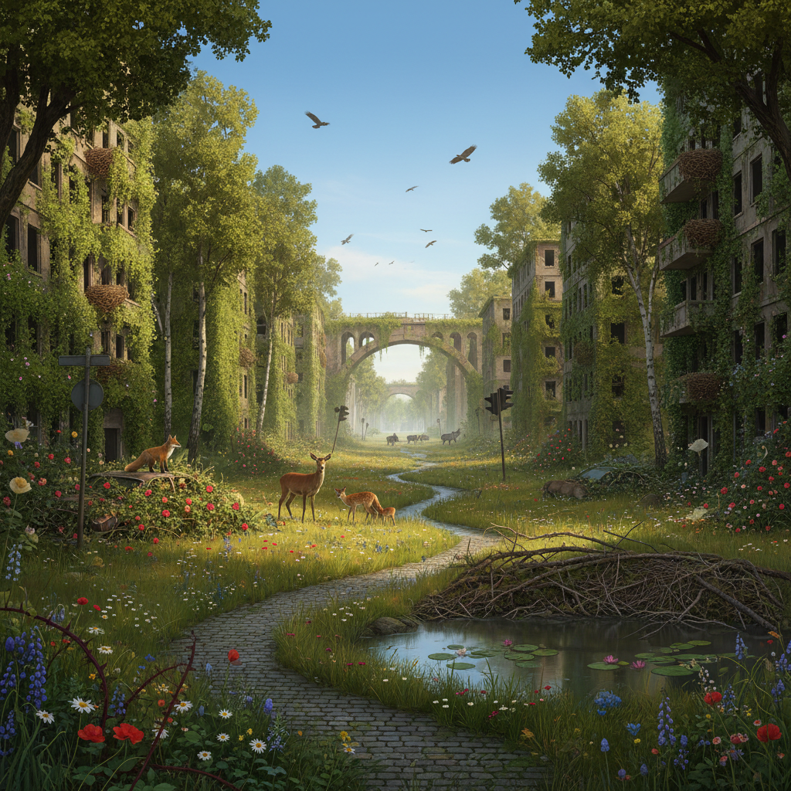

# Rewilding Art 再野化艺术

> "Rewilding art is the practice of letting wildness back into culture — not just planting trees and reintroducing wolves but rewilding the imagination itself, creating art that remembers what landscapes looked like before we tamed them, that envisions what they could become if we stepped back, that celebrates the messy, uncontrolled, self-organizing beauty of ecosystems left to their own devices, and that asks the most radical question in conservation: what if we trusted nature to know what it's doing?" — Unknown

## 概述

再野化艺术（Rewilding Art）是与"再野化"（Rewilding）生态运动平行发展的艺术实践。再野化是一种保护策略，主张让退化的生态系统恢复到更自然的状态——通过重新引入关键物种、移除人工干预、让自然过程自行恢复。再野化艺术则探索这种理念在文化和美学层面的含义。

再野化艺术的实践包括：1）想象再野化后的景观——描绘城市和农田恢复为野地的场景；2）记录再野化过程——用艺术手段记录生态恢复的过程；3）参与式再野化——艺术家直接参与再野化项目；4）文化再野化——探索如何让"野性"回归人类文化和想象；5）身体再野化——探索人体与野性自然的重新连接。再野化艺术与大地艺术、生态艺术和环境艺术有密切关联，但更强调"放手"和"退让"而非"干预"和"创造"。

## 核心特征

| 特征 | 描述 |
|------|------|
| 野性 | 野性的回归 |
| 退让 | 人类的退让 |
| 恢复 | 生态的自然恢复 |
| 想象 | 想象野化的未来 |
| 过程 | 关注过程而非结果 |
| 共存 | 人与野性的共存 |

## 视觉特征

- **荒野**：恢复中的荒野景观
- **动物**：回归的野生动物
- **废墟**：被自然接管的人造物
- **森林**：重新生长的森林
- **水**：恢复的河流和湿地
- **时间**：时间流逝的痕迹

## 代表作品

| 作品 | 艺术家 | 年代 | 意义 |
|------|--------|------|------|
| *Rewilding Britain* visuals | Various | 2010年代 | 再野化运动的视觉 |
| *Knepp Estate documentation* | Various | 2000年代起 | 再野化农场的记录 |
| *Urban rewilding art* | Various | 2020年代 | 城市再野化艺术 |
| *Feral* | George Monbiot | 2013 | 再野化文学 |
| *Rewilding photography* | Various | 2010年代 | 再野化摄影 |

## 历史时间线

| 时期 | 事件 |
|------|------|
| 1990年代 | 再野化概念的提出 |
| 2000年代 | 欧洲再野化项目的启动 |
| 2013 | Monbiot的《Feral》出版 |
| 2020年代 | 再野化艺术的兴起 |
| 当代 | 城市再野化的流行 |

## 中国语境

再野化在中国有独特的语境和实践。中国的一些大型生态恢复项目——如退耕还林、退牧还草、大熊猫栖息地恢复、长江十年禁渔——在某种程度上体现了再野化的精神。中国的一些艺术家和摄影师在记录这些生态恢复过程：拍摄重新出现的野生动物、记录植被的自然恢复、以及想象城市空间的再野化可能。中国传统文化中的"天人合一"理念和道家的"无为"思想与再野化的哲学有深刻的共鸣——让自然按照自己的方式运行，而非强加人类的意志。中国的一些当代景观设计师（如俞孔坚的"大脚革命"）也在实践着某种再野化的设计理念。

## AI生成概念图

## 与其他风格的关系

- **Land Art** → 大地艺术
- **Eco-Art** → 生态艺术
- **Nature Photography** → 自然摄影
- **Solarpunk** → 太阳朋克
- **Eco-Brutalism** → 生态粗野主义
- **Environmental Art** → 环境艺术

---

*浮光艺志 | Chronicle of Artistry*
