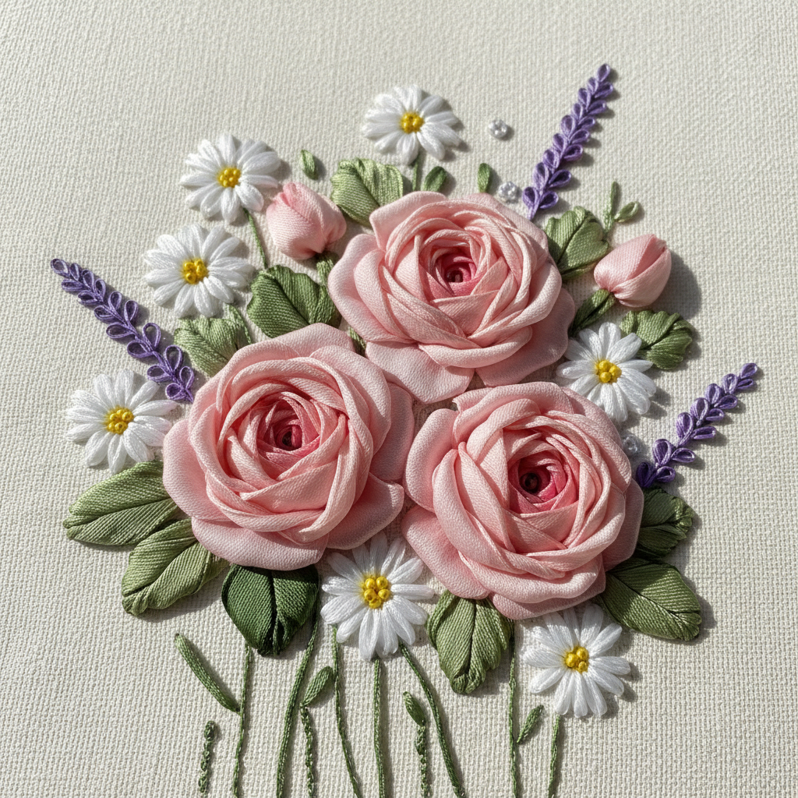

# Ribbon Embroidery Art 丝带绣艺术

> "Ribbon embroidery is embroidery in three dimensions — silk ribbons are threaded through fabric and manipulated into roses, daisies, leaves, and buds that bloom from the surface with a fullness and softness that thread alone cannot achieve. Each ribbon stitch captures light differently as the silk twists and folds, creating flowers that seem to have just been picked from a garden and pressed gently into the cloth." — Unknown

## 概述

丝带绣艺术（Ribbon Embroidery Art）是使用丝绸或缎带代替传统绣线进行刺绣的技法——利用丝带的宽度、光泽和柔软性创造出立体的花卉和装饰效果。丝带绣以其快速、立体和华丽的效果著称，特别适合表现花卉、蝴蝶结和自然主题。

丝带绣艺术的实践包括：1）丝带玫瑰——用丝带折叠和缠绕制作玫瑰；2）直针丝带绣——将丝带平铺穿过织物；3）环形针——创造花瓣和叶片的环形；4）法国结丝带——用丝带打法国结；5）聚集花——将丝带聚集成花朵形状；6）组合技法——丝带与传统绣线的组合；7）当代丝带绣——将传统技法与现代设计结合的创作。

## 核心特征

| 特征 | 描述 |
|------|------|
| 立体 | 强烈的立体效果 |
| 快速 | 相对快速的制作 |
| 华丽 | 丝绸的华丽光泽 |
| 花卉 | 以花卉为主题 |
| 柔软 | 柔软流动的质感 |
| 光泽 | 丝绸的光泽变化 |

## 视觉特征

- **立体**：从平面凸起的花朵
- **光泽**：丝绸丝带的光泽
- **柔软**：柔软流动的质感
- **色彩**：丰富的色彩搭配
- **自然**：自然主义的花卉
- **华丽**：华丽浪漫的整体感

## 代表作品

| 作品 | 艺术家/文化 | 年代 | 意义 |
|------|-------------|------|------|
| *Rococo ribbon work* | 法国 | 18世纪 | 洛可可丝带装饰 |
| *Victorian ribbon embroidery* | 英国 | 19世纪 | 维多利亚丝带绣 |
| *Australian ribbon embroidery* | 澳大利亚 | 20世纪 | 澳大利亚丝带绣 |
| *Di van Niekerk works* | 南非 | 当代 | 当代丝带绣大师 |
| *Contemporary ribbon art* | 当代 | 当代 | 当代丝带绣 |

## 历史时间线

| 时期 | 事件 |
|------|------|
| 17世纪 | 丝带装饰在法国宫廷的兴起 |
| 18世纪 | 洛可可时期丝带绣的发展 |
| 19世纪 | 维多利亚时代丝带绣的流行 |
| 20世纪末 | 丝带绣的全球复兴 |
| 当代 | 丝带绣的艺术化和创新 |

## 中国语境

丝带绣艺术在中国有广泛的普及和发展。中国在2000年代经历了丝带绣的流行热潮——大量的丝带绣材料包和教程涌入市场。中国的手工艺市场中，丝带绣因其快速出效果和立体美感而受到欢迎——特别是在家居装饰领域。中国的一些手工艺人将丝带绣与中国传统刺绣结合——创造具有中国特色的丝带绣作品。中国的婚礼和节日装饰中，丝带绣花卉是受欢迎的手工装饰——以其华丽和喜庆的效果著称。中国的一些设计师将丝带绣应用于时装设计——在服装和配饰上创造立体的花卉装饰。中国的手工艺教育中，丝带绣作为一种入门级的立体刺绣技法被广泛教授——因为其相对容易学习和快速出效果。

## AI生成概念图

## 与其他风格的关系

- **Stumpwork** → 立体绣
- **Crewelwork** → 毛线绣
- **Silk Embroidery** → 丝绸刺绣
- **Floral Art** → 花卉艺术
- **Textile Art** → 纺织艺术
- **Rococo Art** → 洛可可艺术

---

*浮光艺志 | Chronicle of Artistry*
