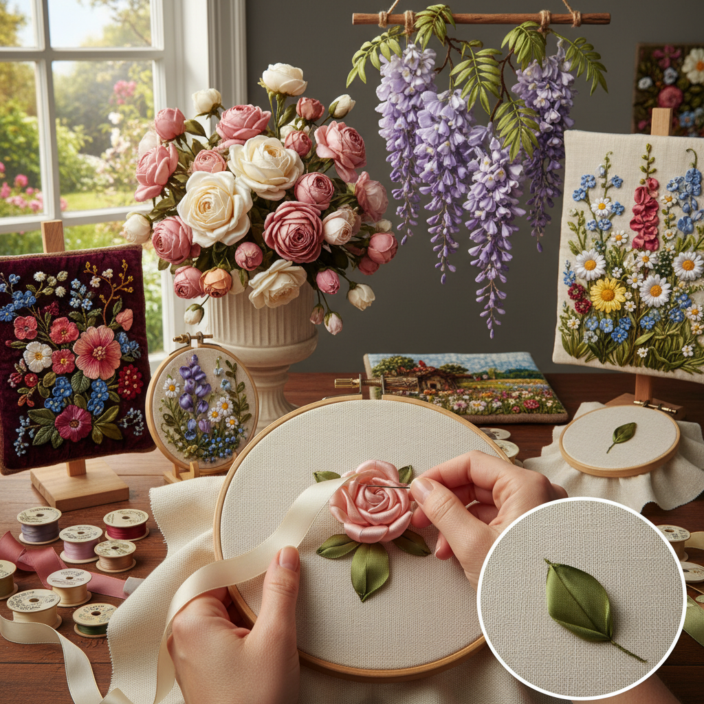

# Ribbon Embroidery 丝带绣

> "Ribbon embroidery is embroidery in three dimensions — silk ribbons threaded through a needle and stitched through fabric, each stitch a petal that curls and folds with the natural drape of silk, creating flowers so lifelike they seem to have just been picked from a garden and pressed onto cloth." — Unknown

## 概述

丝带绣（Ribbon Embroidery/Silk Ribbon Embroidery）是一种使用丝带（通常是丝绸丝带，宽度从2mm到13mm不等）代替线进行刺绣的技法。丝带绣的独特之处在于：丝带的宽度和柔软性使每一针都自然形成立体的花瓣、叶片或褶皱效果——一针就能创造出用线需要数十针才能达到的体积感。

丝带绣的历史可以追溯到17世纪的法国——路易十五时期的宫廷服装和配饰大量使用丝带装饰。18世纪，丝带绣在法国和英国的女性手工艺中流行。维多利亚时代，丝带绣用于装饰帽子、手袋、首饰盒和相框。20世纪后期，澳大利亚的刺绣艺术家推动了丝带绣的全球复兴。当代丝带绣主要用于花卉主题的装饰——玫瑰、雏菊、紫藤等花卉是最常见的题材。

## 核心特征

| 特征 | 描述 |
|------|------|
| 丝带 | 使用丝绸丝带 |
| 立体 | 天然的立体效果 |
| 花卉 | 花卉主题为主 |
| 快速 | 相对快速的效果 |
| 柔软 | 丝带的柔软质感 |
| 光泽 | 丝绸的光泽 |

## 视觉特征

- **立体**：丝带的立体花瓣
- **柔软**：丝绸的柔软褶皱
- **光泽**：丝绸的自然光泽
- **花卉**：逼真的花卉效果
- **色彩**：丰富的丝带色彩
- **浪漫**：浪漫的装饰风格

## 代表作品

| 作品 | 艺术家 | 年代 | 意义 |
|------|--------|------|------|
| *French court ribbonwork* | 法国宫廷 | 17-18世纪 | 法国宫廷丝带绣 |
| *Victorian ribbon embroidery* | Various | 维多利亚时代 | 维多利亚丝带绣 |
| *Australian ribbon revival* | Various | 1990s | 澳大利亚丝带绣复兴 |
| *Contemporary ribbon art* | Various | 当代 | 当代丝带绣艺术 |
| *Ribbon embroidery fashion* | Various | 当代 | 丝带绣时装 |

## 历史时间线

| 时期 | 事件 |
|------|------|
| 17世纪 | 法国宫廷丝带装饰 |
| 18世纪 | 丝带绣在欧洲的流行 |
| 维多利亚时代 | 丝带绣的装饰化 |
| 1990年代 | 丝带绣的全球复兴 |
| 当代 | 丝带绣的持续发展 |

## 中国语境

丝带绣在中国有广泛的流行——2000年代中国经历了丝带绣的热潮。中国的手工材料市场上有大量的丝带绣材料包（kit）。中国的丝带绣以花卉主题为主——玫瑰、牡丹、薰衣草等。中国的电商平台上有大量丝带绣成品和材料的销售。中国的手工工作室和社区中心经常开设丝带绣课程。丝带绣因其"快速出效果"的特点在中国的手工爱好者中受到欢迎。

## AI生成概念图

## 与其他风格的关系

- **Embroidery** → 刺绣
- **Stumpwork** → 立体刺绣
- **Flower Art** → 花卉艺术
- **Textile Art** → 纺织艺术
- **Fashion Design** → 时装设计
- **Rococo Style** → 洛可可风格

---

*浮光艺志 | Chronicle of Artistry*
