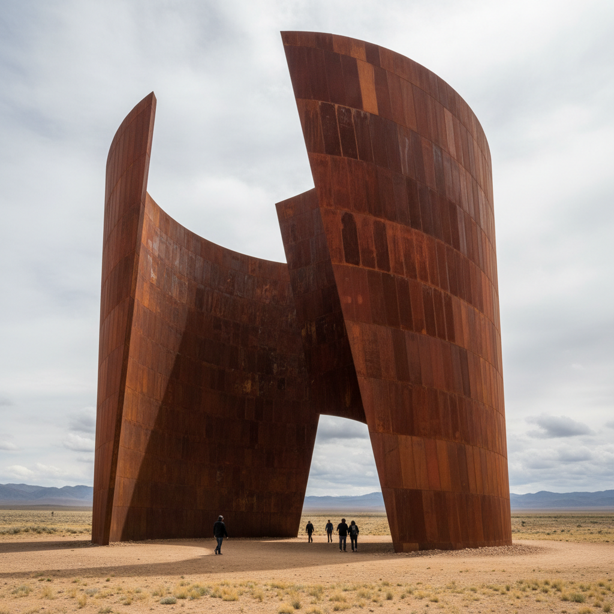

# Richard Serra 理查德·塞拉

> **流派**: 极简主义 · 过程艺术 · 大地艺术  
> **时期**: 1938–2024 美国  
> **关键词**: 耐候钢、巨型曲面、身体体验、重力与平衡

## 概述

理查德·塞拉是20世纪后半叶最重要的雕塑家之一。他用巨大的耐候钢板创造出令人敬畏的曲面空间，观者必须用身体穿行其中才能完整体验作品。他的雕塑挑战了重力、平衡和人体尺度的极限。

## 视觉特征

- **耐候钢**: 表面自然氧化形成深褐色铁锈层
- **巨型尺度**: 高达数十米的钢板墙体
- **曲面空间**: 弯曲的钢板创造出压迫或开放的通道
- **重力感**: 倾斜的巨大钢板传达不稳定的张力
- **时间痕迹**: 锈蚀表面随时间不断变化

## 代表作品

- 《倾斜之弧》(1981，已拆除)
- 《时间的问题》(2005) 毕尔巴鄂古根海姆
- 《带状》系列 (2000s)
- 《东西/西东》(2014) 卡塔尔沙漠

## 历史影响

塞拉将雕塑从物体变为体验，从观看变为穿行。他证明了艺术可以像建筑一样改变人对空间和自身身体的感知。

## 相关风格

- [Minimalism 极简主义](minimalism.md)
- [Donald Judd 唐纳德·贾德](donald-judd.md)
- [Anish Kapoor 安尼施·卡普尔](anish-kapoor.md)
