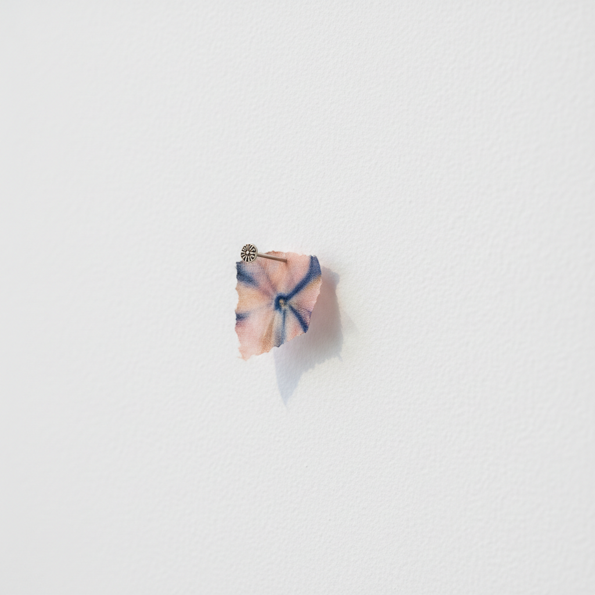

# Richard Tuttle 理查德·塔特尔

> **时期：** 1941–至今  
> **关键词：** 微型极简、脆弱材料、墙面诗学、反纪念碑性

## 概述

Richard Tuttle 是美国艺术家，以极小、极轻、极脆弱的作品挑战艺术的物质性和可见性极限。他的作品——一小片染色布钉在墙上、一根弯曲的铁丝、一张撕碎的纸——要求观者放慢脚步、靠近观看，在几乎"什么都没有"中发现诗意。他是极简主义的反面：不是宏大的工业体量，而是亲密的手工微光。

## 风格特征

- **微小尺度**：作品常常小到几乎被忽略，挑战观看的注意力
- **脆弱材料**：纸、布、铁丝、绳子等日常材料的最小化使用
- **墙面关系**：作品与墙面的关系（阴影、距离、角度）是作品的一部分
- **手工痕迹**：每一个折痕、撕裂和弯曲都保持手的直接性
- **色彩的轻触**：淡雅的水彩、染料或铅笔色彩，如同呼吸般轻柔

## 代表作品

- *Wire Pieces*系列（1972）
- *Cloth Octagonal*系列（1967）
- *Twenty Pearls*（2003）
- *Systems*系列（2014）

## 历史意义

Tuttle 证明了艺术可以在物质性的最低限度中存在，他的作品是对消费主义和景观社会的安静抵抗。他影响了后来的"反形式"艺术和关系美学中对微小姿态的重视。

## 概念图

