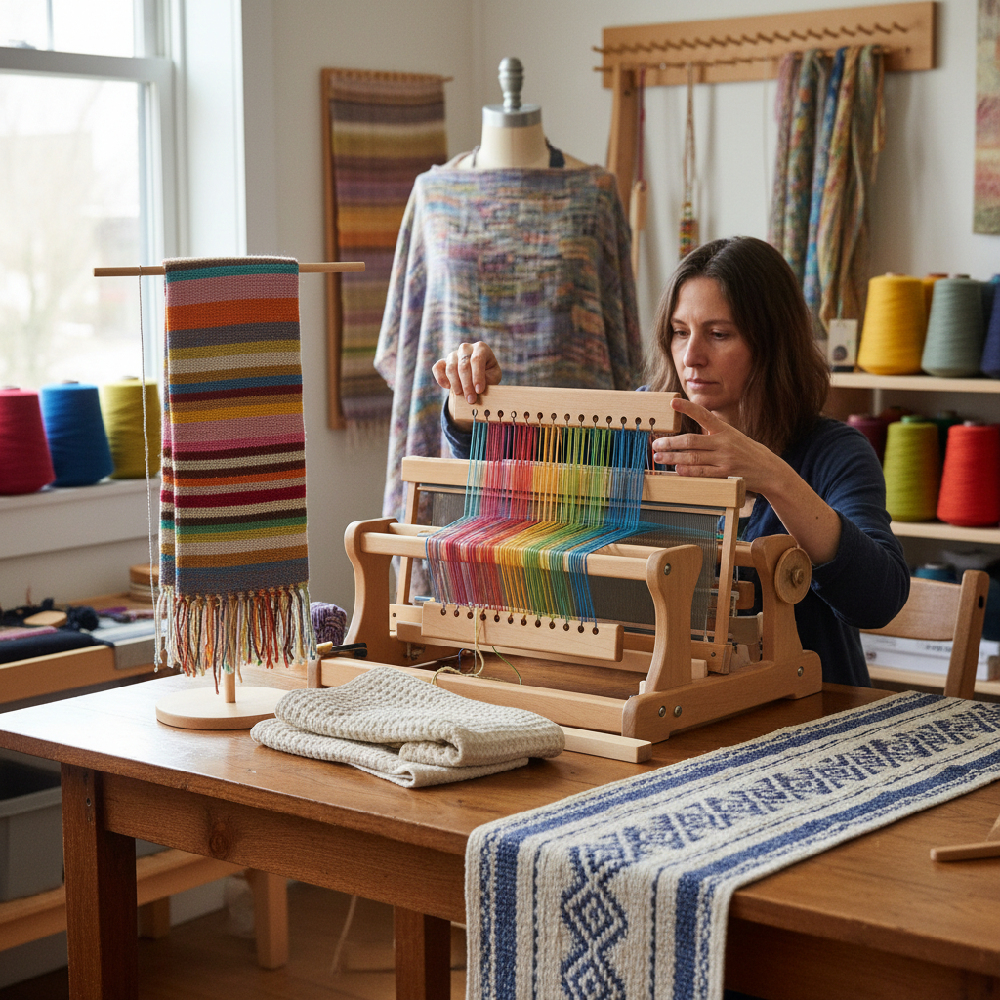

# Rigid Heddle Weaving 刚性综框编织

> "The rigid heddle loom is the great democratizer of weaving — compact enough for a kitchen table, yet capable of producing cloth that rivals the output of far more complex equipment." — Unknown

## 概述

刚性综框编织（Rigid Heddle Weaving）是使用刚性综框织机（rigid heddle loom）进行的编织技法。刚性综框织机是一种中等复杂度的织机——比Inkle loom功能更强，但比多综框织机（multi-shaft loom）简单得多。其核心部件是一个带有交替孔眼和槽缝的刚性综框（heddle），经线交替穿过孔眼和槽缝。当综框升起时，孔眼中的经线上升；当综框下降时，孔眼中的经线下降——由此形成开口供纬线穿过。

刚性综框织机可以编织比Inkle loom更宽的织物（通常10-32英寸宽），适合制作围巾、桌布、毛巾、面料等。它是许多编织爱好者的"第一台真正的织机"——价格适中、学习曲线平缓、但能产出令人满意的织物。

## 核心特征

| 特征 | 描述 |
|------|------|
| 综框 | 刚性综框控制经线 |
| 中等 | 中等复杂度 |
| 宽幅 | 可织较宽织物 |
| 入门 | 编织的理想入门 |
| 多用 | 围巾、桌布、面料 |
| 便携 | 相对便携 |

## 视觉特征

- **平纹**：基本的平纹组织
- **条纹**：经向和纬向条纹
- **质感**：丰富的质感变化
- **宽幅**：较宽的织物
- **色彩**：多色的配色
- **纹理**：通过纱线变化创造纹理

## 代表作品

| 作品 | 艺术家 | 年代 | 意义 |
|------|--------|------|------|
| *Rigid heddle scarves* | Various | 当代 | 刚性综框围巾 |
| *Handwoven towels* | Various | 当代 | 手工编织毛巾 |
| *Table runners* | Various | 当代 | 桌旗 |
| *Yardage for garments* | Various | 当代 | 服装面料 |
| *Pick-up stick patterns* | Various | 当代 | 提花棒图案 |

## 历史时间线

| 时期 | 事件 |
|------|------|
| 古代 | 简单织机的使用 |
| 中世纪 | 综框概念的发展 |
| 20世纪初 | 现代刚性综框织机的设计 |
| 1970s | Ashford等品牌的推广 |
| 2000s | 刚性综框编织的复兴 |
| 当代 | 在线教程和社区的繁荣 |

## 中国语境

刚性综框编织在中国的手工编织爱好者中正在快速普及。中国的电商平台上有多种品牌的刚性综框织机可供选择——从国产到进口品牌（如Ashford、Schacht、Kromski）。中国的一些手工工作坊和编织教室开设了刚性综框编织课程。社交媒体上（小红书、B站）有大量中文的刚性综框编织教程。中国的编织爱好者社群中，刚性综框织机是最受欢迎的入门织机之一。

## AI生成概念图

## 与其他风格的关系

- **Inkle Weaving** → 窄带织机编织
- **Backstrap Weaving** → 腰机编织
- **Tablet Weaving** → 织带
- **Weaving** → 编织
- **Textile Art** → 纺织艺术
- **Tapestry Weaving** → 挂毯编织

---

*浮光艺志 | Chronicle of Artistry*
