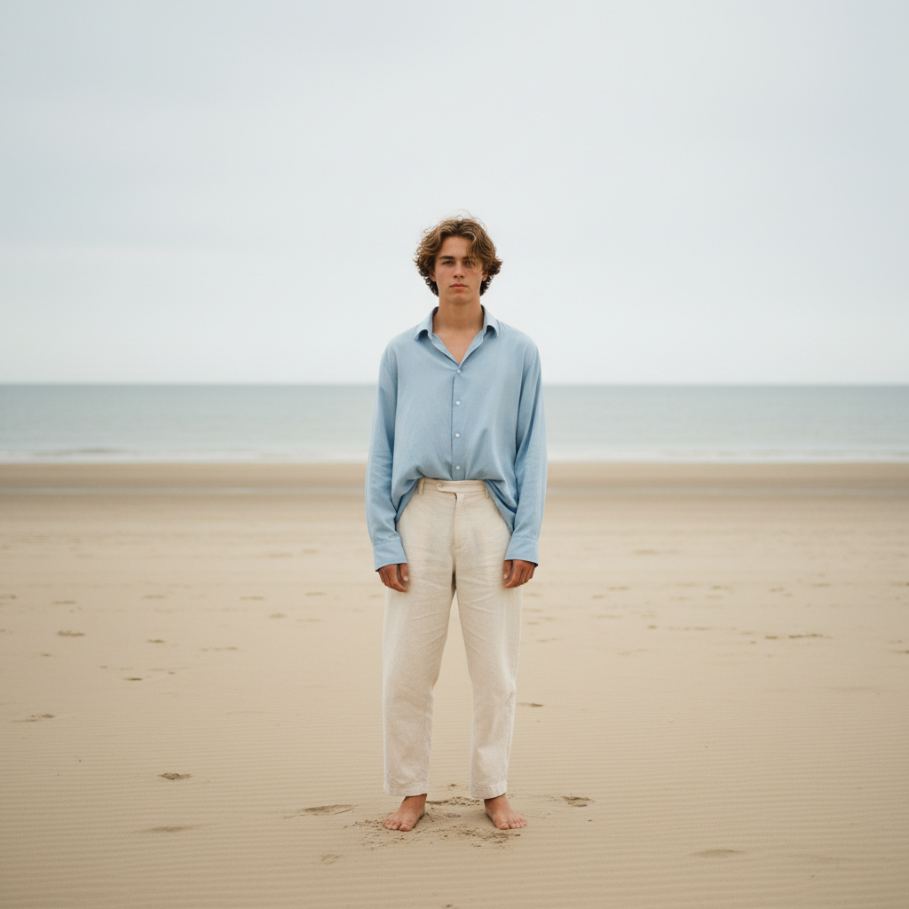

# Rineke Dijkstra 里内克·迪克斯特拉

> **时期：** 1959–至今  
> **关键词：** 青少年肖像、海滩系列、脆弱与力量、正面凝视

## 概述

Rineke Dijkstra 是荷兰摄影师，以拍摄青少年的正面全身肖像闻名。她的海滩系列——穿着泳衣的少年站在海边，直视镜头——捕捉了青春期特有的脆弱、笨拙和尊严并存的瞬间，成为当代肖像摄影的标杆。

## 风格特征

- **正面全身**：人物正面站立，直视镜头
- **简洁背景**：海滩、白墙等干净背景突出人物
- **自然光**：柔和的自然光线，无戏剧性布光
- **青春期身体**：尚未定型的身体姿态中的脆弱与力量
- **系列化**：同一主题的持续追踪和比较

## 代表作品

- *Beach Portraits*系列（1992–至今）
- *Buzzclub/Mysteryland*（1996–1997）
- *Israeli Soldiers*系列（1999–2003）
- *The Krazyhouse*（2009）

## 概念图

