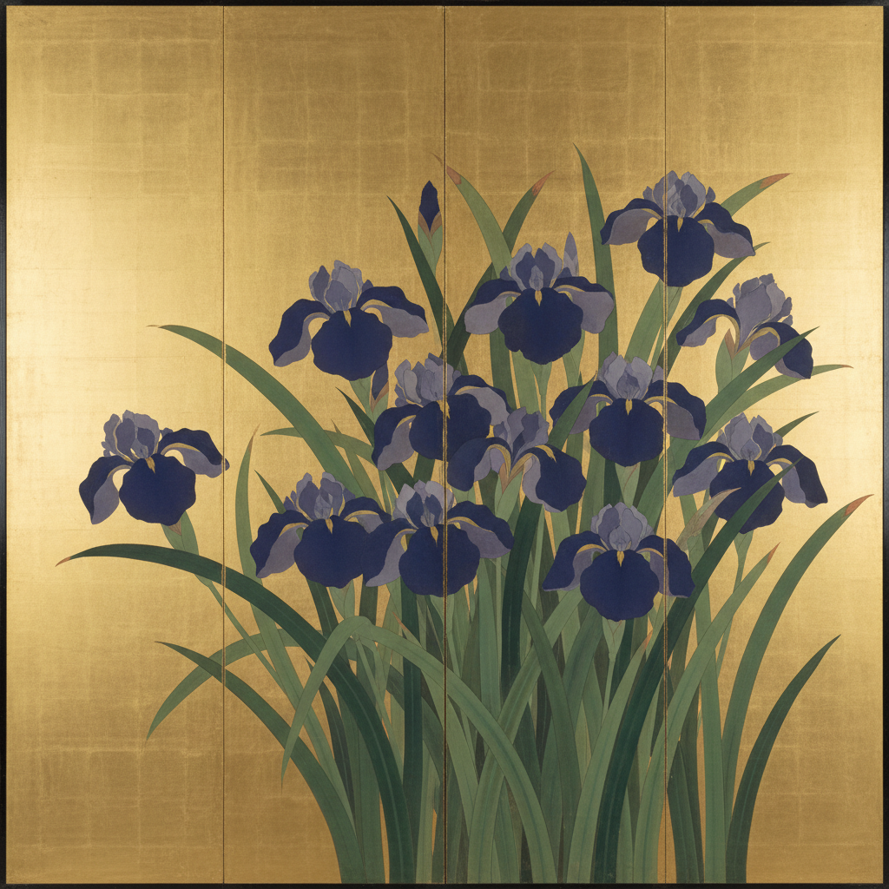

# Rinpa 琳派 | 日本装饰画派

> **"自然之美，以金箔为舞台，以大胆构图为戏剧。"**

## 概述

琳派（琳派 / Rinpa）是日本美术史上最具装饰性和影响力的画派之一，由17世纪初的本阿弥光悦和俵屋宗达开创，经尾形光琳在18世纪发扬光大（"琳派"之名即取自光琳之"琳"）。琳派以大胆的构图、华丽的金银箔底、自然主题的装饰化处理和"たらし込み"（滴落渗透）技法闻名，跨越绘画、漆器、陶瓷、纺织等多种媒介。

## 时间线

| 年份 | 事件 |
|------|------|
| 1600s | 本阿弥光悦与俵屋宗达在京都开创琳派美学 |
| 1658–1716 | 尾形光琳活跃期，《红白梅图屏风》《燕子花图屏风》 |
| 1658–1743 | 尾形乾山（光琳之弟）将琳派美学带入陶瓷 |
| 1761–1828 | 酒井抱一在江户复兴琳派 |
| 1795–1858 | �的铃木其一继承抱一风格 |
| 当代 | 琳派美学影响日本现代设计和动画 |

## 核心特征

- **たらし込み（Tarashikomi）**：在未干的颜料上滴入另一色，产生自然渗透效果
- **金银箔底**：以金箔或银箔作为画面背景，创造华丽空间
- **大胆裁切**：自然物象被画面边缘大胆裁切，产生现代感
- **装饰性平面**：放弃透视深度，追求平面装饰效果
- **自然主题**：花鸟、流水、植物的季节性表现
- **跨媒介**：绘画、屏风、扇面、漆器、陶瓷、纺织

## 代表艺术家

| 艺术家 | 代表作 |
|--------|--------|
| 俵屋宗达 | 《风神雷神图屏风》 |
| 尾形光琳 | 《红白梅图屏风》《燕子花图屏风》 |
| 尾形乾山 | 琳派风格陶瓷 |
| 酒井抱一 | 《夏秋草图屏风》 |
| 铃木其一 | 《朝颜图屏风》 |

## 视觉特征

- 金箔/银箔的华丽底色
- 大面积色块与精细描绘的对比
- 水墨渗透的偶然性美感
- 植物的装饰化、图案化处理
- 留白与充盈的戏剧性对比
- 屏风的大尺幅展开式构图

## 与其他风格的关系

| 风格 | 关系 |
|------|------|
| 大和绘 | 琳派继承了大和绘的日本本土传统 |
| 浮世绘 | 同时代但不同路径，琳派更贵族化 |
| Art Nouveau | 19世纪末欧洲受琳派影响（日本主义） |
| Gustav Klimt | 金箔使用直接受琳派启发 |
| 当代日本设计 | 琳派的平面装饰性影响深远 |

## 概念图

---

*浮光艺志 | Chronicle of Artistry*
