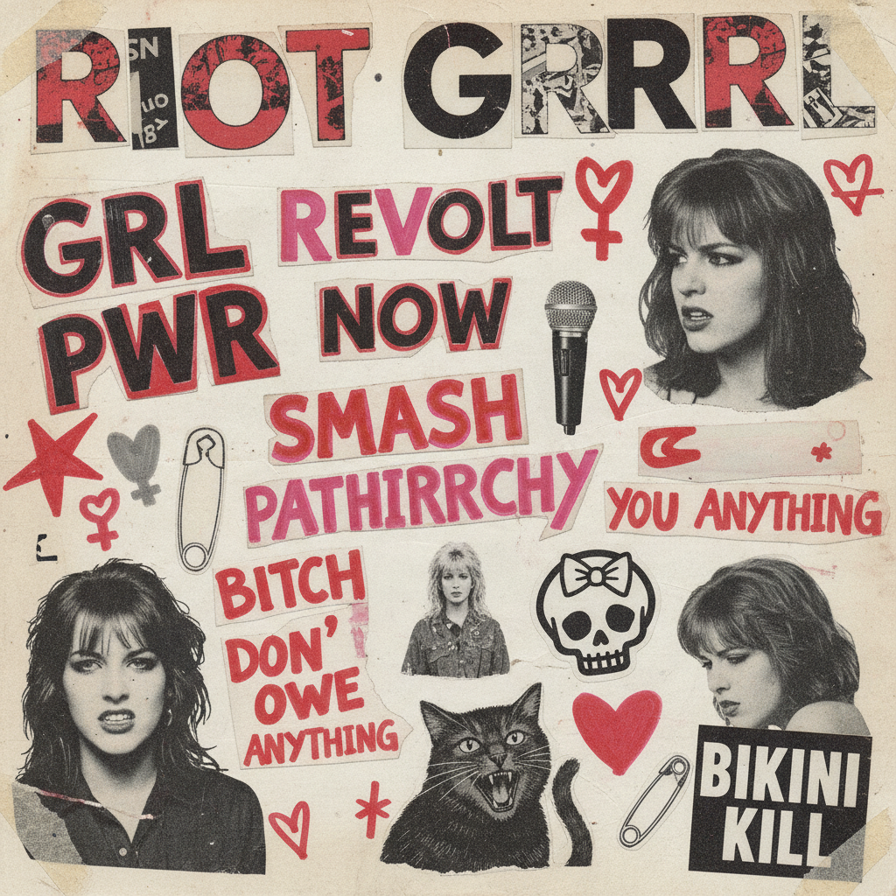

# Riot Grrrl 暴女运动



> **"DIY 杂志、手写歌词、愤怒的吉他——女孩也可以组乐队、也可以愤怒。"**

## 概述

| 维度 | 描述 |
|------|------|
| 时期 | 1991–1997（原始）/ 2010s 复兴 |
| 别名 | Riot Grrrl, Riot Girl, Grrrl Power |
| 核心色彩 | 黑色、红色、粉色、白色 |
| 关键元素 | DIY杂志(zine)、手写字、拼贴、朋克音乐 |
| 代表人物 | Bikini Kill, Sleater-Kinney, Kathleen Hanna |
| 关联风格 | Punk, Grunge, Feminist Art, Zine Culture |

---

## 历史脉络

| 年份 | 事件 |
|------|------|
| 1991 | Bikini Kill 成立——Riot Grrrl 运动开始 |
| 1992 | "Revolution Girl Style Now" 宣言 |
| 1993 | 运动高峰——全美 Riot Grrrl 分会 |
| 1997 | 运动"官方"结束——但精神延续 |
| 2010s | 第四波女权主义——Riot Grrrl 美学复兴 |
| 2020s | 与当代女权运动持续交叉 |

### 核心哲学

Riot Grrrl 的精神是**"女孩可以愤怒——愤怒是一种力量"**：
- 愤怒 = 合理的（"我有权愤怒"）
- DIY = 自主（"不需要唱片公司"）
- 社区 = 力量（"女孩帮助女孩"）
- 身体 = 自己的（"我的身体我做主"）
- "Girls to the front!"（女孩到前排来！）

---

## 视觉语法

### 色彩系统

```
主色：
  黑色 (#000000) — 朋克、力量
  红色 (#FF0000) — 愤怒、革命
  粉色 (#FF69B4) — 颠覆"女性化"
  白色 (#FFFFFF) — 纸张、对比

辅色：
  紫色 (#800080) — 女权色
  黄色 (#FFFF00) — 警告、注意
  绿色 (#008000) — 反叛

质感：
  复印 — 低质量复印、颗粒
  手写 — 马克笔、涂鸦
  拼贴 — 剪切、粘贴
  粗糙 — DIY、不完美
  贴纸 — 标语、宣言
```

### 标志性元素

| 类别 | 元素 |
|------|------|
| 出版 | Zine（DIY杂志）、传单、贴纸 |
| 文字 | 手写标语、打字机字体、涂鸦 |
| 图像 | 拼贴、复印、黑白照片 |
| 音乐 | 朋克吉他、愤怒歌词、现场 |
| 服装 | 破洞丝袜、Doc Martens、band tee |
| 态度 | 愤怒、DIY、社区、女权、反叛 |

---

## 与千禧怀旧的关系

### 90s 朋克女权的遗产
- Riot Grrrl = 90s 最重要的亚文化运动之一
- 影响了 Spice Girls "Girl Power"（商业化版本）
- 影响了当代女权运动的视觉语言
- "愤怒的女孩"从亚文化到主流

### Zine 文化的复兴
- 2010s 独立出版/Zine 文化复兴
- 从纸质到数字——但精神不变
- DIY = 对算法/平台的反叛
- "我不需要 Instagram 来发声"

---

## 中国语境

- 与中国独立音乐/朋克场景的交叉
- 中国女性主义运动的视觉表达
- 与中国"独立女性"话语的关系
- Zine 文化在中国的小众存在

---

## 设计应用

| 场景 | 应用方式 |
|------|----------|
| 出版 | DIY+手写+拼贴+复印+粗糙 |
| 品牌 | 反叛+手工+黑红+直接+有态度 |
| 活动 | 现场+社区+DIY+参与式 |
| 数字 | 手写字体+拼贴+粗糙+直接 |

---

## 相关风格

← [Punk 朋克](punk.md) | [Grunge Revival 垃圾摇滚复兴](grunge-revival.md) →

↑ [返回千禧怀旧目录](README.md) | [返回总目录](../README.md)
