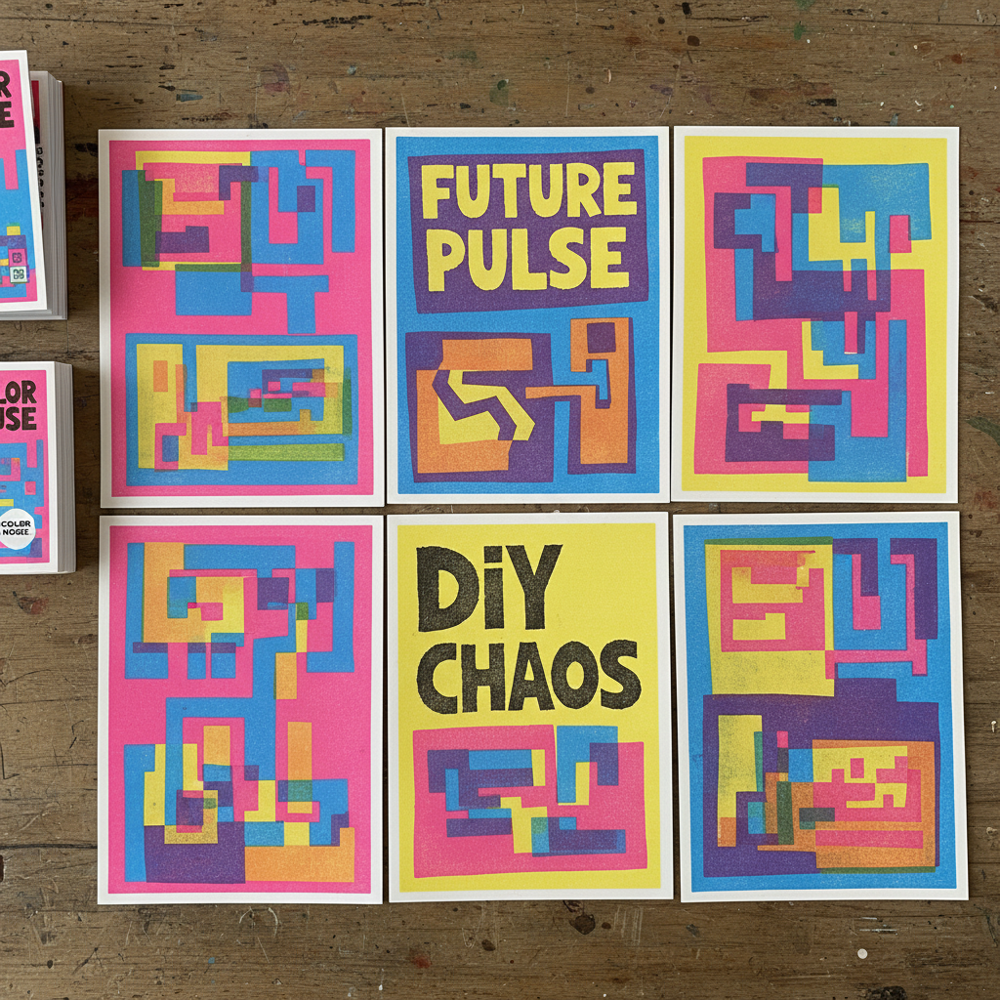

# Risograph Art 理想印刷艺术

> "Risograph is punk rock printmaking — a Japanese digital duplicator that prints one soy-based ink color at a time through a thermal stencil master, producing prints with the saturated flat color of screen printing, the slight misregistration charm of letterpress, and the democratic accessibility of a photocopier. Each pass adds a layer of translucent color that overlaps to create unexpected combinations." — Unknown

## 概述

理想印刷艺术（Risograph Art）是一种使用日本理想科学工业（RISO）公司生产的数字速印机进行艺术创作的印刷形式——每次通过热敏蜡纸模板印刷一种颜色的大豆油墨，通过多次套印创造多色效果。Risograph以其鲜艳的荧光色彩、独特的纹理、轻微的套印偏差和环保的大豆油墨著称。

理想印刷艺术的实践包括：1）分色——将设计分解为单色层；2）制版——热敏蜡纸的自动制版；3）套印——多次通过机器印刷不同颜色；4）叠色——利用油墨透明度创造叠色效果；5）荧光色——使用独特的荧光油墨；6）纹理——利用机器特性创造独特纹理；7）当代Riso——将Risograph与当代设计和独立出版结合。

## 核心特征

| 特征 | 描述 |
|------|------|
| 分色 | 每次印一种颜色 |
| 荧光 | 独特的荧光色彩 |
| 偏差 | 轻微的套印偏差 |
| 环保 | 大豆油墨环保 |
| 民主 | 低成本可及性 |
| 独立 | 独立出版文化 |

## 视觉特征

- **荧光**：鲜艳的荧光色彩
- **平涂**：平坦的色块效果
- **叠色**：透明叠色的效果
- **纹理**：独特的印刷纹理
- **偏差**：轻微的套印偏差
- **手工**：手工感的不完美

## 代表作品

| 作品 | 艺术家/文化 | 年代 | 意义 |
|------|-------------|------|------|
| *Risograph zines* | 国际 | 2010年代起 | Riso独立出版物 |
| *Hato Press prints* | 英国 | 2010年代 | Hato出版社作品 |
| *Knust Press* | 荷兰 | 2000年代起 | Knust出版社 |
| *Risograph posters* | 国际 | 当代 | Riso海报设计 |
| *Riso art prints* | 国际 | 当代 | Riso艺术版画 |

## 历史时间线

| 时期 | 事件 |
|------|------|
| 1986年 | RISO公司推出数字速印机 |
| 1990年代 | 主要用于办公室文件复印 |
| 2000年代 | 艺术家和设计师开始使用 |
| 2010年代 | Riso艺术和独立出版的爆发 |
| 当代 | Riso成为独立出版的标志性媒介 |

## 中国语境

Risograph在中国的设计和独立出版界有快速增长的影响力。中国的独立出版和zine文化中，Risograph作为核心的印刷方式——在北京、上海、广州等城市的独立出版社广泛使用。中国的平面设计教育中，Risograph作为一种创意印刷方式——在设计院校中越来越受欢迎。中国的一些设计工作室和印刷工坊——提供Risograph印刷服务和工作坊。中国的艺术书展（如abC艺术书展）中，Risograph印刷品——是最常见的独立出版形式之一。中国的年轻设计师和插画师——将Risograph作为表达个人风格的重要媒介。中国的文创市场中，Riso印刷品——因其独特的视觉效果和手工感而受到欢迎。

## AI生成概念图

## 与其他风格的关系

- **Screen Printing** → 丝网印刷
- **Letterpress** → 活版印刷
- **Zine Culture** → 独立出版文化
- **Graphic Design** → 平面设计
- **Printmaking** → 版画
- **Pop Art** → 波普艺术

---

*浮光艺志 | Chronicle of Artistry*
